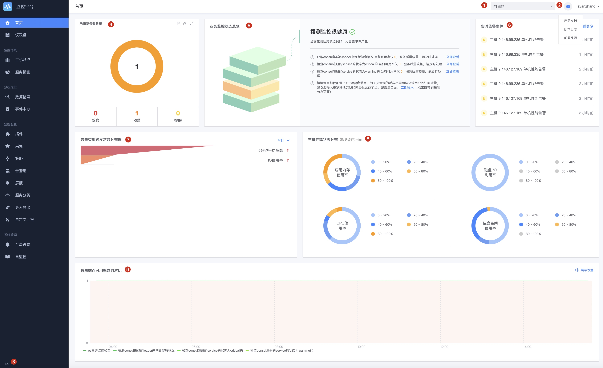

# 导航说明

简单了解下导航的功能说明，能够快速的了解监控平台的功能分布。

## 基本功能

* 标号 1) 业务下拉选择，获取有权限的列表，CMDB 中有权限的业务。
* 标号 2)
    * 产品文档地址：本白皮书的文档
    * 版本日志：可以查看到每个版本迭代的说明
    * 问题反馈：对于监控的问题或者需求可以快速的进行反馈。
* 标号 3) 导航的固定方式

### 报表视图

主要是通过视图和报表的呈现方式来解决日常的**巡检**和潜在问题发现的途径。未来还会增加告警报表，事件报表等能力。

* [首页](report/home.md)：展示本业务的统计信息，监控配置情况，快速了解需要处理的事项
* [仪表盘](report/dashboard.md)：通过指标生成视图，替换自定义监控的场景

### 监控场景

基于不同场景会订制出不同的场景信息和视角来帮助在这个场景下的用户可以快速的掌握相应的信息。未来可以扩展更多的场景，如网络，硬件，容器等。

* [主机监控](scene/host-monitor.md)：查看主机和进程相关信息的场景
* [服务拨测](scene/dial.md)：通过远程拨测服务判断服务是否正常。提供在这个场景在的各种视角和信息
    * 拨测任务：服务拨测任务的管理
    * 拨测节点：服务拨测需要的源节点设置

### 分析定位

在收到告警后进行一个快速的问题定位，将提供各种定位工具，如事件、日志的检索，还会有数据检索，trace 链路，应用拓扑等。

* [事件中心](analyze/event.md)：记录所有的告警事件和告警通知的内容，可以进行告警详情的查看和处理，如告警确认和告警的事件屏蔽
* [数据检索](analyze/data-search.md)：查看采集的日志原始内容

### 监控配置

所有和监控配置相关的内容都是在监控配置中定义，报表视图，监控场景和分析定位都是查看类不存在监控配置的修改。

* [插件制作](conf/plugins.md)：所有的采集配置都需要先定义插件(除了内置插件 如日志)，插件包含内置插件和自定义插件， 业务私有插件和公共插件，插件的本地采集和远程采集模式，支持不同的操作系统
* [采集任务](conf/collect-tasks.md)：所有的采集时序和日志类都是从采集来实现目标机器的采集过程。满足动态和静态的采集
* [告警策略](conf/rules.md)：所有监控策略的配置入口，可以配置监控采集的时序数据，系统事件数据，自定义上报的事件和时序数据，数据平台接入，日志关键字监控等。有相应的算法支撑
* [告警组](conf/alarm-group.md)：设置常用的一组人和通知方式
* [告警屏蔽](conf/block.md)：屏蔽告警通知， 有基于范围屏蔽，基于策略，基于事件屏蔽
* [分类管理](conf/service-class.md)：CMDB 的服务模块分类，基于服务分类来管理数据内容
* [配置导入导出](conf/import-export.md)：批量的进行配置的导入和导出操作
* [自定义上报](conf/custom-report.md)：支持自定义事件和自定义时序数据的上报设置

### 平台配置

是影响整个监控平台的配置，也可以看到平台的运行状况。

* [全局配置](global/admin-config.md)：监控系统的全局开关，如数据的保存周期，水印开关，消息队列设置等
* [自监控](global/self-monitor.md)：监控平台自身的运行状态信息： 存活状态，运行状态，业务运营信息等

