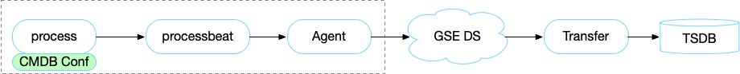

# 进程与端口监控

当前进程和端口的监控依赖 CMDB 的配置，CMDB 配置好后就可以自动采集进程相关的数据和事件。

## 前置步骤

**工作原理**：



> 注意：CMDB 配置了进程信息后会主动下发到服务器上，监控就是利用该配置进行的进程采集。所以需要确保 CMDB 的配置正确。

**配置步骤**：

* 第一步：配置平台注册进程 & 自动下发进程配置信息
* 第二步：主机监控查看进程信息
* 第三步：设定策略
* 第四步：设定仪表盘

接入下来以 druid-broker 进程为例

## 第一步： 配置平台注册进程

**配置路径**： 导航  →  业务  →  1)业务拓扑  →  2)模块设置  →  4)服务实例设置  →  5)进程设置  →  6)标签设置(可选)


- 进程信息配置

  - 进程别名(必填)：对外显示的服务名，用户自定义，一般与进程实际服务名称对应，会在监控平台-主机监控-主机详情-进程服务中用于区分不同进程

  - 进程名(必填)：程序的二进制名称，比如 Kafka 的二进制是 java ，就填写 java

  - 启动参数匹配规则(非必填、重点)：实现精确匹配进程的重要规则，主要应用于如 Java 或 Python 等二进制名重复的进程，Agent 端采集器会通过该规则去识别进程 `cmdline` 符合参数的唯一进程。如果填入的参数不唯一就会识别到多个进程，如果进程二进制名本身唯一，可不填

  - 绑定 IP(非必填)：进程实际监听的 IP 地址，可不填，如果填必须是准确对应 IP 的 地址，如 IP 错误，采集器会无法匹配进程导致数据上报异常

  - 端口(非必填)：同“绑定 IP”

  - 协议(非必填)：同“绑定 IP”

如 durid-broker 这个 java 程序：


更多其他进程配置方法请查看[各种进程配置方法](../functions/addenda/process_cases.md)

### 服务模版

> 服务实例： 如果进程的端口，路径等信息都是一样的，建议使用服务模版，并且设置服务分类。方便后面的管理工作。如果是端口路径不一致也可以自动添加实现。


**自动下发**：

在配置平台上对进程的修改，会通过配置平台的事件推送功能自动下发至 Agent 上的 `/etc/gse/host/hostid` ，监控的进程端口采集器会捕获文件变化，做异常检测，并且将内容更新到采集器中，下发时间预计在 2 分钟内，页面进程端口更新信息在 5 分钟内。

## 第二步： 主机监控查看进程监控


- 进程：正常时标绿显示

- 端口：点击进程，正常时标绿显示，端口不存在以红色显示，被占用则是黄色，灰色说明采集器未上报数据，需要按照数据未上报流程检查

- 资源/性能：正常时图表有连续不断的数据

- 检查进程是否精确匹配：
   - 如果是二进制为 Java 或 Python 的服务，检查进程端口资源是否只上报了配置的进程，如果配置的进程是唯一的，上报进程出现复数，说明精确匹配失败，需要确认匹配参数是否唯一


### 无数据定位

**配置平台事件推送设置**：

  - 修改进程管理信息后，该推送会在 1 分钟内将修改的配置推送到 Agent 端，因此每次修改完进程管理信息后，可到此处确认推送数是否有新增。

**配置更新确认**：

```bash
    # Linux Agent 配置文件路径
    /var/lib/gse/host/hostid
    # Windows Agent 配置文件路径
    /gse/data/host/hostid
    # 检查文件内容是否相符

    # 确认hostid更新正常后，切换到以下目录检查 processbeat.conf 是否跟随 hostid 更新配置内容
    # Linux
    /usr/local/gse/plugins/etc/processbeat.conf
    # Windows
    C:/gse/plugins/etc/processbeat.conf
```

> 注意：Agent 的安装路径可以进行修改，具体位置可以查看“节点管理”。

**processbeat 的日志查看**

如果前面配置都正确，但是依旧没有数据，这个时候就需要打开 processbeat 的 debug 模式查看日志的信息，来进行定位。

## 第三步： 配置告警策略

配置一个端口的策略

监控对象选择：主机-进程

添加监控指标：选择系统事件-进程端口

高级选项：设置触发条件 3/5


如果监控进程的指标，默认会采集如下进程的指标[主机-进程-指标](../functions/addenda/process-metrics.md)


告警组：设置一个运维组


监控目标选择：动态-druid_broker

> 信息：建议使用动态方式，这样可以随着节点进行动态监控。


## 第四步： 仪表盘添加视图

当需要把关注的指标不同进程，不同主机等放置到一起查看的时候，就可以去设置一个仪表盘。

具体查看仪表盘的使用[仪表盘功能](../functions/report/dashboard.md)

## 其他

更多进程相关的采集查看场景 [如何实现多实例采集](multi_instance_monitor.md)
