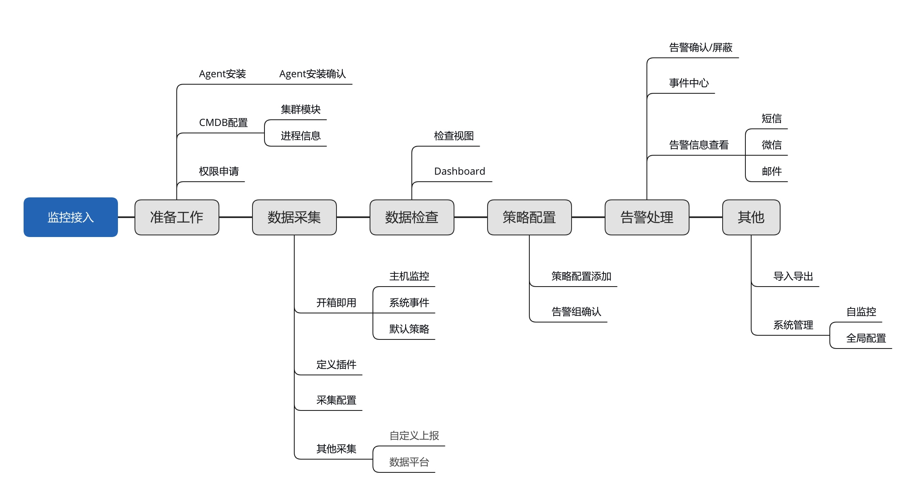

# 快速入门

要快速的接触监控平台先通过快速入门会有一个基本的认识。

## 接入流程

基本上接入流程有如下阶段：

1. **[准备工作](prepare.md)**：监控平台的监控目标和进程信息主要是依赖 CMDB 的配置，监控的采集链路依赖蓝鲸 Agent 的部署，监控的功能使用依赖[权限的设置](../functions/global/permissions.md)
2. **数据采集**：监控本身就是围绕数据来工作的，数据从何而来要么通过[监控插件](../functions/conf/plugins.md)和[采集配置](../functions/conf/collect-tasks.md)获取，要么通过[自定义上报](../functions/conf/custom-report.md)主动上报上来，或者直接使用[数据平台](../guide/bigdata_monitor.md)的结果表数据
3. **数据检查**：数据是否采集成功，最终还是以是否可以查看相关的图形数据为主。每个采集任务都有一个 **检查视图** 可以查看当前主机/实例采集的数据情况。当然也可以从[Dashboard](../functions/report/dashboard.md)去检索一个任意的指标
4. **策略配置**：采集上来的数据要么看要么告警，想要告警的指标通过策略配置进行设置。可以提前规划下告警组在告警通知的时候需要使用
5. **告警处理**：当策略生效并且触发了告警，我们可以通过[事件中心](../functions/analyze/event.md)进行查看，也可以通过[告警通知](../functions/conf/rules.md)接收到相应的告警内容，对于告警事件可以快速的进行**告警确认**或[告警屏蔽](../functions/conf/block.md)
6. **其他**：还有很多其他的高级功能可以使用。 [导入导出](../functions/conf/import-export.md)，[全局配置](../functions/global/admin-config.md)

## 监控的四个阶段

监控平台有这么多功能，有这么多的文档，如何循序渐进的使用监控平台呢？大致可以分为四个层面： 

* 第一层：开箱即用               -- **适用于初级用户** 
* 第二层：扩展采集和告警自动处理   -- **适用于高级用户** 
* 第三层：策略高级控制和配置分享   -- **适用于专家级用户**
* 第四层：平台管理和插件开发   -- **适用于管理员和二次开发者**

### 第一层： 开箱即用

* 主机-操作系统监控 
    * CMDB 中纳管的机器并且安装了 Agent 的机器会默认进行采集
    * 默认采集的指标 [主机-操作系统-指标](../functions/addenda/host-metrics.md)
    * 默认采集的事件 [主机-操作系统-系统事件](../functions/addenda/host-events.md)
    * 主机监控 主机图表查看和对比等功能 [主机监控](../functions/scene/host-monitor.md)
* 内置的默认策略 [内置策略](../functions/addenda/builtin-rules.md)
* 主机-进程监控
    * CMDB 配置的进程默认就会进行采集
    * 默认采集的进程指标和事件 [主机-进程-指标](../functions/addenda/process-metrics.md)
* 官方插件： 内置 20 款官方插件，可直接在采集中使用，满足常用组件的监控需求。提供动态的采集需求，自动增删采集
    * [内置官方插件](../functions/addenda/builtin-plugins.md)
    * [采集配置](../functions/conf/collect-tasks.md)
* 策略配置：可满足 IP，服务实例，集群模块的监控需求，提供 8 种检测算法。并且支持数据平台的数据监控需求
    * [算法说明](../functions/addenda/algorithms.md)
    * [策略配置](../functions/conf/rules.md)
    * [告警组](../functions/conf/alarm-group.md)
    * [如何监控数据平台的数据](../guide/bigdata_monitor.md)
* 监控屏蔽：提供服务实例，IP，集群模块，策略，事件的屏蔽粒度
     * [告警屏蔽](../functions/conf/block.md)
* 仪表盘：提供不同的图表配置，支持日志数据、数据平台数据、监控采集的指标数据画图需求
     * [仪盘表](../functions/report/dashboard.md)
* 服务拨测：提供模拟用户请求的监控需求。 
     * [服务拨测](../functions/scene/dial.md)
* 日志采集和监控
    * 通过日志平台可以进行日志采集和字段提取
    * 方便的日志检索功能
    * 日志关键字告警功能和日志的指标数据监控能力
    * 日志的指标数据画图能力
    * [如何监控日志平台的数据](../guide/log_monitor.md)

### 第二层： 扩展采集和告警自动处理

* 在线制作插件：通过在线插件制作来扩充采集能力，插件制作提供了脚本，Exporter，，JMX，BK-Pull 5 种便利的插件制作类型。可以几分钟实现一个好用的采集插件。并且还提供远程采集的方式来满足不方便 Agent 部署的情况。
    * [插件制作](../functions/conf/plugins.md)
    * [如何通过脚本进行监控](../guide/script_collect.md)
    * [如何实现多实例采集](../guide/multi_instance_monitor.md)
    * [如何对开源组件进行监控](../guide/component_monitor.md)
    * [如何在线制作 Exporter 插件](../guide/import_exporter.md)
    * [如何在线制作  插件](../guide/import_datadog_online.md)
    * [如何在线制作 JMX 插件](../guide/plugin_jmx.md)
    * [无 Agent 如何实现采集](../guide/noagent_monitor.md)
* 自定义上报： 通过自定义上报来扩充采集能力，通过 HTTP 方式上报可以满足业务灵活的业务指标数据上报的能力。 
    * [自定义上报](../functions/conf/custom-report.md)
* 告警回调能力：通过 HTTP 的告警回调，可以进行自动触发。    [如何设置告警回调](../guide/http_callback.md)
* 故障自愈能力：通过故障自愈对接对接监控打通处理动作。
    
    
### 第三层： 策略高级控制和配置分享

* 精细化控制：无数据告警，告警恢复，告警收敛和汇总控制
    *  [通知收敛和汇总机制](../functions/addenda/coverge.md)
* 自定义告警通知模版：通过模版满足个性化需求
    * [如何自定义通知模版](../guide/notify_case.md)
    * [变量列表](../functions/addenda/variables.md)
* 策略抑制能力：小范围优先级大于大范围
* 主机运营字段：通过主机的运营字段来控制是否要进行监控，可与发布和故障处理相关操作打通
* 忽略进程端口范围端：某些进程端口范围不是用于监控的
* 导入和导出：可以通过采集，策略，插件的批量导入导出来满足配置的快速分享

### 第四层： 平台管理和插件开发

* 插件程序开发：当市面上没有合适的插件时，可以自己制作开发。Python 和 Golang 两种语言可以选择自己更擅长的
    * [Exporter 插件开发](../dev/plugin_exporter_dev.md)
    * [插件开发](../dev/plugin_datadog_dev.md)
* 全局管理：有很多功能控制在全局配置，如磁盘的黑名单，告警风暴的阈值，通知渠道的设置
    * [全局配置](../functions/global/admin-config.md)
* 自监控：监控的监控，保证平台的稳定性
    * [自监控](../functions/global/self-monitor.md)
