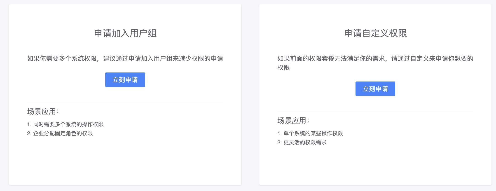

# 权限申请

监控平台的权限申请接入了权限中心，所以需要申请监控平台的使用权限主要是通过权限中心操作。

具体有两种申请方式：

1. 创建权限用户组，如 xx 业务运维组，可以由权限的管理员添加对应的人，或者申请加入该组。
2. 申请自定义权限，可以直接在权限中心进入，也可以在监控产品的引导上进入。

## 权限粒度

按监控提供的功能进行查看和管理两种基本的划分，一般来说有如下几个用户场景：

* 告警通知的接收者：如运维，开发，测试，产品等。适用申请查看类和屏蔽类操作。
* 监控的配置者：如运维。适用于申请查看+管理类操作。
* 监控平台的管理者：适用于全局的功能。 

