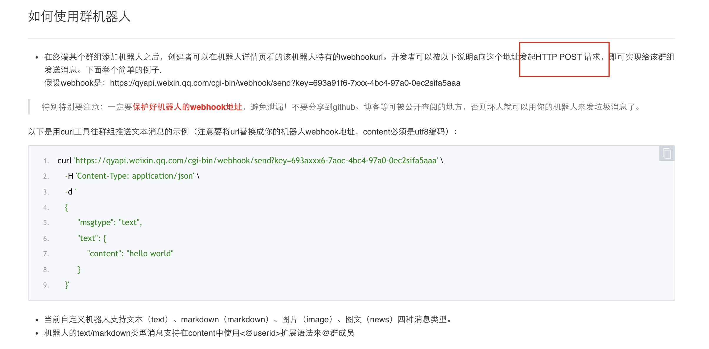

#  案例：微信群自定义机器人

本文主要是以回调的方式打通微信机器人的功能进行说明。 HTTP回调具体功能说明可以查看 [处理套餐-HTTP回调](./solutions_http_callback.md)

## 配置过程

告警回调使用微信的自定义机器人发送消息，参考文档https://work.weixin.qq.com/api/doc/90000/90136/91770



回调参数配置如下


使用案例-自定义接收回调数据

接收服务器demo如下

```
package main

import (
	"fmt"
	"io/ioutil"
	"log"
	"net/http"
)

func hello(w http.ResponseWriter, r *http.Request) {
	if r.URL.Path != "/" {
		http.Error(w, "404 not found.", http.StatusNotFound)
		return
	}

	switch r.Method {
	case "POST":
        //如果需要对告警做更多格式化，可以自行处理
		reqBody, err := ioutil.ReadAll(r.Body)
		if err != nil {
			log.Fatal(err)
		}

		fmt.Printf("%s\n", reqBody)
		w.Write([]byte("Received a POST request\n"))
	default:
		fmt.Fprintf(w, "Sorry, only POST method is supported.")
	}
}

func main() {
	http.HandleFunc("/", hello)

	fmt.Printf("Starting server for testing HTTP POST...\n")
	if err := http.ListenAndServe(":8080", nil); err != nil {
		log.Fatal(err)
	}
}


#编译成二进制
#CGO_ENABLED=0 GOOS=linux GOARCH=amd64 go build -o http_svr

```

启动服务


测试接收数据


配置套餐


配置告警，选用该套餐


接收数据如下所示


告警回调接收数据成功

