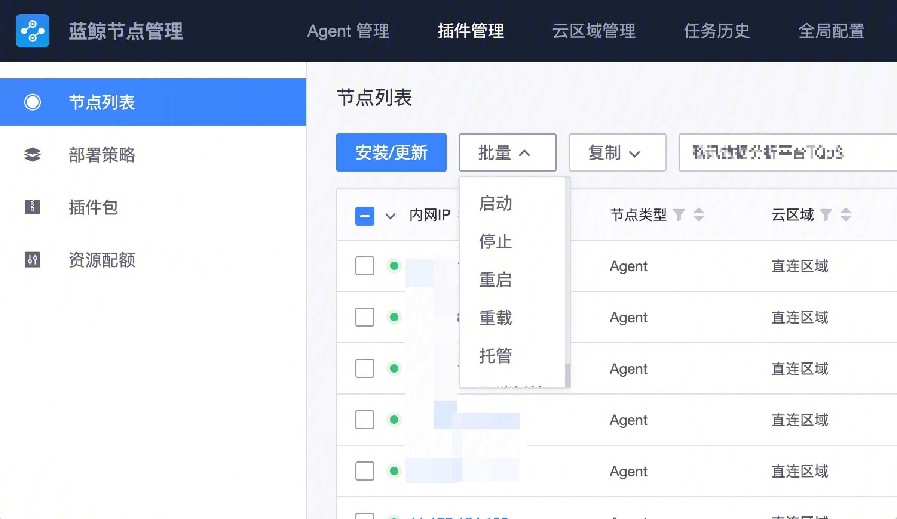

# 采集器FAQ

## **采集器安装位置、配置文件、日志**
### **采集器安装在gse agent的同级路径**

``` 
/usr/local/gse/agent   #gse agent部署目录
/usr/local/gse/plugins #采集器部署目录
```

### **采集器的配置文件**
采集器的配置文件，在plugins目录下的etc目录下。采集器配置文件以“采集器名称.conf"命名。

``` 
[root@VM-42-61-centos /usr/local/gse/plugins/etc]# ll
total 36
d--xr--r-- 2 root root 4096 Jul  6 19:34 bkmonitorbeat
-rwxr-xr-x 1 root root 8231 Jul  6 19:34 bkmonitorbeat.conf
-rw-r--r-- 1 root root  638 Mar 11 10:17 bkunifylogbeat.conf
-rw-r--r-- 1 root root   72 Mar 11 10:17 gsecmdline.conf
```

### **采集器日志查看**

从采集器的配置文件中可知，采集器的日志是写入到/var/log/gse目录下的。

### **采集器启停日志查看**

采集器的启停脚本中，会往/tmp/bkc.log写入日志，记录启停信息。

``` 
# tail /tmp/bkc.log
20220623-141557 INFO|83|log-main stop bkmonitorbeat ...
20220623-141559 INFO|75|log-main start bkmonitorbeat ...
20220706-193451 INFO|96|log-main stop bkmonitorbeat ...
20220706-193453 INFO|185|log-main start bkmonitorbeat ...
20220706-203857 INFO|185|log-main start bkmonitorbeat ...
20220706-203908 INFO|185|log-main start bkmonitorbeat ...
20220706-205212 INFO|96|log-main stop bkunifylogbeat ...
20220706-205214 INFO|185|log-main start bkunifylogbeat ...
```


## **采集器如何进行启动、停止、重启或者重载**

### A. 通过节点管理SaaS进行采集器（插件）的启动、停止或重启 （**推荐**）




### B、在服务器上进行修改 （不推荐）

 在plugins的bin目录下，有reload.sh、restart.sh、start.sh、stop.sh，进行对应操作。
 
``` 
./restart.sh bkmonitorbeat  # 重启蓝鲸监控指标采集器
./reload.sh bkmonitorbeat   # 重载蓝鲸监控指标采集器

# 因为gse agent的托管了采集器，所以即使在机器上启动、停止进程，agent均会按照托管配置进行对应操作。
# 例如：stop掉了采集器，agent又会拉起采集器，即stop无法达到预期目的。
# 所以，采集器的启动和停止，建议在 ”A、节点管理“上操作。
 
./start.sh bkmonitorbeat    # 启动蓝鲸监控指标采集器
./stop.sh bkmonitorbeat     # 停止蓝鲸监控指标采集器
```

## **如何限制监控采集器的资源使用率**

### **1. 调整监控采集器的配置文件，进行资源限制**
蓝鲸监控的采集器的配置文件(/usr/local/gse/plugins/etc/bkmonitorbeat.conf)中，resource_limit字段用于进行主机资源使用率的限制

``` 
resource_limit:
  enabled: true
  cpu: 1    # CPU 资源限制 单位 core(float64)
  mem: -1 # 内存资源限制 单位 MB(int)，-1 代表无限制
```

* cpu：1        # 表示限制为1核使用。（该使用率是在多核上进行动态漂移的使用率，非物理上的单核cpu使用率）
* mem：-1    #  内存限制请勿自行修改，在某些linux内核版本上，可能会引发bug，使得采集器崩溃

### **2. 通过gse agent托管配置文件，进行资源使用率的兜底限制**

#### 采集器与gse agent的关系

采集器是通过托管的方式，由gse agent进行管控。
我们可以通过节点管理、或者手动修改gse agent的配置文件，进行采集器的托管。托管后，采集器会由gse agent进行进程自动化管理的动作。
在gse agent的插件托管的proinfo.json配置文件中，可以进行对应采集器的资源使用率进行兜底管理（即kill掉采集器进程）。

### 如何查看采集器的资源使用率

在gse agent的etc目录（/usr/local/gse/agent/etc）下，可以看到proinfo.json配置文件。

``` 
{
		 "procName" : "bkmonitorbeat",
         "cpulmt" : 10,
         "memlmt" : 10,
		 ......
 }
```
cpulmt：该插件的cpu最高资源使用率。默认10，表示该插件运行最高占用主机的10%的cpu资源时，gse agent会kill掉该采集器。
memlmt：该插件的内存最高最高资源使用率。默认10，表示该插件运行最高占用主机的10%的内存资源，gse agent会kill掉该采集器。

#### 如何修改采集器的资源使用率

因为gse agent对托管文件proinfo.json的保护机制，当采集器重启后，对应的采集器托管配置会重置为默认值。
所以在配置文件中修改cpulmt和memlmt，不是一个长效的方案。
请在节点管理中，插件管理-资源配合页面，按照业务拓扑的模块为维度，进行cpulmt和memlmt的修改。


