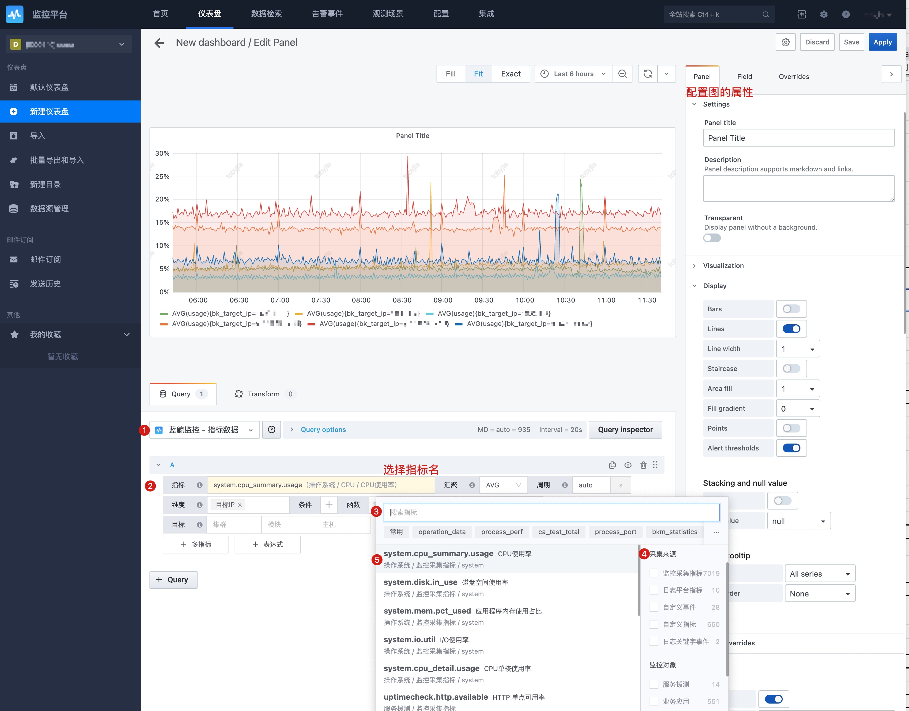

# 仪表盘

仪表盘使用的是Grafana , 基于Grafana的设计理念，基本在不改变Grafana的情况下融入了蓝鲸监控自己的功能。

Grafana的基本使用可以查看官网或者网上的使用文章。 接下来主要介绍一些蓝鲸监控附加的功能和一些常用的功能介绍。 

## 基本使用

### 新建视图和分组

1. 新建视图，可以先选数据也可以先选图
2. 如果想实现分组，使用 Convert to row 就可以实现类似的分组功能

### 视图插件

可以基于Grafana的版本，让管理员进行相应图表的增加。

### 数据源插件

监控平台提供了三种数据源插件

1. 指标数据
2. 事件数据
3. 日志数据

### 指标数据面板

* 指标选择：选择正确的指标
* 汇聚方法：当一个汇聚周期内有多个数据点时，这个时候要注意选择汇聚方法。当采集的数据是 1 分钟，汇聚周期也是 1 分钟时，并且数据点也只有一个，那么汇聚方法不论是 SUM MAX MIN 其实都是一样的。
    
    汇聚的运算方法：支持 SUM，AVG，MAX，MIN，COUNT,  SUM(PromQL)，AVG(PromQL)，MAX(PromQL)，MIN(PromQL)，COUNT(PromQL)
* 汇聚周期：汇聚周期的单位有秒(s)和分钟(m),还支持auto 会自动基于时间范围选择适配的汇聚周期，查询效率会有优化。
* 维度：类似 Group by 
* 条件：类似 Where 用于过滤数据
* 函数: 支持各种函数计算
* 多指标/表达式： 可以进行多指标的计算
* 目标：是快捷的 IP/实例选择方法
* 别名：一般默认的示例名称都很长，那么就可以好好利用别名功能让图表更好看

### 日志数据源查询

* 索引集: 选择日志的索引集
* Query String： 支持原生的ES查询语法
* 汇聚方法： 除了常见的MAX COUNT，还有RAW DATA 在是文本类图表插件下有用，如上图的原始日志的呈现

### 事件数据源查询

* 类型： 自定义上报事件、日志关键字事件
* 数据名称： 就是对应类型的的数据项名称
* Query String： 支持ES的原生查询语法
* 方法： 只提供了count

## 常用功能

### 别名功能

别名语法：以`$`开头，`$表头_字段名`

比如：指标 id. 表头为`metric` ， 字段名为`id` . 所以整个变量为： `$metric_id` 如果是要显示指标名就是. `$metric_name`

比如：维度名 . 表头为`tag`，字段名为`device_name`，所以整个变量为：`$tag_device_name` 。

* 表头: 可以点击每个框的帮助信息，点击显示该表头的名称
* 字段名：鼠标浮上去会显示名称

中文名|	表头名|	别名组合方式
---|---|---
指标	| metric	| `$metric_id` 代表指标名
方法	| formula	| `$formula` 代表汇聚方法
周期	| interval	| `$interval` 代表汇聚周期 
维度	| tag	| `$tag_字段名` 如 $tag_bk_target_ip

### 常用图表配置

### 保存查询时间范围

## 高级功能

### 极值

函数- TOP 或 Bottom 功能

TOP和Bottom的逻辑是统计这查询时间范围的数据，按原本的查询汇聚方法是MAX 还是SUM，进行整体数据的排序后，再进行TOP和Bottom的排序。

与topk和bottomk的区别是，topk、bottomk取每个时间点的数据进行排序。

### 排序

#### 降序

####  升序

### 时间对比

与过去某天数据对比，就可以使用时间偏移功能。

时间格式：

| key  | shorthand | 
|---|---|
| years | y | 
| quarters | Q| 
| months | M | 
| weeks | w | 
| days | d  | 
| hours | h | 
| minutes | m | 
| seconds | s | 

如：`1d 1day 1days`

对比昨天，一周前的数据，可以使用函数time_shift功能，如下图所示

[更多函数查看](../data-visualization/mutil_metric.md)

### 变量功能

在仪表盘的设置里面有一个变量功能，设置了变量再配合查询的条件就可以实例变量的联动效果。接下来配置一个集群模块对应的主机查询为例。

#### 配置集群和模块的联动变量

先配置集群`cluster`。

默认的clusert变量如下，先你给个的说明见图中的解释，其中的Mutil-value，表示可以一次选多个值，Include All option，表示可以选择所有

再配置模块`module`，模块里面的查询条件以集群 ID 做为条件。

#### 配置主机

主机(host)变量关联集群(cluster)和模块(module),实现集群，模块改变后，主机IP随之改变。

设置变量`host`。

可以开启多主机选择和 all 条件 

就可以看到如下的效果。

#### 配置查询条件关联

在条件里面使用 host 变量，就可以达到联动查询的效果

#### Repeat功能-自动绘制多张图

选择Repeat功能，自动根据变量值绘制多个图

### 数据下钻

如该图配置了数据下钻，点击了该 IP 通过“主机详情”就可以跳转到主机监控对应的页面。

配置方法：在视图配置里面，使用`Add link`功能，在 URL 里面使用相关变量

