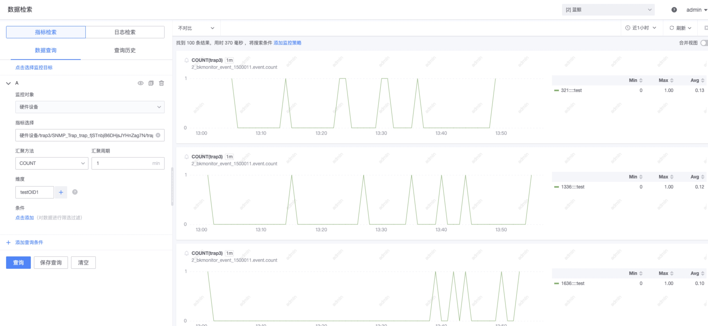
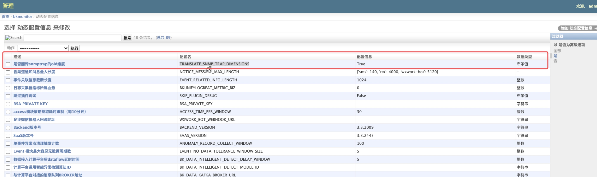

# snmp trap使⽤说明


## **⼀、 snmp trap上报流程**


1. 监控平台下发 trap server(实现为 bkmonitorbeat的 trap任务 )到指定机器，并监听 trap端⼝ 
2. ⽤户配置需要监控的设备，上报 trap报⽂到 trap server

3. trap server解析报⽂，并将数据格式转换为监控可识别的⾃定义事件格式数据，上报到监控链路 具体可参考下图 :


## **⼆、 snmp trap任务下发流程**


### **1.⽣成 snmp.yml**


使⽤监控提供的 generator⼯具，结合⽤户提供的 mib库⽂件，⽣成 snmp.yml⽂件 MIBDIRS环境变量⾥填写⽤户存放 mib库的⽂件夹，多个 mib⽂件夹使⽤ :分割


```
export MIBDIRS=mibs:/usr/local/share/snmp/mibs:/usr/share/snmp/mibs .
/generator all

```


得到的 snmp.yml内容举例 :


```
basic_name:
  metrics:
  - name: etherRateControlGroup
    oid: 1.3.6.1.2.1.35.2.1.15
    type: OBJGROUP
    help: ""
  - name: netSnmpDomains
    oid: 1.3.6.1.4.1.8072.3.3
    type: OTHER
    help: ""
    
```


### **2.补充额外的 snmp.yml配置**


举例 : ⽤户需要关注 1.3.6.1.2.1.2333这个 oid，以及 1.3.6.1.2.1.2334.1~10这⼀组 oid，则需要⼿动在 snmp.yml⾥ 额外配置 report_oid_dimensions:


注意 oid前⾯要加⼀个 "." 这是底层实现导致的


```
 
basic_name:
  report_oid_dimensions: [".1.3.6.1.2.1.2333",".1.3.6.1.2.1.2334"]
  metrics:
  - name: etherRateControlGroup
    oid: 1.3.6.1.2.1.35.2.1.15
    type: OBJGROUP
    help: ""
  - name: netSnmpDomains
    oid: 1.3.6.1.4.1.8072.3.3
    type: OTHER
    help: ""
```


如果存在⼤量级 oid索引需要上报维度的场景， snmp.yml配置需要额外进⾏处理


例如 : 客户需要关注 1.3.6.1.2.1.2334.1 ~ 1.3.6.1.2.1.2334.200000 这样 20w量级的 oid，此时如果使⽤上⾯的写 法，会造成 oid维度过多， es数据⽆法⼊库，进⽽导致事件丢失的问题，这⾥需要使⽤特殊写法 ,即在 oid尾部增 加 **.index**:


```
 
basic_name:
  report_oid_dimensions: [".1.3.6.1.2.1.2333",".1.3.6.1.2.1.2334.index"]
  metrics:
  - name: etherRateControlGroup
    oid: 1.3.6.1.2.1.35.2.1.15
    type: OBJGROUP
    help: ""
  - name: netSnmpDomains
    oid: 1.3.6.1.4.1.8072.3.3
    type: OTHER
    help: ""
```


此时，对应 oid的维度名将以 index前⾯的部分上报，⽽维度的值会以 {oid_index}::::{value}的形式拼接 例如 : ⽤户上报 oid的名称为 .1.3.6.1.2.1.2334.333,值为 test1,则实际上报维度名为 .1.3.6.1.2.1.2334,值为


333::::test1


效果截图⼤体如下 :





注意 :由于相同维度名在单个事件内只能有⼀个，所以该⽅案 **不适⽤** 于 **单个** 事件⾥同时出现相同前缀 oid索引的场景    例如 : 同时上报了 .1.3.6.1.2.1.2334.1和 .1.3.6.1.2.1.2334.2的场景，使⽤该⽅案会造成维度丢失


### **3.配置下发采集任务**


在监控的采集下发⻚⾯上，配置 snmp_trap任务参数，并上传 snmp.yml，随后点击下⼀步选择⼀台机器下发 trap server


### **4.观察数据上报**


通过数据检索可以观察该任务的数据上报情况 :


### **5.策略配置**


注 : 基于⾃定义事件的字段发现机制， trap事件数据在第⼀次上报时 (视图上能看到数据 )， oid维度往往是找不到 的，需要等待 5-10分钟后，经由链路的字段发现功能⾃动补充到 saas的维度列表 ,基于该特征， trap任务的策略配 置需要在 trap任务上报⼀段时间之后进⾏处理


在策略⻚⾯配置该任务的 trap告警


## **三、额外配置相关**


### **1.打开维度翻译开关**


默认情况下， trap上报的 oid维度将以原始 oid形式上报上来，如 1_3_6_1_2_1_35_2_1_15这样的 oid维度 key， ⽤户可能想在维度中获取翻译好的 oid英⽂名称，如 etherRateControlGroup


此时需要执⾏以下两步 :


1.admin⻚⾯打开 translate开关


地址 : `{paas}/o/bk_monitorv3/admin/bkmonitor/globalconfig/?is_advanced__exact=1`


配置名称： TRANSLATE_SNMP_TRAP_DIMENSIONS


如图，需要将该项改为 true





2.重新下发 trap任务


使⽤增删⽬标的⽅式重新下发 trap任务即可


### **2.oid value汉字编码处理**


如果⽤户 trap事件⾥， oid的 value是中⽂使⽤了特殊的编码格式 (如 gbk)，由于 trap server默认处理汉字编码格式 为 utf8，此时 trap server上报的汉字会变成乱码，此时需要⽤户在 snmp.yml配置中⼿动增加⼀项配置 encode:


```
 
basic_name:
  encode: gbk
  metrics:
  - name: etherRateControlGroup
    oid: 1.3.6.1.2.1.35.2.1.15
    type: OBJGROUP
    help: ""
  - name: netSnmpDomains
    oid: 1.3.6.1.4.1.8072.3.3
    type: OTHER
    help: ""
```


注 : 基于⽬前的场景考虑，当前只额外⽀持 gbk编码


注 2: 如果不使⽤ gbk，需要将 encode参数整⾏删除，不要留下类似 encode: 这样的空⽩参数


### **3.raw byte类型 oid处理**


常规情况下， trap server获取到 byte数组格式的 oid value时，会尝试将其转码为可读字符，但存在特殊场景下的 数据，其 value含义时 byte本身，此时不应转码，在该场景下，⽤户需要在 snmp.yml配置中⼿动增加⼀项配置 raw_byte_oids:


此时， 1.3.6.1.2.333.4这个 oid就不会被尝试转码为可读字符，⽽是使⽤ byte数组形式上报


```
basic_name:
  raw_byte_oids: [".1.3.6.1.2.333.4"]
  metrics:
  - name: dot1dStpBridgeGroup
    oid: 1.3.6.1.2.1.17.8.1.3
    type: OBJGROUP
    help: ""
  - name: hrDeviceProcessor
    oid: 1.3.6.1.2.1.25.3.1.3
    type: OBJIDENTITY
    help: ""
```


## **四、 trap任务参数说明**

snmp的认证信息由客户设备定义，然后填写到监控的采集配置中
snmpv1/v2这两种协议认证只有⼀个字段，即 community,中⽂译为团体名

注 1: snmptrap使⽤团体名作为 trap数据的过滤措施，所以可以不填，不填时视为接收所有团体的 trap,**多个需要过 滤的团体名可⽤逗号分隔**
注 2:下表举例⼀列为空则表示通常不填</p>|


|**名称**|**⽤途**|**举例**|**使⽤ snmp版本**|
|---|---|---|---|

|community|snmp v1,v2的唯⼀认证信息|public|v1,v2|

|安全名|snmpv3的⽤户名|admin|v3|

|上下⽂名称|snmpv3的视图名称||v3|

|安全级别|snmpv3的安全类型，通过下拉列表选择|authPriv|v3|

|验证协议|snmpv3认证协议，通过下拉列表选择|SHA|v3|

|验证⼝令|snmpv3认证协议对应的密码|12345678|v3|

|隐私协议|snmpv3隐私协议，通过下拉列表选择|DES|v3|

|私钥|snmpv3隐私协议对应的密码|12345678|v3|

|设备 ID|snmpV3设备 ID,需要对应设备提供|800000000102030400|v3|


## **五、问题排查**

### **1.snmp.yml⽣成结果为空** 

通常为 mib库缺失导致，可以使⽤以下命令观察结果 :


`./generator parse_error`


### **2.trap任务始终⽆数据**

1. 前往 trap server机器上，打开 /usr/local/gse/plugins/etc/bkmonitorbeat/xxxx_snmptrap_xxxx.conf⽂件，查 看其 dataid
2. 使⽤该 dataid，⾛⽆数据排查流程 ⽆数据排查⽂档 :


## **六、注意事项**


### **1.维度 oid配置限制**


补充 report_oid_dimensions配置时，需要控制上报 oid维度的数量，不要补充过多的 oid信息到维度上，过多 oid 维度会引发 es写⼊的 total fields limit报错，从⽽导致 trap事件数据只有部分能够写⼊ es


### **2.查询限制**


不要使⽤维度值不可枚举或数量过⼤的维度作为查询条件


例如 :trap固定上报的维度 agent_port，该值为随机值，会产⽣ 1-6w的维度量级 配置这种维度作为查询条件，有概率导致查询 es返回 "create too many buckets"报错导致查询⽆数据 同理，配置告警时也不应将这种条件作为监控维度，以防告警后台查询失败导致⽆告警


## 相关文档

SNMP指标插件制作[查看文档](../integrations-metric-plugins/plugin_snmp.md)

