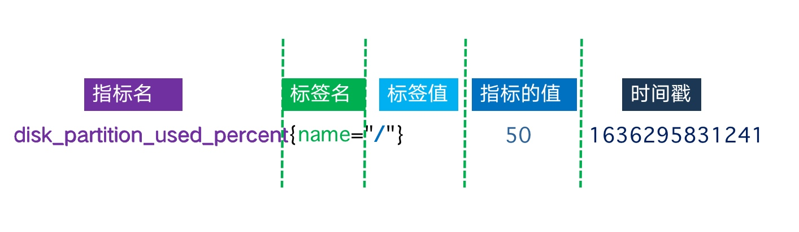

# 什么是指标和维度


## 1.指标概述

     在监控系统中，指标是一个很重要的概念，我们常常忽视他的存在。指标的定义，与监控系统所支持的数据模型结构，有着非常密切的关系。
     
     监控数据的来源，从数据的类型可以分为：数值，短文本字符串，日志(长文本字符串)。
     
     通常所讲的指标，都是对当前系统环境具有度量价值的统计数据，使我们能够明确知道当前系统环境的运行状态。

## 2.什么是指标

  指标，是对软件属性或者硬件属性的度量。也就是我们对监控对象定义的目标，这些指标需要与我们的系统、业务程序、环境相紧密关联，指标的定义原则必须符合SMART原则。

* S代表具体(Specific)  指标是明确的，有具体的含义，能反映具体的属性，有针对性的。
* M代表可衡量(Measurable) 可测量指标的活动，包括百分比、数值等。
* A代表可实现(Assignable) 能够将指标的值获取到，有技术手段或工具采集到。
* R代表相关性(Realistic)  与其他指标在逻辑上存在一定关联性。
* T代表有时限(Time-bound) 在一定的时间范围内取值跟踪。


## 3.什么是多维指标

在了解多维指标之前，我们先来回顾监控指标的发展历史。

### 1.退出码时期

对指标只关注返回状态。在Linux系统中，脚本执行的退出的状态码[1]，状态码返回0表示执行成功，返回1表示失败，2-255其他状态码会有更多含义。

和Linux系统退出状态码含义相同的监控系统，最先在Nagios中使用，监控的检测脚本，通过shell脚本的退出状态码0-3这4个状态，来分别判断服务的不同运行状态，返回值的含义如下

```
0 - Service is OK.
1 - Service has a WARNING.
2 - Service is in a CRITICAL status.
3 - Service status is UNKNOWN.
```

编写对应的检测脚本如下[2],然后由监控系统去判断服务的运行状态


### 2.单指标时期

所谓单指标，指的是指标和值是成对出现的，即K-V键值对成对出现,典型代表监控为Zabbix。比如，定义磁盘使用率状态,有多少个磁盘分区，则需要定义多少个指标，如下所示

```
disk_partition_used_percent["/"] 50
disk_partition_used_percent["/boot"] 10
disk_partition_used_percent["/home"] 1
disk_partition_used_percent["/data1"] 50
disk_partition_used_percent["/data2"] 50
```

 **单指标有什么缺点呢**

1.不能进行复杂条件查询，一次只能查询一个指标的值，比如需要查找所有机器最大磁盘分区的使用率，则需要将所有磁盘全部查出后，进行数据计算后，才能找到对应的值。

2.指标构造非常不方便，需要将指标进行拼接，比如SNMP的网络端口和端口对应的流量、包等指标进行关联，需要多次进行查询，才能将值取出，指标构造非常复杂[3]。


最终构造的数据结构如下所示


### 3.多维指标时期

多维指标，定义非常简单，指标名和单维度指标是一样的，只是将维度放到另外一个字段中

```
disk_partition_used_percent{name="/"} 50
disk_partition_used_percent{name="/boot"} 10
disk_partition_used_percent{name="/home"} 15
disk_partition_used_percent{name="/data1"} 30
disk_partition_used_percent{name="/data2"} 70
```

   对比上面的单维度指标，多维指标的好处非常明显，将同一类型的指标，不同名称的数据，可以归为一种数据进行查询，比如我可以在查询指标的时候不指定name，那么将返回所有的name值，或者是一次选择"/data1","/data2"多个分区，则可以一次性返回查询数据。

   有了多维指标，可以很好的进行聚合查询，指标名与维度进行彻底的分离，从而为复杂的数据计算分析创造了基础条件。

### 4.什么是时序数据

#### 1.时序数据

时间序列是以规律的时间间隔采样的测量值的有序集合。例如，每分钟采集一次主机CPU的使用率。时序数据有以下的概念

术语|	描述
---|---
Namespace	| 命名空间，类似于database
Metric Name	| 指标名
Tags	| 每个指标名下面可以加多个Key/Value类型的Tag
TagKey	| 标签名
TagValue	 | 标签值
Value	 | 指标对应的值
Timestamp	| 指标产生的时间，如果不填写，则会以入库时间自动填充为准


下面以一个实际例子来对应各种时序数据的概念。



注意：这里的书写规则是按照prometheus的格式进行书写的，即：指标名{标签名="标签值"} 值 时间戳

当然，时序的指标还可以按照influxDB line protocol来书写[4],如下所示


#### 2.时间序列概念

如下的数据，采集了3条数据，则会产生5个时间序列，每个时间序列有3个数据点

```
disk_partition_used_percent{name="/"} 50
disk_partition_used_percent{name="/boot"} 10
disk_partition_used_percent{name="/home"} 15
disk_partition_used_percent{name="/data1"} 30
disk_partition_used_percent{name="/data2"} 70
```


从上面可以看出，数据点就是采集的数据值。而时间序列是指标名中的维度乘积。时间序列计算的公式如下

```
metric_name{tagA="tagA_value",tagB="tagB_value"} metric_value 
tagA_value=[0 1 2 .... m]
tagB_value=[0 1 2 .... n]
time_series_total=count(tagA_value) * count(tagB_value)=m * n
```

### 5.怎么定义指标和维度

在监控平台中，使用的是prometheus格式，如下所示

`metric_name{<label name>=<label value>, ...} value timestamp`

metric: 指标的名称(metric name)可以反映被监控样本的含义(比如，http_request_total - 表示当前系统接收到的 HTTP 请求总量)。指标名称只能由 ASCII 字符、数字、下划线组成并必须符合正则表达式`[a-zA-Z_][a-zA-Z0-9_]*`。

label: 标签(label)反映了当前样本的特征维度，通过这些维度 Prometheus 可以对样本数据进行过滤，聚合等。标签的名称只能由 ASCII 字符、数字以及下划线组成并满足正则表达式`[a-zA-Z_][a-zA-Z0-9_]*`。在蓝鲸监控平台中等同于 dimension。

timestap：非必须
例如

```
node_disk_read_bytes_total{device="sr0"} 4.3454464e+07
node_disk_read_bytes_total{device="vda"} 8.570345472e+09
node_vmstat_pswpin 0
node_vmstat_pswpout 0
http_request_total{status="200", method="GET", route="/api"} 94355
http_request_total{status="404", method="POST", route="/user"} 94334
```

### 6.指标和维度定义的最佳实践

在上文中，我们已掌握了时序数据和指标相关的内容。下面，我们来详细研究指标的类型

#### 1. 计数器(Counter)
  
  计数器类型代表一种样本数据单调递增的指标，在没有发生重置的情况下只增不减，其样本值应该是不断增大的。例如，可以使用Counter类型的指标来表示服务的请求数，已完成的请求数，错误的发生次数等。在prometheus client SDK中，主要使用Inc()和Add(float64)这2个函数。

#### 2. 仪表盘(Gauge)

仪表盘类型代表一种样本数据可以任意变化的指标，即可增可见。可以理为状态的快照，例如CPU使用率，网卡速率。

#### 3. 直方图(Histogram)

在程序接口服务中，由于1秒的请求通常都不止一个，比如1秒有1000个请求，950个请求平均响应在10ms以下，50个请求在50ms以上，如果使用counter或者gauge类型，我们是应该使用求这一组数据的最大值，最小值，还是平均值作为最终的指标统计呢，其实都是不合适的。使用最大值，会漏掉最小值；使用最小值，会漏掉最大值；使用平均值，则整体数值不符合实际情况，产生了长尾效应。因此，一种新的指标类型产生，即一组数据按照其分布规律去组合排列。

```
# HELP prometheus_tsdb_compaction_chunk_size_bytes Final size of chunks on their first compaction
# TYPE prometheus_tsdb_compaction_chunk_size_bytes histogram
prometheus_tsdb_compaction_chunk_size_bytes_bucket{le="32"}               5
prometheus_tsdb_compaction_chunk_size_bytes_bucket{le="48"}               25
prometheus_tsdb_compaction_chunk_size_bytes_bucket{le="72"}                35
prometheus_tsdb_compaction_chunk_size_bytes_bucket{le="108"}              39
prometheus_tsdb_compaction_chunk_size_bytes_bucket{le="162"}               39
prometheus_tsdb_compaction_chunk_size_bytes_bucket{le="243"}              1503
prometheus_tsdb_compaction_chunk_size_bytes_bucket{le="364.5"}           1673
prometheus_tsdb_compaction_chunk_size_bytes_bucket{le="546.75"}          1774
prometheus_tsdb_compaction_chunk_size_bytes_bucket{le="820.125"}        1810
prometheus_tsdb_compaction_chunk_size_bytes_bucket{le="1230.1875"}     1853
prometheus_tsdb_compaction_chunk_size_bytes_bucket{le="1845.28125"}  1856
prometheus_tsdb_compaction_chunk_size_bytes_bucket{le="2767.921875"} 1856
prometheus_tsdb_compaction_chunk_size_bytes_bucket{le="+Inf"}               1856
prometheus_tsdb_compaction_chunk_size_bytes_sum                                      471152
prometheus_tsdb_compaction_chunk_size_bytes_count                                      1856
```

直方图类型的有3种指标名，假设指标是<basename>,则其指标由以下组成

样本的值分布在Bucket中的数量，命名为 <basename>_bucket{le="<上边界>"}，有多个样本分布在不同区间
所有样本的总和，命名为<basename>_sum
所有样本的总数，命名为<basename>_count, 其值和<basename>_bucket{le="+Inf"}相同

#### 4. 摘要(Summary)

```
# HELP prometheus_target_interval_length_seconds Actual intervals between scrapes.
# TYPE prometheus_target_interval_length_seconds summary
prometheus_target_interval_length_seconds{interval="15s",quantile="0.01"} 14.99828357
prometheus_target_interval_length_seconds{interval="15s",quantile="0.05"} 14.99869915
prometheus_target_interval_length_seconds{interval="15s",quantile="0.5"}   15.000018812
prometheus_target_interval_length_seconds{interval="15s",quantile="0.9"}   15.00112985
prometheus_target_interval_length_seconds{interval="15s",quantile="0.99"} 15.001921368
prometheus_target_interval_length_seconds_sum{interval="15s"}                    7455.018291232004
prometheus_target_interval_length_seconds_count{interval="15s"}                 497
```

摘要类型的有3种指标名，假设指标是<basename>,则其指标由以下组成

样本的值分布在Bucket中的数量，命名为 <basename>{quantile="<分位数>"}
所有样本的总和，命名为<basename>_sum
所有样本的总数，命名为<basename>_count, 其值和<basename>_bucket{le="+Inf"}相同

