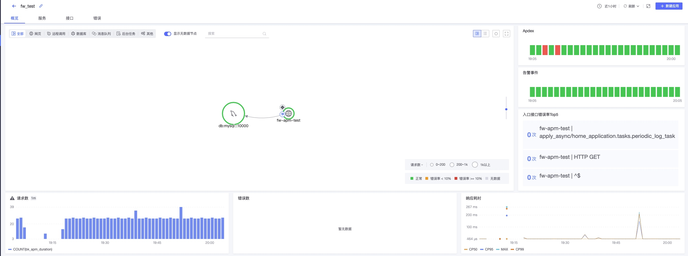

# Opentelemetry SDK ( 蓝鲸SaaS框架 ) 使用说明


## 背景

为了更好地对蓝鲸SaaS应用进行应用监控，目前已支持基于蓝鲸SaaS开发框架，通过简单的服务申请和配置，接入蓝鲸监控的应用监控服务。从而实现对SaaS应用的调用链监控，更好地保证SaaS应用的正常运行，同时在排查问题时提供更加便捷的排查手段。

本文是基于一个全新的开发框架模版，接入应用监控服务的实践过程。

## 依赖SDK说明

1. 仓库  

   [开发框架内部仓库]()
   [第三方SDK依赖列表]()
   
2. 环境依赖说明
   
   Python >= 3.6
   蓝鲸PaaS平台

## 使用案例

案例[代码仓库]()

### 数据埋点

#### 开发框架模版准备

1. 在PaaS申请app_code，并下载最新的开发框架模版，并解压。

2. 根据[蓝鲸开发框架新手指南]()将开发框架在本地跑起来。

#### 应用监控服务申请

1. 到已经支持应用监控服务的监控SaaS中，选择【观测场景】-【应用监控】-【新建应用】，根据提示填入对应app_code和SaaS基础信息，完成应用监控申请。


2. 申请完成后，点击右侧【配置】按钮，获取对应基础信息。需要重点记录上报使用的token和url信息，
 
   开发框架集成的是grpc的exporter，请选择grpc的push url。

#### 开发框架配置与数据准备

1. requirements.txt中修改blueapps依赖版本：
   
   ```
   blueapps[opentelemetry]==4.4.5
   ```
   
2. 在config/default.py文件的INSTALLED_APPS中添加：
   
   ```python
   INSTALLED_APPS += (
       ...,
       "blueapps.opentelemetry.instrument_app",
   )
   
   ENABLE_OTEL_TRACE = True
   
   BK_APP_OTEL_INSTRUMENT_DB_API = True # 是否开启 DB 访问 trace（开启后 span 数量会明显增多）
   ```
   
3. 为了对上报效果进行验证，我们在项目的操作如下：
   - 在项目入口视图打下对应日志：
   
   ```python
   # home_application/views.py
   import logging
   
   logger = logging.getLogger("root")
   
   def home(request):
       """
       首页
       """
       logger.info("A log in home view")
       return render(request, 'home_application/index_home.html')
   ```
   
   - 新增周期任务，定时打日志
     打开celery配置开关
     
     ```python
     # config/default.py
     
     IS_USE_CELERY = True
     ```
     
     添加对应进程
     
     ```yaml
     # app_desc.yaml
     spec_version: 2
     module:
       language: Python
       scripts:
         pre_release_hook: "python manage.py migrate --no-input"
       processes:
         web:
           command: gunicorn wsgi -w 4 -b :$PORT --access-logfile - --error-logfile - --access-logformat '[%(h)s] %({request_id}i)s %(u)s %(t)s "%(r)s" %(s)s %(D)s %(b)s "%(f)s" "%(a)s"'
         beat:
           command: python manage.py celery beat -l info
         worker:
           command: python manage.py celery worker -l info
     ```
     
     新增home_application/tasks.py文件：
     
     ```python
     # home_application/tasks.py
     # -*- coding: utf-8 -*-
     
     import logging
     
     from celery.schedules import crontab
     from celery.task import periodic_task
     
     logger = logging.getLogger("root")
     
     @periodic_task(run_every=crontab())
     def periodic_log_task():
         logger.info("this is a log from periodic_task")
     ```

至此，开发框架的接入和修改算是完成了，可以进行代码提交。

### 部署环境变量配置

在上云的PaaS平台中，部署前需要配置一些前置的环境变量，用上我们之前在监控申请的token和url。

在PaaS开发者中心对应的SaaS应用页面，选择【应用引擎】-【环境配置】，配置对应的环境变量：

| 变量名                      | 变量值                   | 说明                                                                                                                    |
| ------------------------ | --------------------- | --------------------------------------------------------------------------------------------------------------------- |
| PIP_VERSION              | 21.1.3                | PaaS环境要求                                                                                                              |
| CXX                      | g++                   | PaaS环境要求                                                                                                              |
| ENABLE_OTEL_TRACE        | True                  | 开启Trace，开发框架要求                                                                                                        |
| BKAPP_OTEL_SAMPLER       | parentbased_always_on | 配置采样策略，值有always_on，always_off, parentbased_always_on, parentbased_always_off, traceidratio,  parentbased_traceidratio |
| BKAPP_OTEL_BK_DATA_TOKEN | {在监控申请的token}         | 监控上报配置项                                                                                                               |
| BKAPP_OTEL_GRPC_HOST     | {在监控获取的grpc push url} | 监控上报配置项                                                                                                               |

配置完环境变量之后，点击部署即可。

### 观察数据

部署成功后，访问SaaS主页，或者隔一段时间，可以看到PaaS的【日志查询】也已经有对应的日志记录，如：


开发框架已经在日志中集成了对Trace-id的字段记录，所以点开对应的日志详情，可以看到对应日志的trace-id：


因为数据采集和展示会有一些延迟(约10min)，为了验证我们的日志已经成功上报，可以到监控中的【数据检索】-【Trace检索】输入从PaaS日志获取到的traceID，可以看到有对应的trace信息，说明日志已成功上报。


最后，在项目运行一定时间之后，我们就可以在监控的【应用监控】面板看到对应的结果展示：




### 上报说明

开发框架已经针对Trace场景帮开发者做好了集成和基础配置，尽可能打造开箱即用的体验。所以，对于上报相关的配置和细节，可以通过开发框架的源码获取。

具体上报配置可见[链接](../scene-apm/apm_monitor_overview.md)。


### 常见问题说明

1. 在将SaaS部署到PaaS线上环境之前，需要配置PIP_VERSION和CXX这两个PaaS要求的环境变量，否则可能会导致部署失败。

2. 开发框架默认的采样配置为parentbased_always_off，如果只是单系统并希望快速验证，需要将该配置调整为parentbased_always_on或always_on。在实际应用中请根据需要调整采样配置。

