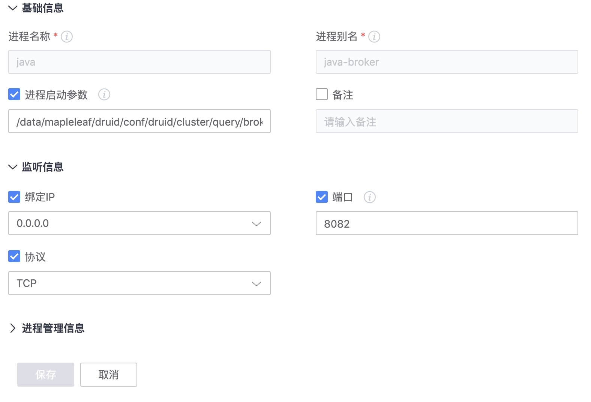

# 进程与端口监控

当前进程和端口的监控依赖 CMDB 的配置，CMDB 配置好后就可以自动采集进程相关的数据和事件。

## 第一步： 配置平台注册进程

**配置路径**： 导航  →  业务  →  1)业务拓扑  →  2)模块设置  →  4)服务实例设置  →  5)进程设置  →  6)标签设置(可选)


- 进程信息配置

  - 进程别名(必填)：对外显示的服务名，用户自定义，一般与进程实际服务名称对应，会在监控平台-主机监控-主机详情-进程服务中用于区分不同进程

  - 进程名(必填)：程序的二进制名称，可以通过 `readlink -f  /proc/${pid}/exe` 获取

  - 启动参数匹配规则(非必填、重点)：实现精确匹配进程的重要规则，主要应用于如 Java 或 Python 等二进制名重复的进程，Agent 端采集器会通过该规则去识别进程 `cmdline` 符合参数的唯一进程。如果填入的参数不唯一就会识别到多个进程，如果进程二进制名本身唯一，可不填

  - 绑定 IP(非必填)：进程实际监听的 IP 地址，可不填，如果填必须是准确对应 IP 的 地址，如 IP 错误，采集器会无法匹配进程导致数据上报异常

  - 端口(非必填)：同“绑定 IP”

  - 协议(非必填)：同“绑定 IP”

如 durid-broker 这个 java 程序：




更多其他进程配置方法请查看[各种进程配置方法](./process_cases.md)

### 服务模版

> 服务实例： 如果进程的端口，路径等信息都是一样的，建议使用服务模版，并且设置服务分类。方便后面的管理工作。如果是端口路径不一致也可以自动添加实现。


**自动下发**：

在配置平台上对进程的修改，会通过配置平台的事件推送功能自动下发至 Agent 上的 `/etc/gse/host/hostid` ，监控的进程端口采集器会捕获文件变化，做异常检测，并且将内容更新到采集器中，下发时间预计在 2 分钟内，页面进程端口更新信息在 5 分钟内。

## 第二步： 主机监控查看进程监控


- 进程：正常时标绿显示

- 端口：点击进程，正常时标绿显示，端口不存在以红色显示，被占用则是黄色，灰色说明采集器未上报数据，需要按照数据未上报流程检查

- 资源/性能：正常时图表有连续不断的数据

- 检查进程是否精确匹配：
   - 如果是二进制为 Java 或 Python 的服务，检查进程端口资源是否只上报了配置的进程，如果配置的进程是唯一的，上报进程出现复数，说明精确匹配失败，需要确认匹配参数是否唯一


### 常见问题

1. 在CMDB创建了进程名，却告警进程名不存在：机器上不存在该进程，进程名错误

2. 已在CMDB中关闭了端口，但告警进程不存在：如在CMDB中的主机上配置了进程管理，则代表机器上应该存在该进程，必须准确。即使在端口已经false的情况下，仍会报进程不存在。

3. 当前进程绑定在ipv6的IP上，但由于CMDB未支持ipv6,会导致误告，待CMDB支持ipv6

4. CMDB中配置了正确的进程端口，但仍然报告进程端口不存在，请查看/var/lib/gse/host/hostid 是否与CMDB中的一致，如不一样，是同步延迟导致

5. 相关配置位置

```
进程相关配置文件 

在CMDB创建进程后，相关配置文件会写到/var/lib/gse/host/hostid 以及 /usr/local/gse/plugins/etc/bkmonitorbeat.conf中，如下所示  

/var/lib/gse/host/hostid  
windows的路径为c:/gse/data/host/hostid

/usr/local/gse/plugins/etc/processbeat.conf  
windows的路径为 c:/gse/plugins/etc/bkmonitorbeat.conf

进程采集插件 

进程信息通过bkmonitorbeat插件采集，如进程不存在，则无法采集进行端口信息

#ps -ef |grep bkmonitorbeat
./bkmonitorbeat -c ../etc/bkmonitorbeat.conf
#ps -ef |grep bkmonitorbeat
./bkmonitorbeat -c ../etc/bkmonitorbeat.conf

```

## 第三步： 配置告警策略


如果监控进程的指标，默认会采集如下进程的指标[主机-进程-指标](./process-metrics.md)


## 相关文档

更多进程相关的采集查看场景 [如何实现多实例采集](../integrations-metrics/multi_instance_monitor.md)


