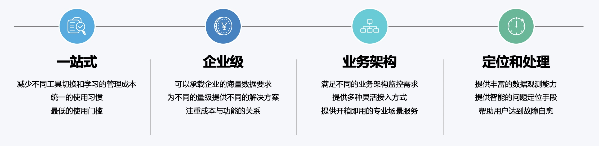
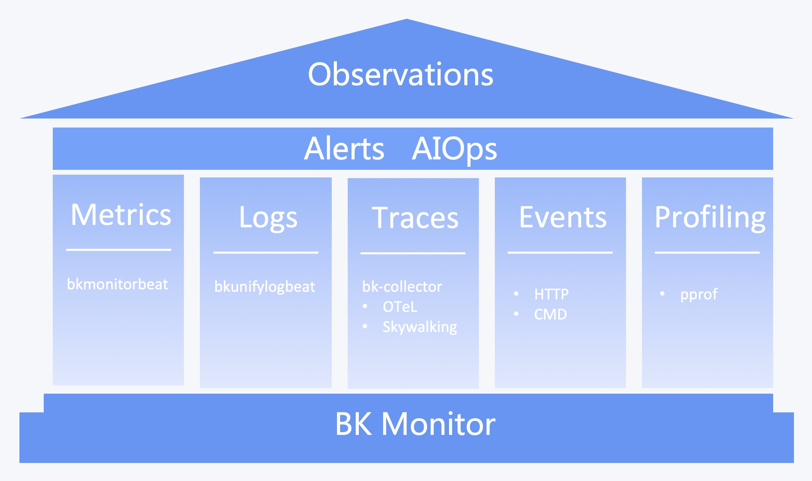

# Product Introduction

The monitoring platform is a business observation product officially launched by BlueKing. It has rich data collection capabilities, big data processing capabilities, and powerful platform expansion capabilities. Relying on BlueKing PaaS, complete closed-loop observation capabilities can be formed in the entire BlueKing ecosystem, helping businesses truly establish a business operation system covering CI-CD-CO.

The monitoring platform has the characteristics of ease of use, timeliness, accuracy, intelligence, openness, and ecology. It is committed to meeting the needs and capabilities of different monitoring scenarios, escorting online businesses, and helping the business to "strategize and win thousands of miles." outside".

**A one-stop, enterprise-level platform that meets different business structures and provides fast and accurate alarm and location processing. **

Related products:

1. Depends on PaaS, CMDB, node management, container management services, etc.
2. Log data: Log platform
3. Troubleshooting: fault self-healing
4. Intelligent monitoring: computing platform and AIOps platform
5. Peripheral services: JOB, standard operation and maintenance, ITSM, etc.

6 types of data that support observability:

1. Metrics indicator data
2. Logs log data
3. Traces call chain data
4. Events event data
5. Profiling performance data
6. Alerts alarm data

