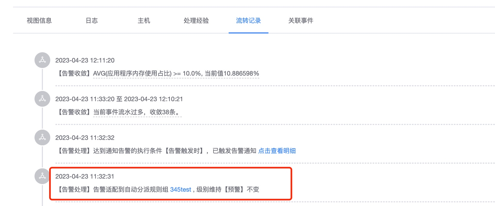

# Alarm dispatch

Alarm dispatch is a rule adaptation based on the data dimension after the alarm is generated, so that the alarm information can be accurately assigned to different handlers.

For example, the judgment logic of alarm policy configuration is the same, but the platform content needs to be received by the platform administrator. Different cluster leaders are inconsistent and need to be assigned according to the cluster that generates the alarm.

## Basic logic

The alarm dispatch configuration consists of two basic elements: **Alarm Dispatch Group** and **Dispatch Rule**.

* **Alarm dispatch group**: The priority determines the level of hit rules in the dispatch process. The higher the priority level data, the priority will be adapted. During the adaptation process of alarm dispatching, once an alarm group is hit, rule groups with lower priority will be automatically ignored.
* The rules in the alarm group will be adapted according to the matching rules set by the user and corresponding alarm processing will be performed. All rules in the group that are hit by the adaptation will have the same priority. When multiple rules in the same dispatch group are hit, it involves All notification parts will take effect at the same time, such as alarm groups, alarm upgrades, etc. To adjust the alarm level, select User Setting Level > Maintain the original alarm level. Among the levels set by the user, the highest alarm level shall prevail.

## Alarm dispatch configuration

Entry: Monitoring Configuration ->Alarm Dispatch

### Create a dispatch group

Click New to create a dispatch group. The first time default is 100. The default priority will be the existing maximum priority +5, and the maximum will not exceed 10000. The user can adjust it by himself. Alarm group name, cannot be repeated in the current space.

### Add new rule configuration

After creating a new alarm group, you will enter the rule configuration page. The general configuration is as follows

* Who to assign to: Select the alarm group, which means that after the rule is hit, notifications will be sent to the corresponding members according to the notification method in the alarm group.
* Which alarms are matched: Adaptation rules, that is, hit rules. The system summarizes some options based on existing alarms. Most of the attribute conditions can be completed by handwriting input, such as the writing of tags tags as follows (after the input is completed, press Enter to confirm) If there is no option, you can support it by manual input (after entering the key and value, you need to press Enter to confirm. tags means tags, and you need to add the prefix tags., and the dimensions can directly write the corresponding key)
* How to perform dispatch: You can set related notifications and processes. The default notification must be turned on. If not needed, you can click on the notification upgrade column to configure it.
* Whether to modify the content of the original police report: You can make some adjustments to the original police report, such as adding corresponding labels or adjusting the alarm level.

### Notify upgrade configuration

This alarm supports the notification upgrade function. That is, after the alarm is generated without any processing (confirmation or shielding) and remains abnormal, the alarm can be notified to the people who need to be notified through the notification upgrade method. The following configuration will be used when the alarm exceeds 60 If it is not processed for several minutes, a notification will be sent to operation and maintenance. Notifications are sent only once to each alarm group.

### Alarm dispatch debugging

After the alarm rules are configured, they need to be debugged before they can be saved. By debugging and taking effect, you can see how the existing alarms under the current business will adapt after adding or modifying the rules, as shown below. After debugging and there are no problems, click Valid and you can save directly.

### Alarm dispatch takes effect

After the current alarm dispatch rules are configured, historical policy alarms support dispatch by default. If alarm dispatch is not required or the original alarm notification function needs to be cancelled, it can be set in the policy configuration, as follows:

### Alarm dispatch effect

In the monitoring and processing process, if the dispatch rule is adapted, the following log will be added to the circulation record, and the assigned personnel will be added to the person in charge of the alarm. Later periodic tasks will continue to notify the corresponding person in charge.

