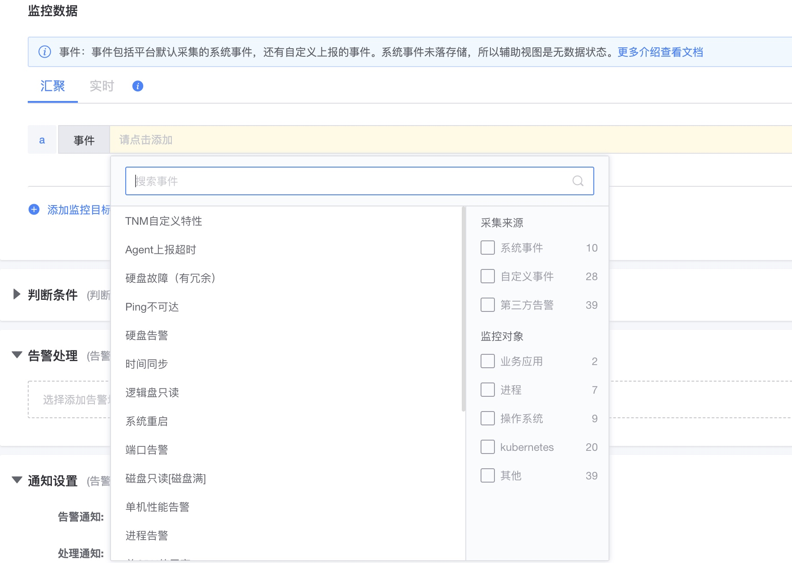

# Event alert strategy

Event data is one of the important sources of information and an indispensable data type in monitoring.

For specific event types, view [Data Model-Event Data](../../Architecture/datamodule.md)

## The difference between event data and other data

* Difference from indicators: There is only one indicator for the number of events, the others are dimensions, and the Cotent field can hold sampled detailed data.
* Difference from log: events are formatted data without all detailed content
* Difference from alarm events: Alarm events are content generated through alarm policies, or alarm events from other monitoring tools.

## Source of event data

1. Through [custom event reporting](../integrations-events/custom_events_http.md)
2. Built-in event plug-in: Log keyword event plug-in, SNMP Trap plug-in can be used through [data collection](../../ProductFeatures/integrations-metrics/collect_tasks.md)
3. System events: collected by bkmonitorbeat by default.
4. K8s events: collected by bkmonitorbeat-operator.

## Alarm configuration

Formatted event data

* The aggregation method is only COUNT

System event data

*Only supports real-time
* System events are not stored