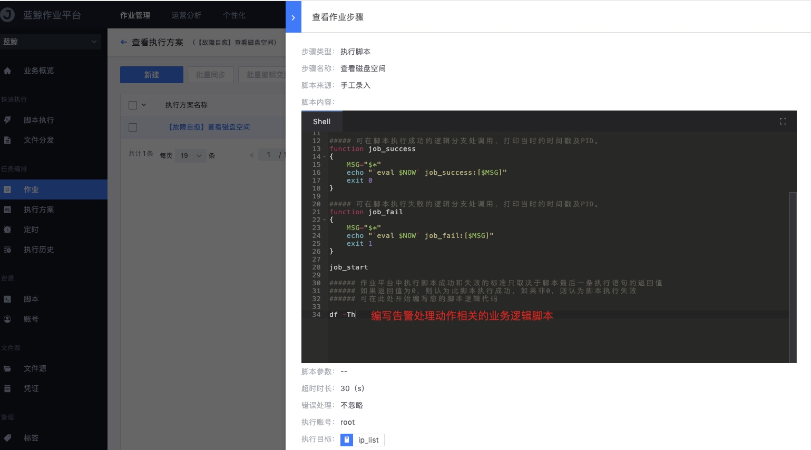

# Processing package-operation platform

Execute relevant operations through the operation platform. For documentation related to the operating platform, please refer to Operating Platform-Management and Control Operations

## Permission description

To use this function, you need to have execution permissions on the operating platform. The default permissions are as follows.

Personnel classification | Work platform permissions
---|---
Operation and maintenance personnel | Job orchestration permissions: Yes by default  Job execution permissions: Yes by default
Developer | Job Scheduling Permission: None by default  Job Execution Permission: None by default
Product Personnel | Job Scheduling Permission: None by default  Job Execution Permission: None by default

If you do not have permission, you can ask operation and maintenance personnel to write a job script and then call it in the processing package.

## Scheduling jobs

Arrange jobs and process action-related business logic.

host variables

## Add new processing package

Configuration package

global variables

debug

Debugging process

Debugging successful

Click [View job details] to view the execution process of the job

## Policy configuration

