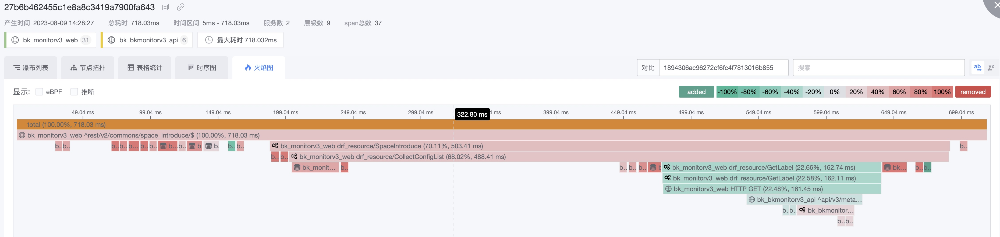
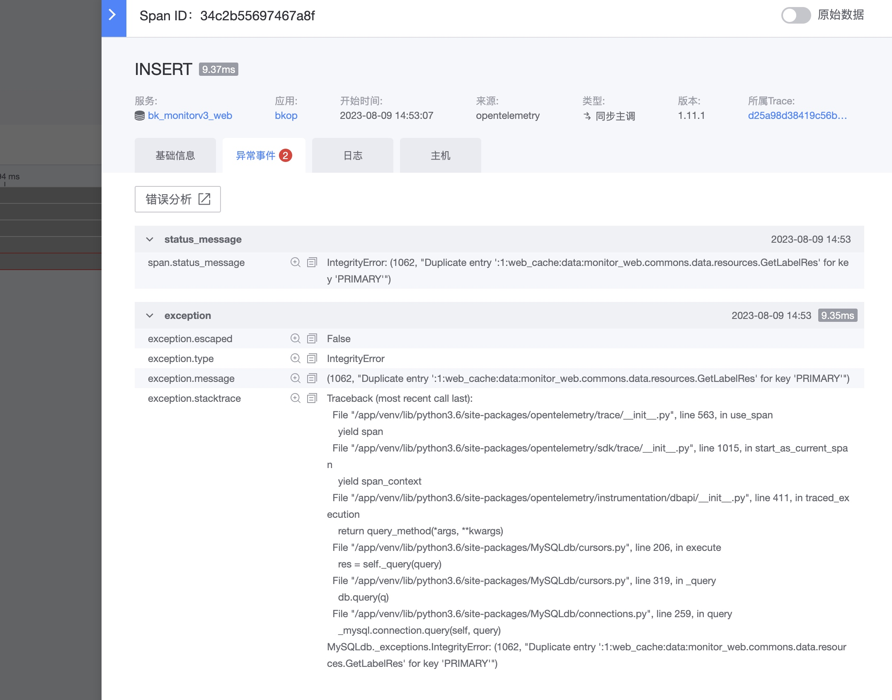

# Trace retrieval

Trace retrieval is mainly to meet the purpose of fast retrieval of Traces reported through APM. View all relevant data based on the Trace call chain. Specific data access view [turn on APM](../scene-apm/apm_monitor_overview.md)

## ID precise search and range search

- The first type: Generally, there is a clear ID. After obtaining it from the browser or log, the ID can be accurately viewed directly.

   For example, the corresponding TraceID and SpanID can be obtained in the header of http `Traceparent:00-29a543417ecfe6b3c2939ccff4ee3eba-fb11889da130bf29-01`

- The second type: no clear ID, but a rough time range, so you can view a rough situation

## Range search

1. Query conditions. There are rich query conditions that can quickly query related list data.
2. List data provides four perspectives:
     - Trace perspective: TraceID list, Span is not distinguished, the same TraceID will be gathered into one row of records
     - Span perspective: SpanID list, the most original data list, presented in one row according to SpanID, without distinguishing TraceID
     - Interface statistics: aggregation by interface dimension
     - Service statistics: aggregated by service dimensions
3. Provides some shortcut capabilities:
     - Error: Contains the case of error status_code:2 in OTel
     - Entry service: the first Service of the server process
     - Entrance interface: the first interface of the entrance service
     - Root Span: the first Span of the entire Trace

## Single Trace details
    
Four data viewing capabilities:

1. Waterfall list: There is a strict parent-child superior-subordinate relationship, which can be quickly positioned according to the upstream and downstream.
2. Node topology: Ignore the time relationship and only display the hierarchical and topological relationships between spans. The integrity is very intuitive.
3. Table statistics: Present data of different dimensions in a table, allowing you to quickly compare and view values and focus on problem points.
4. Sequence diagram: Show the relationship between calling and being called from the perspective of program implementation, and quickly check whether it is consistent with the original design.
5. Flame graph: Use a flame graph to present the time-consuming and occupying situation of Span, and quickly view key spans. And solves the rendering problem on concurrent processes.

Other advanced abilities:

1. Source: Default OTel, supports eBPF (needs to integrate DeepFlow, to be released in subsequent versions)
2. Cross-application: When a TraceID cross-application, it will be displayed, and you can view it accordingly if you have permission.
3. Inference: DB, middleware, and third parties can all be inferred from the main service.
4. Folding: In order to better view the data, different data types have corresponding folding capabilities to reduce the interference of similar data.

### Waterfall List

### Node topology

### Table Statistics

### Timing diagram

### Flame graph

## Comparison function

The comparison function mainly solves two types of problems:

1. Use a complete TraceID as a reference to find out whether there is any missing data in the current Trace.
2. Is there any change in comparison after tuning?

The comparison function only supports node topology and flame graph

## Span details

### basic information

### Abnormal events

### Logs and hosts

Logs and hosts are associated through the service configuration and will be matched based on instance information.

