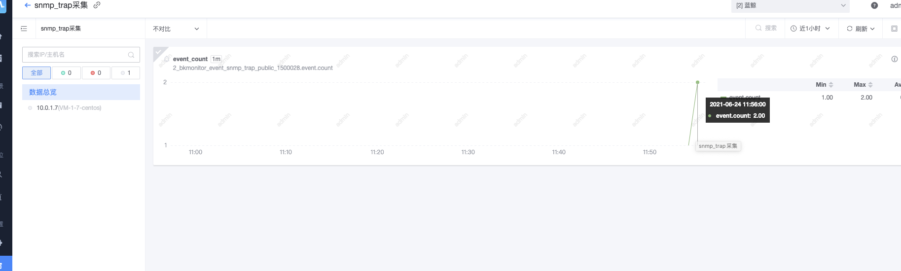

SNMP active collection instructions

### 1. Basic concepts:

#### 1.1 snmp related concepts

##### OID

The common SNMP identifier of the device. The format is a number such as 1.3.6.1. Use the snmp protocol and access the device through oid to obtain the device information under the corresponding oid, such as startup time, etc.

##### MIB library

The device oid description file officially provided by each device can be used to obtain the oid and content description information of the oid that can be used for monitoring.

##### TRAP

snmp trap is a kind of event-type snmp information. When some events occur in the corresponding device (such as the network card goes offline), snmp trap messages will be sent to the pre-configured target.

##### snmp protocol version

​ v1: It is the simplest snmp collection

    v2/v2c: The most commonly used snmp collection at this stage

    v3: The latest snmp version, adding a series of security parameters

#### 1.2 Concepts related to monitoring snmp function

##### snmp active collection

Refers to the function of monitoring and issuing a snmp_exporter, remotely actively collecting oid information of other customers' devices through the snmp protocol, and converting it into time series data indicators for reporting.

##### snmp trap collection

Refers to the function of monitoring and delivering an snmp trap server, listening on a fixed port, passively receiving snmp trap data sent from customer equipment, and converting it into custom event data for reporting.

##### generator

The snmp.yml generation tool provided by the monitoring platform can parse the MIB library and combine the corresponding indicators into a snmp.yml file.

##### generator.yml

Generator configuration file, the user needs to tell the generator which oids need to be collected in the configuration file

##### snmp.yml

The yaml configuration file required to be reported by the snmp active collection function is automatically generated by the generator or can be manually written according to certain rules. It contains all the snmp indicator information that will be collected and needs to be uploaded when configuring the plug-in.

### 2. Snmp active collection

The main logic of the snmp active collection function of the monitoring platform is:

1.generator parses the mib library to generate the snmp.yml file

2. Issue the snmp.yml file and collector, and actively collect the corresponding oid indicators for devices with snmp ports open.

#### 2.1 Generate snmp.yml file

Note, this step only provides the simplest version of the generation operation instructions. For complex operations, please refer to the generator usage introduction: https://github.com/prometheus/snmp_exporter/tree/master/generator

Use generator, based on generator.yml and mib library, to generate snmp.yml

generator.yml is an example. This file will traverse the following three nodes and all their child nodes to obtain mib information:

Note: the if_mib field cannot be modified, this field is the default field for monitoring

```yaml
modules:
   if_mib: # The module name. You can have as many modules as you want.
     walk: # List of OIDs to walk. Can also be SNMP object names or specific instances.
       - 1.3.6.1.2.1.2 # Same as "interfaces"
       - sysUpTime # Same as "1.3.6.1.2.1.1.3"
       - 1.3.6.1.2.1.310.0.0.1.6.40 # Instance of "ifHCInOctets" with index "40"
```

generator executes the command, where generator.yml is placed in the same directory as generator, so there is no need to specify parameters here.

The MIB library files used this time are stored in the mibs folder.

```cmd
MIBDIRS=mibs ./generator generate
```

Obtain the snmp.yml file as follows:

```yaml
# WARNING: This file was auto-generated using snmp_exporter generator, manual changes will be lost.
if_mib:
  walk:
  - 1.3.6.1.2.1.2
  get:
  - 1.3.6.1.2.1.1.3.0
  - 1.3.6.1.2.1.310.0.0.1.6.40
  metrics:
  - name: sysUpTime
    oid: 1.3.6.1.2.1.1.3
    type: gauge
    help: The time (in hundredths of a second) since the network management portion of the system was last re-initialized. - 1.3.6.1.2.1.1.3
  - name: ifNumber
    oid: 1.3.6.1.2.1.2.1
    type: gauge
    help: The number of network interfaces (regardless of their current state) present on this system. - 1.3.6.1.2.1.2.1
  - name: ifType
    oid: 1.3.6.1.2.1.2.2.1.3
    type: gauge
    help: The type of interface - 1.3.6.1.2.1.2.2.1.3
    indexes:
    - labelname: ifIndex
      type: gauge
    enum_values:
      1: other
      2: regular1822
      3: hdh1822
      4: ddnX25
      5: rfc877x25
      6: ethernetCsmacd
      7: iso88023Csmacd
      8: iso88024TokenBus
      9: iso88025TokenRing
      10: iso88026Man
      11: starLan
      12: proteon10Mbit
      13: proteon80Mbit
      14: hyperchannel
      15: fddi
      16: lapb
      17: sdlc
      18: ds1
      19: e1
      20: basicISDN
      21: primaryISDN
      22: propPointToPointSerial
      23: ppp
      24: softwareLoopback
      25: eon
      26: ethernet3Mbit
      27: nsip
      28: slip
      29: ultra
      30: ds3
      31: sip
      32: frameRelay
      33: rs232
      34: para
      35: arcnet
      36: arcnetPlus
      37: atm
      38: miox25
      39: sonet
      40: x25ple
      41: iso88022llc
      42: localTalk
      43: smdsDxi
      44: frameRelayService
      45: v35
      46: hssi
      47: hippi
      48: modem
      49: aal5
      50: sonetPath
      51: sonetVT
      52: smdsIcip
      53: propVirtual
      54: propMultiplexor
      55: ieee80212
      56: fibreChannel
      57: hippiInterface
      58: frameRelayInterconnect
      59: aflane8023
      60: aflane8025
      61: cctEmul
      62: fastEther
      63: isdn
      64: v11
      65: v36
      66: g703at64k
      67: g703at2mb
      68: qllc
      69: fastEtherFX
      70: channel
      71: ieee80211
      72: ibm370parChan
      73: escon
      74: dlsw
      75: isdns
      76: isdnu
      77: lapd
      78: ipSwitch
      79: rsrb
      80: atmLogical
      81: ds0
      82: ds0Bundle
      83: bsc
      84: async
      85: cnr
      86: iso88025Dtr
      87: eplrs
      88: arap
      89: propCnls
      90: hostPad
      91: termPad
      92: frameRelayMPI
      93: x213
      94: adsl
      95: radsl
      96: sdsl
      97: vdsl
      98: iso88025CRFPInt
      99: myrinet
      100: voiceEM
      101: voiceFXO
      102: voiceFXS
      103: voiceEncap
      104: voiceOverIp
      105: atmDxi
      106: atmFuni
      107: atmIma
      108: pppMultilinkBundle
      109: ipOverCdlc
      110: ipOverClaw
      111: stackToStack
      112: virtualIpAddress
      113: mpc
      114: ipOverAtm
      115: iso88025Fiber
      116: tdlc
      117: gigabitEthernet
      118: hdlc
      119: lapf
      120: v37
      121: x25mlp
      122: x25huntGroup
      123: transpHdlc
      124: interleave
      125: fast
      126: ip
      127: docsCableMaclayer
      128: docsCableDownstream
      129: docsCableUpstream
      130: a12MppSwitch
      131: tunnel
      132: coffee
      133: ces
      134: atmSubInterface
      135: l2vlan
      136: l3ipvlan
      137: l3ipxvlan
      138: digitalPowerline
      139: mediaMailOverIp
      140: dtm
      141: dcn
      142: ipForward
      143: msdsl
      144: ieee1394
      145: if-gsn
      146: dvbRccMacLayer
      147: dvbRccDownstream
      148: dvbRccUpstream
      149: atmVirtual
      150: mplsTunnel
      151: srp
      152: voiceOverAtm
      153: voiceOverFrameRelay
      154: idsl
      155: compositeLink
      156: ss7SigLink
      157: propWirelessP2P
      158: frForward
      159: rfc1483
      160: usb
      161: ieee8023adLag
      162: bgppolicyaccounting
      163: frf16MfrBundle
      164: h323Gatekeeper
      165: h323Proxy
      166: mpls
      167: mfSigLink
      168: hdsl2
      169: shdsl
      170: ds1FDL
      171: pos
      172: dvbAsiIn
      173: dvbAsiOut
      174: plc
      175: nfas
      176: tr008
      177: gr303RDT
      178: gr303IDT
      179: isup
      180: propDocsWirelessMaclayer
      181: propDocsWirelessDownstream
      182: propDocsWirelessUpstream
      183: hiperlan2
      184: propBWAp2Mp
      185: sonetOverheadChannel
      186: digitalWrapperOverheadChannel
      187: aal2
      188: radioMAC
      189: atmRadio
      190: imt
      191: mvl
      192: reachDSL
      193: frDlciEndPt
      194: atmVciEndPt
      195: opticalChannel
      196: opticalTransport
      197: propAtm
      198: voiceOverCable
      199: infiniband
      200: teLink
      201: q2931
      202: virtualTg
      203: sipTg
      204: sipSig
      205: docsCableUpstreamChannel
      206: econet
      207: pon155
      208: pon622
      209: bridge
      210: linegroup
      211: voiceEMFGD
      212: voiceFGDEANA
      213: voiceDID
      214: mpegTransport
      215: sixToFour
      216: gtp
      217: pdnEtherLoop1
      218: pdnEtherLoop2
      219: opticalChannelGroup
      220: homepna
      221: gfp
      222: ciscoISLvlan
      223: actelisMetaLOOP
      224: fcipLink
      225: rpr
      226: qam
      227: lmp
      228: cblVectaStar
      229: docsCableMCmtsDownstream
      230: adsl2
      231: macSecControlledIF
      232: macSecUncontrolledIF
      233: aviciOpticalEther
      234: atmbond
      235: voiceFGDOS
      236: mocaVersion1
      237: ieee80216WMAN
      238: adsl2plus
      239: dvbRcsMacLayer
      240: dvbTdm
      241: dvbRcsTdma
      242: x86Laps
      243: wwanPP
      244: wwanPP2
      245: voiceEBS
      246: ifPwType
      247: ilan
      248: pip
      249: aluELP
      250: gpon
      251: vdsl2
      252: capwapDot11Profile
      253: capwapDot11Bss
      254: capwapWtpVirtualRadio
      255: bits
      256: docsCableUpstreamRfPort
      257: cableDownstreamRfPort
      258: vmwareVirtualNic
      259: ieee802154
      260: otnOdu
      261: otnOtu
      262: ifVfiType
  - name: ifMtu
    oid: 1.3.6.1.2.1.2.2.1.4
    type: gauge
    help: The size of the largest packet which can be sent/received on the interface, specified in octets - 1.3.6.1.2.1.2.2.1.4
    indexes:
    - labelname: ifIndex
      type: gauge
  - name: ifSpeed
    oid: 1.3.6.1.2.1.2.2.1.5
    type: gauge
    help: An estimate of the interface's current bandwidth in bits per second - 1.3.6.1.2.1.2.2.1.5
    indexes:
    - labelname: ifIndex
      type: gauge
  - name: ifAdminStatus
    oid: 1.3.6.1.2.1.2.2.1.7
    type: gauge
    help: The desired state of the interface - 1.3.6.1.2.1.2.2.1.7
    indexes:
    - labelname: ifIndex
      type: gauge
    enum_values:
      1: up
      2: down
      3: testing
  - name: ifOperStatus
    oid: 1.3.6.1.2.1.2.2.1.8
    type: gauge
    help: The current operational state of the interface - 1.3.6.1.2.1.2.2.1.8
    indexes:
    - labelname: ifIndex
      type: gauge
    enum_values:
      1: up
      2: down
      3: testing
      4: unknown
      5: dormant
      6: notPresent
      7: lowerLayerDown
  - name: ifLastChange
    oid: 1.3.6.1.2.1.2.2.1.9
    type: gauge
    help: The value of sysUpTime at the time the interface entered its current operational state - 1.3.6.1.2.1.2.2.1.9
    indexes:
    - labelname: ifIndex
      type: gauge
  - name: ifInOctets
    oid: 1.3.6.1.2.1.2.2.1.10
    type: counter
    help: The total number of octets received on the interface, including framing characters - 1.3.6.1.2.1.2.2.1.10
    indexes:
    - labelname: ifIndex
      type: gauge
  - name: ifInUcastPkts
    oid: 1.3.6.1.2.1.2.2.1.11
    type: counter
    help: The number of packets, delivered by this sub-layer to a higher (sub-)layer, which were not addressed to a multicast or broadcast address at this sub-layer - 1.3.6.1.2.1.2.2.1.11
    indexes:
    - labelname: ifIndex
      type: gauge
  - name: ifInNUcastPkts
    oid: 1.3.6.1.2.1.2.2.1.12
    type: counter
    help: The number of packets, delivered by this sub-layer to a higher (sub-)layer, which were addressed to a multicast or broadcast address at this sub-layer - 1.3.6.1.2.1.2.2.1.12
    indexes:
    - labelname: ifIndex
      type: gauge
  - name: ifInDiscards
    oid: 1.3.6.1.2.1.2.2.1.13
    type: counter
    help: The number of inbound packets which were chosen to be discarded even though no errors had been detected to prevent their being deliverable to a higher-layer protocol - 1.3.6.1.2.1.2.2.1.13
    indexes:
    - labelname: ifIndex
      type: gauge
  - name: ifInErrors
    oid: 1.3.6.1.2.1.2.2.1.14
    type: counter
    help: For packet-oriented interfaces, the number of inbound packets that contained errors preventing them from being deliverable to a higher-layer protocol - 1.3.6.1.2.1.2.2.1.14
    indexes:
    - labelname: ifIndex
      type: gauge
  - name: ifInUnknownProtos
    oid: 1.3.6.1.2.1.2.2.1.15
    type: counter
    help: For packet-oriented interfaces, the number of packets received via the interface which were discarded because of an unknown or unsupported protocol - 1.3.6.1.2.1.2.2.1.15
    indexes:
    - labelname: ifIndex
      type: gauge
  - name: ifOutOctets
    oid: 1.3.6.1.2.1.2.2.1.16
    type: counter
    help: The total number of octets transmitted out of the interface, including framing characters - 1.3.6.1.2.1.2.2.1.16
    indexes:
    - labelname: ifIndex
      type: gauge
  - name: ifOutUcastPkts
    oid: 1.3.6.1.2.1.2.2.1.17
    type: counter
    help: The total number of packets that higher-level protocols requested be transmitted, and which were not addressed to a multicast or broadcast address at this sub-layer, including those that were discarded or not sent - 1.3.6.1.2.1.2.2.1.17
    indexes:
    - labelname: ifIndex
      type: gauge
  - name: ifOutNUcastPkts
    oid: 1.3.6.1.2.1.2.2.1.18
    type: counter
    help: The total number of packets that higher-level protocols requested be transmitted, and which were addressed to a multicast or broadcast address at this sub-layer, including those that were discarded or not sent - 1.3.6.1.2.1.2.2.1.18
    indexes:
    - labelname: ifIndex
      type: gauge
  - name: ifOutDiscards
    oid: 1.3.6.1.2.1.2.2.1.19
    type: counter
    help: The number of outbound packets which were chosen to be discarded even though no errors had been detected to prevent their being transmitted - 1.3.6.1.2.1.2.2.1.19
    indexes:
    - labelname: ifIndex
      type: gauge
  - name: ifOutErrors
    oid: 1.3.6.1.2.1.2.2.1.20
    type: counter
    help: For packet-oriented interfaces, the number of outbound packets that could not be transmitted because of errors - 1.3.6.1.2.1.2.2.1.20
    indexes:
    - labelname: ifIndex
      type: gauge
  - name: ifOutQLen
    oid: 1.3.6.1.2.1.2.2.1.21
    type: gauge
    help: The length of the output packet queue (in packets). - 1.3.6.1.2.1.2.2.1.21
    indexes:
    - labelname: ifIndex
      type: gauge
  - name: ifHCInOctets
    oid: 1.3.6.1.2.1.310.0.0.1.6
    type: counter
    help: The total number of octets received on the interface, including framing characters - 1.3.6.1.2.1.310.0.0.1.6
    indexes:
    - labelname: ifIndex
      type: gauge

```


#### 2.2 Create snmp plug-in

Through the monitoring platform plug-in page, create a new snmp plug-in and upload the snmp.yml file


Click Next to proceed with debugging

* Parameter Description:

     * Listening port: The port provided to the monitoring collector, as long as it is available

     * Binding address: Provide the IP used by the monitoring collector, as long as it is available

     * community: community name, unique authentication information of snmpv2 version

     

* After clicking to start debugging, you will enter the debug process

     

After passing the test, you will jump to the indicator adjustment interface. At this time, you can delete the indicators according to your needs.

Note: Adding additional indicators is invalid and cannot be collected. Please add complete indicators when generating snmp.yml.


After confirming that the indicators are correct, click Save to complete the plug-in creation.


#### 2.3 Deliver collection

On the new collection page, select the snmp plug-in just created to configure the collection.


Click Next to select the target device and collector to deliver to the host.

Note that only one collector host can be selected, and multiple device IPs can be selected.


Start delivery and wait for delivery to end


After the delivery is completed, check the view to view the collected data.


#### 2.4 Configuration strategy


#### 2.5 Observe alarms


### 3. snmp trap collection

#### 3.1 Generate snmp.yml file

generator.yml

```yaml
modules:
   if_mib: # The module name. You can have as many modules as you want.
     walk: # List of OIDs to walk. Can also be SNMP object names or specific instances.
       - 1.3.6.1.2.1.2 # Same as "interfaces"
       - sysUpTime # Same as "1.3.6.1.2.1.1.3"
       - 1.3.6.1.2.1.310.0.0.1.6.40 # Instance of "ifHCInOctets" with index "40"
```

Use commands. Please note the difference between the commands used here and active collection.

```cmd
MIBDIRS=mibs ./generator all
```

snmp trap uses more snmp.yml indicators than active collection, because active collection filters out some unnecessary indicators:

```yaml
asic_name:
  metrics:
  - name: dot1dNotifications
    oid: 1.3.6.1.2.1.17.0
    type: OTHER
    help: ""
  - name: risingAlarm
    oid: 1.3.6.1.2.1.16.0.1
    type: NOTIFTYPE
    help: ""
  - name: ssSwapOut
    oid: 1.3.6.1.4.1.2021.11.4
    type: INTEGER32
    help: ""
  - name: logMatchMaxEntries
    oid: 1.3.6.1.4.1.2021.16.1
    type: INTEGER32
    help: ""
  - name: snmpSet
    oid: 1.3.6.1.6.3.1.1.6
    type: OTHER
    help: ""
  - name: dot3Compliance2
    oid: 1.3.6.1.2.1.35.2.2.4
    type: MODCOMP
    help: ""
  - name: ipIfStatsInNoRoutes
    oid: 1.3.6.1.2.1.4.31.3.1.8
    type: COUNTER
    help: ""
  - name: transportDomainSctpIpv4
    oid: 1.3.6.1.2.1.100.1.9
    type: OBJIDENTITY
    help: ""
  - name: ipv6IfStatsInTooBigErrors
    oid: 1.3.6.1.2.1.55.1.6.1.3
    type: COUNTER
    help: ""
  - name: nsExtendOutNumLines
    oid: 1.3.6.1.4.1.8072.1.3.2.3.1.3
    type: INTEGER32
    help: ""
  - name: icmpStatsOutMsgs
    oid: 1.3.6.1.2.1.5.29.1.4
    type: COUNTER
    help: ""
  - name: snmpNotifyBasicCompliance
    oid: 1.3.6.1.6.3.13.3.1.1
    type: MODCOMP
    help: ""
  - name: ipv6IfReasmMaxSize
    oid: 1.3.6.1.2.1.55.1.5.1.5
    type: UNSIGNED32
    help: ""
  - name: logMatch
    oid: 1.3.6.1.4.1.2021.16
    type: OTHER
    help: ""
  - name: snmpNotifyEntry
    oid: 1.3.6.1.6.3.13.1.1.1
    type: OTHER
    help: ""
  - name: ipv6IfIcmpOutEchos
    oid: 1.3.6.1.2.1.56.1.1.1.25
    type: COUNTER
    help: ""
  - name: icmpOutAddrMaskReps
    oid: 1.3.6.1.2.1.5.26
    type: COUNTER
    help: ""
  - name: tunnelConfigRemoteAddress
    oid: 1.3.6.1.2.1.10.10.0.0.1.2.1.2
    type: IPADDR
    help: ""
  - name: sctpStatsGroup
    oid: 1.3.6.1.2.1.104.2.2.2
    type: OBJGROUP
    help: ""
  - name: hostTopNEntry
    oid: 1.3.6.1.2.1.16.5.2.1
    type: OTHER
    help: ""
  - name: hrSystemGroup
    oid: 1.3.6.1.2.1.25.7.3.1
    type: OBJGROUP
    help: ""
  - name: alarmTable
    oid: 1.3.6.1.2.1.16.3.1
    type: OTHER
    help: ""
  - name: bufferControlIndex
    oid: 1.3.6.1.2.1.16.8.1.1.1
    type: INTEGER32
    help: ""
  - name: smRunResult
    oid: 1.3.6.1.2.1.64.1.4.2.1.8
    type: OCTETSTR
    help: ""
  - name: tcpHCGroup
    oid: 1.3.6.1.2.1.49.2.2.5
    type: OBJGROUP
    help: ""
  - name: nlmLogContextEngineID
    oid: 1.3.6.1.2.1.92.1.3.1.1.7
    type: OCTETSTR
    help: ""
  - name: snmpTargetParamsMPModel
    oid: 1.3.6.1.6.3.12.1.3.1.2
    type: INTEGER
    help: ""
  - name: snmpTargetParamsSecurityLevel
    oid: 1.3.6.1.6.3.12.1.3.1.5
    type: INTEGER
    help: ""
  - name: alarmRisingThreshold
    oid: 1.3.6.1.2.1.16.3.1.1.7
    type: INTEGER32
    help: ""
  - name: memBuffer
    oid: 1.3.6.1.4.1.2021.4.14
    type: INTEGER32
    help: ""
  - name: ipv4GeneralGroup
    oid: 1.3.6.1.2.1.48.2.2.3
    type: OBJGROUP
    help: ""
  - name: ipForwardNextHopAS
    oid: 1.3.6.1.2.1.4.24.2.1.10
    type: INTEGER32
    help: ""
  - name: ipv6InterfaceRetransmitTime
    oid: 1.3.6.1.2.1.4.30.1.7
    type: UNSIGNED32
    help: ""
  - name: sunos4
    oid: 1.3.6.1.4.1.8072.3.2.2
    type: OTHER
    help: ""
  - name: sctpLayerParamsGroup
    oid: 1.3.6.1.2.1.104.2.2.1
    type: OBJGROUP
    help: ""
  - name: ianaLangSRSL
    oid: 1.3.6.1.2.1.73.5
    type: OBJIDENTITY
    help: ""
  - name: eventOwner
    oid: 1.3.6.1.2.1.16.9.1.1.6
    type: OCTETSTR
    help: ""
  - name: physicalInterfaceNumTXError
    oid: 1.3.6.1.4.1.63.501.3.4.2.1.9
    type: INTEGER
    help: ""
  - name: nsDebugGroup
    oid: 1.3.6.1.4.1.8072.5.2.7.1
    type: OBJGROUP
    help: ""
  - name: dskAvailHigh
    oid: 1.3.6.1.4.1.2021.9.1.14
    type: UNSIGNED32
    help: ""
  - name: sctpRtoMax
    oid: 1.3.6.1.2.1.104.1.2.3
    type: UNSIGNED32
    help: ""
  - name: versionConfigureOptions
    oid: 1.3.6.1.4.1.2021.100.6
    type: DisplayString
    help: ""
  - name: vacmAccessWriteViewName
    oid: 1.3.6.1.6.3.16.1.4.1.6
    type: DisplayString
    help: ""
  - name: ianaLangPerl
    oid: 1.3.6.1.2.1.73.3
    type: OBJIDENTITY
    help: ""
  - name: historyControlIndex
    oid: 1.3.6.1.2.1.16.2.1.1.1
    type: INTEGER32
    help: ""
  - name: ifLastChange
    oid: 1.3.6.1.2.1.2.2.1.9
    type: TIMETICKS
    help: ""
  - name: dot3PauseEntry
    oid: 1.3.6.1.2.1.10.7.10.1
    type: OTHER
    help: ""
  - name: sctpAssocRemAddrStartTime
    oid: 1.3.6.1.2.1.104.1.5.1.8
    type: TIMETICKS
    help: ""
  - name: inetCidrRouteNextHopType
    oid: 1.3.6.1.2.1.4.24.7.1.5
    type: INTEGER
    help: ""
  - name: channelDataControl
    oid: 1.3.6.1.2.1.16.7.2.1.4
    type: INTEGER
    help: ""
  - name: tcpListenerLocalAddress
    oid: 1.3.6.1.2.1.6.20.1.2
    type: InetAddress
    help: ""
  - name: ifTestStatus
    oid: 1.3.6.1.2.1.31.1.3.1.2
    type: INTEGER
    help: ""
  - name: ipFwAccDstAddr
    oid: 1.3.6.1.4.1.2021.13.1.1.1.4
    type: IPADDR
    help: ""
  - name: ipDefaultRouterGroup
    oid: 1.3.6.1.2.1.48.2.2.22
    type: OBJGROUP
    help: ""
  - name: bufferControlTable
    oid: 1.3.6.1.2.1.16.8.1
    type: OTHER
    help: ""
  - name: captureBufferPacketID
    oid: 1.3.6.1.2.1.16.8.2.1.3
    type: INTEGER32
    help: ""
  - name: snmpTargetAddrRetryCount
    oid: 1.3.6.1.6.3.12.1.2.1.5
    type: INTEGER32
    help: ""
  - name: nlmLogVariableCounter64Val
    oid: 1.3.6.1.2.1.92.1.3.2.1.11
    type: COUNTER64
    help: ""
  - name: ipv6TcpConnEntry
    oid: 1.3.6.1.2.1.6.16.1
    type: OTHER
    help: ""
  - name: captureBufferEntry
    oid: 1.3.6.1.2.1.16.8.2.1
    type: OTHER
    help: ""
  - name: agentxSessionDescr
    oid: 1.3.6.1.2.1.74.1.3.2.1.3
    type: DisplayString
    help: ""
  - name: nlmLogVariableOpaqueVal
    oid: 1.3.6.1.2.1.92.1.3.2.1.12
    type: OPAQUE
    help: ""
  - name: ipIfStatsInMcastOctets
    oid: 1.3.6.1.2.1.4.31.3.1.36
    type: COUNTER
    help: ""
  - name: mrModuleName
    oid: 1.3.6.1.4.1.2021.102.1.2
    type: DisplayString
    help: ""
  - name: hrFSFat
    oid: 1.3.6.1.2.1.25.3.9.5
    type: OBJIDENTITY
    help: ""
  - name: smTraps
    oid: 1.3.6.1.2.1.64.2.0
    type: OTHER
    help: ""
  - name: event
    oid: 1.3.6.1.2.1.16.9
    type: OTHER
    help: ""
  - name: mteTriggerBooleanEntry
    oid: 1.3.6.1.2.1.88.1.2.5.1
    type: OTHER
    help: ""
  - name: netSnmpUnixDomain
    oid: 1.3.6.1.4.1.8072.3.3.2
    type: OTHER
    help: ""
  - name: ucdShutdown
    oid: 1.3.6.1.4.1.2021.251.2
    type: NOTIFTYPE
    help: ""
  - name: tunnelInetConfigStatus
    oid: 1.3.6.1.2.1.10.10.0.0.1.3.1.7
    type: INTEGER
    help: ""
  - name: nsCacheEnabled
    oid: 1.3.6.1.4.1.8072.1.5.2
    type: INTEGER
    help: ""
  - name: dot1dStpPortDesignatedRoot
    oid: 1.3.6.1.2.1.17.2.15.1.6
    type: OCTETSTR
    help: ""
  - name: ipFwAccViaAddr
    oid: 1.3.6.1.4.1.2021.13.1.1.1.7
    type: IPADDR
    help: ""
  - name: logMatchCycle
    oid: 1.3.6.1.4.1.2021.16.2.1.11
    type: INTEGER32
    help: ""
  - name: sctpAssocRemAddrRTO
    oid: 1.3.6.1.2.1.104.1.5.1.5
    type: UNSIGNED32
    help: ""
  - name: hrPartitionIndex
    oid: 1.3.6.1.2.1.25.3.7.1.1
    type: INTEGER32
    help: ""
  - name: ipv6RouterAdvertMaxInterval
    oid: 1.3.6.1.2.1.4.39.1.3
    type: UNSIGNED32
    help: ""
  - name: tunnelMIBInetGroup
    oid: 1.3.6.1.2.1.10.0.0.1.2.2
    type: OBJGROUP
    help: ""
  - name: physicalInterfaceSpeed
    oid: 1.3.6.1.4.1.63.501.3.4.2.1.4
    type: INTEGER
    help: ""
  - name: snmpProxyCompliances
    oid: 1.3.6.1.6.3.14.3.1
    type: OTHER
    help: ""
  - name: hrPrinterStatus
    oid: 1.3.6.1.2.1.25.3.5.1.1
    type: INTEGER
    help: ""
  - name: ipNetToMediaTable
    oid: 1.3.6.1.2.1.4.22
    type: OTHER
    help: ""
  - name: udpEndpointLocalPort
    oid: 1.3.6.1.2.1.7.7.1.3
    type: UNSIGNED32
    help: ""
  - name: snmpProxyObjects
    oid: 1.3.6.1.6.3.14.1
    type: OTHER
    help: ""
  - name: ucdavis
    oid: 1.3.6.1.4.1.2021
    type: MODID
    help: ""
  - name: memSwapErrorMsg
    oid: 1.3.6.1.4.1.2021.4.101
    type: DisplayString
    help: ""
  - name: hrFSHPFS
    oid: 1.3.6.1.2.1.25.3.9.6
    type: OBJIDENTITY
    help: ""
  - name: icmpMsgStatsTable
    oid: 1.3.6.1.2.1.5.30
    type: OTHER
    help: ""
  - name: ifHCOutMulticastPkts
    oid: 1.3.6.1.2.1.310.0.0.1.12
    type: COUNTER64
    help: ""
  - name: memTotalSwap
    oid: 1.3.6.1.4.1.2021.4.3
    type: INTEGER32
    help: ""
  - name: smExtsnVendor
    oid: 1.3.6.1.2.1.64.1.2.1.4
    type: OBJID
    help: ""
  - name: ipv6IfIcmpTable
    oid: 1.3.6.1.2.1.56.1.1
    type: OTHER
    help: ""
  - name: ipv6RouteEntry
    oid: 1.3.6.1.2.1.55.1.11.1
    type: OTHER
    help: ""
  - name: etherStats100MbsGroup
    oid: 1.3.6.1.2.1.35.2.1.3
    type: OBJGROUP
    help: ""
  - name: hrSWInstalledType
    oid: 1.3.6.1.2.1.25.6.3.1.4
    type: INTEGER
    help: ""
  - name: tunnelConfigTable
    oid: 1.3.6.1.2.1.10.10.0.0.1.2
    type: OTHER
    help: ""
  - name: alarmSampleType
    oid: 1.3.6.1.2.1.16.3.1.1.4
    type: INTEGER
    help: ""
  - name: ipv6IfIcmpInEchos
    oid: 1.3.6.1.2.1.56.1.1.1.8
    type: COUNTER
    help: ""
  - name: dot1dStpPortPathCost
    oid: 1.3.6.1.2.1.17.2.15.1.5
    type: INTEGER32
    help: ""
  - name: wirelessPhysAddress
    oid: 1.3.6.1.4.1.63.501.3.2.2.1.1
    type: PhysAddress48
    help: ""
  - name: nlmLogVariableEntry
    oid: 1.3.6.1.2.1.92.1.3.2.1
    type: OTHER
    help: ""
  - name: ipv6IfIcmpOutRouterAdvertisements
    oid: 1.3.6.1.2.1.56.1.1.1.28
    type: COUNTER
    help: ""
  - name: matrixControlIndex
    oid: 1.3.6.1.2.1.16.6.1.1.1
    type: INTEGER32
    help: ""
  - name: sysLocation
    oid: 1.3.6.1.2.1.1.6
    type: DisplayString
    help: ""
  - name: agentxConnection
    oid: 1.3.6.1.2.1.74.1.2
    type: OTHER
    help: ""
  - name: mteTriggerThresholdStartup
    oid: 1.3.6.1.2.1.88.1.2.6.1.1
    type: INTEGER
    help: ""
  - name: snmpFrameworkMIBGroups
    oid: 1.3.6.1.6.3.10.3.2
    type: OTHER
    help: ""
  - name: sctpAssocT1expireds
    oid: 1.3.6.1.2.1.104.1.3.1.13
    type: COUNTER
    help: ""
  - name: ipv6IfIcmpOutPktTooBigs
    oid: 1.3.6.1.2.1.56.1.1.1.24
    type: COUNTER
    help: ""
  - name: dot3ControlTable
    oid: 1.3.6.1.2.1.10.7.9
    type: OTHER
    help: ""
  - name: nlmConfigLogEntryLimit
    oid: 1.3.6.1.2.1.92.1.1.3.1.3
    type: UNSIGNED32
    help: ""
  - name: ipIfStatsIPVersion
    oid: 1.3.6.1.2.1.4.31.3.1.1
    type: INTEGER
    help: ""
  - name: nsIETFWGChair2
    oid: 1.3.6.1.4.1.8072.2.2.1.1.3
    type: OCTETSTR
    help: ""
  - name: versionSavePersistentData
    oid: 1.3.6.1.4.1.2021.100.13
    type: INTEGER32
    help: ""
  - name: ipAddressPrefixAdvValidLifetime
    oid: 1.3.6.1.2.1.4.32.1.9
    type: UNSIGNED32
    help: ""
  - name: dot3StatsDeferredTransmissions
    oid: 1.3.6.1.2.1.10.7.2.1.7
    type: COUNTER
    help: ""
  - name: alarmOwner
    oid: 1.3.6.1.2.1.16.3.1.1.11
    type: OCTETSTR
    help: ""
  - name: snmpOutGenErrs
    oid: 1.3.6.1.2.1.11.24
    type: COUNTER
    help: ""
  - name: agentxRegistration
    oid: 1.3.6.1.2.1.74.1.4
    type: OTHER
    help: ""
  - name: bufferControlDownloadSliceSize
    oid: 1.3.6.1.2.1.16.8.1.1.6
    type: INTEGER32
    help: ""
  - name: ipLastChangeGroup
    oid: 1.3.6.1.2.1.48.2.2.7
    type: OBJGROUP
    help: ""
  - name: hostCreationOrder
    oid: 1.3.6.1.2.1.16.4.2.1.2
    type: INTEGER32
    help: ""
  - name: ifSpeed
    oid: 1.3.6.1.2.1.2.2.1.5
    type: GAUGE
    help: ""
  - name: netSnmpObjects
    oid: 1.3.6.1.4.1.8072.1
    type: OTHER
    help: ""
  - name: schedNotificationsGroup
    oid: 1.3.6.1.2.1.63.3.2.3
    type: NOTIFGROUP
    help: ""
  - name: ipv6IfOperStatus
    oid: 1.3.6.1.2.1.55.1.5.1.10
    type: INTEGER
    help: ""
  - name: hostControlDataSource
    oid: 1.3.6.1.2.1.16.4.1.1.2
    type: OBJID
    help: ""
  - name: tunnelInetConfigIfIndex
    oid: 1.3.6.1.2.1.10.10.0.0.1.3.1.6
    type: INTEGER32
    help: ""
  - name: logMatchName
    oid: 1.3.6.1.4.1.2021.16.2.1.2
    type: DisplayString
    help: ""
  - name: snmpUnavailableContexts
    oid: 1.3.6.1.6.3.12.1.4
    type: COUNTER
    help: ""
  - name: udpLocalAddress
    oid: 1.3.6.1.2.1.7.5.1.1
    type: IPADDR
    help: ""
  - name: netSnmpTLSTCPDomain
    oid: 1.3.6.1.4.1.8072.3.3.10
    type: OTHER
    help: ""
  - name: hrSystem
    oid: 1.3.6.1.2.1.25.1
    type: OTHER
    help: ""
  - name: filterStatus
    oid: 1.3.6.1.2.1.16.7.1.1.11
    type: INTEGER
    help: ""
  - name: system
    oid: 1.3.6.1.2.1.1
    type: OTHER
    help: ""
  - name: dot3HCStatsSymbolErrors
    oid: 1.3.6.1.2.1.10.7.11.1.6
    type: COUNTER64
    help: ""
  - name: netSnmpTCs
    oid: 1.3.6.1.4.1.8072.3.1.1
    type: MODID
    help: ""
  - name: dskDevice
    oid: 1.3.6.1.4.1.2021.9.1.3
    type: DisplayString
    help: ""
  - name: snmpEngine
    oid: 1.3.6.1.6.3.10.2.1
    type: OTHER
    help: ""
  - name: ipSystemStatsInDelivers
    oid: 1.3.6.1.2.1.4.310.0.0.18
    type: COUNTER
    help: ""
  - name: udpLocalPort
    oid: 1.3.6.1.2.1.7.5.1.2
    type: INTEGER32
    help: ""
  - name: hostControlStatus
    oid: 1.3.6.1.2.1.16.4.1.1.6
    type: INTEGER
    help: ""
  - name: snmpCommunityMIBCompliances
    oid: 1.3.6.1.6.3.18.2.1
    type: OTHER
    help: ""
  - name: ipv6IfIcmpOutGroupMembReductions
    oid: 1.3.6.1.2.1.56.1.1.1.34
    type: COUNTER
    help: ""
  - name: tunnelIfEntry
    oid: 1.3.6.1.2.1.10.10.0.0.1.1.1
    type: OTHER
    help: ""
  - name: snmpNotifyGroups
    oid: 1.3.6.1.6.3.13.3.2
    type: OTHER
    help: ""
  - name: bsdi
    oid: 1.3.6.1.4.1.2021.250.11
    type: OTHER
    help: ""
  - name: laErrMessage
    oid: 1.3.6.1.4.1.2021.10.1.101
    type: DisplayString
    help: ""
  - name: eventStatus
    oid: 1.3.6.1.2.1.16.9.1.1.7
    type: INTEGER
    help: ""
  - name: ifOldObjectsGroup
    oid: 1.3.6.1.2.1.31.2.1.12
    type: OBJGROUP
    help: ""
  - name: tunnelConfigStatus
    oid: 1.3.6.1.2.1.10.10.0.0.1.2.1.6
    type: INTEGER
    help: ""
  - name: hrSWOSIndex
    oid: 1.3.6.1.2.1.25.4.1
    type: INTEGER32
    help: ""
  - name: rfc1157Proxy
    oid: 1.3.6.1.6.2.1
    type: OTHER
    help: ""
  - name: snmpNotifyFilterSubtree
    oid: 1.3.6.1.6.3.13.1.3.1.1
    type: OBJID
    help: ""
  - name: hrFSDFS
    oid: 1.3.6.1.2.1.25.3.9.17
    type: OBJIDENTITY
    help: ""
  - name: egpNeighIntervalPoll
    oid: 1.3.6.1.2.1.8.5.1.13
    type: INTEGER
    help: ""
  - name: udpInDatagrams
    oid: 1.3.6.1.2.1.7.1
    type: COUNTER
    help: ""
  - name: prErrFixCmd
    oid: 1.3.6.1.4.1.2021.2.1.103
    type: DisplayString
    help: ""
  - name: ipFwAccNrSrcPorts
    oid: 1.3.6.1.4.1.2021.13.10.0.0.13
    type: INTEGER32
    help: ""
  - name: icmpStatsInMsgs
    oid: 1.3.6.1.2.1.5.29.1.2
    type: COUNTER
    help: ""
  - name: hostTopNIndex
    oid: 1.3.6.1.2.1.16.5.2.1.2
    type: INTEGER32
    help: ""
  - name: sysOREntry
    oid: 1.3.6.1.2.1.1.9.1
    type: OTHER
    help: ""
  - name: smLangLanguage
    oid: 1.3.6.1.2.1.64.1.1.1.2
    type: OBJID
    help: ""
  - name: smScriptRowStatus
    oid: 1.3.6.1.2.1.64.1.3.1.1.9
    type: INTEGER
    help: ""
  - name: ipNetToPhysicalType
    oid: 1.3.6.1.2.1.4.35.1.6
    type: INTEGER
    help: ""
  - name: ucdDemoResetKeys
    oid: 1.3.6.1.4.1.2021.14.1.1.1
    type: INTEGER32
    help: ""
  - name: ifCompliance2
    oid: 1.3.6.1.2.1.31.2.2.2
    type: MODCOMP
    help: ""
  - name: agentxRegIndex
    oid: 1.3.6.1.2.1.74.1.4.2.1.1
    type: UNSIGNED32
    help: ""
  - name: ipAddressPrefixTable
    oid: 1.3.6.1.2.1.4.32
    type: OTHER
    help: ""
  - name: icmpInTimestamps
    oid: 1.3.6.1.2.1.5.10
    type: COUNTER
    help: ""
  - name: physicalInterfaceIndex
    oid: 1.3.6.1.4.1.63.501.3.4.2.1.1
    type: INTEGER
    help: ""
  - name: netSnmpPassOID
    oid: 1.3.6.1.4.1.8072.2.255.2.1.3
    type: OBJID
    help: ""
  - name: sctpMIB
    oid: 1.3.6.1.2.1.104
    type: MODID
    help: ""
  - name: nlmLogVariableInteger32Val
    oid: 1.3.6.1.2.1.92.1.3.2.1.7
    type: INTEGER32
    help: ""
  - name: netSnmpIETFWGTable
    oid: 1.3.6.1.4.1.8072.2.2.1
    type: OTHER
    help: ""
  - name: logMatchTable
    oid: 1.3.6.1.4.1.2021.16.2
    type: OTHER
    help: ""
  - name: ipv6UdpIfIndex
    oid: 1.3.6.1.2.1.7.6.1.3
    type: INTEGER32
    help: ""
  - name: mteTriggerObjects
    oid: 1.3.6.1.2.1.88.1.2.2.1.13
    type: DisplayString
    help: ""
  - name: tcpMaxConn
    oid: 1.3.6.1.2.1.6.4
    type: INTEGER32
    help: ""
  - name: tcpConnLocalAddress
    oid: 1.3.6.1.2.1.6.13.1.2
    type: IPADDR
    help: ""
  - name: hostTopNDuration
    oid: 1.3.6.1.2.1.16.5.1.1.5
    type: INTEGER32
    help: ""
  - name: ifLinkUpDownTrapEnable
    oid: 1.3.6.1.2.1.310.0.0.1.14
    type: INTEGER
    help: ""
  - name: netbsd1
    oid: 1.3.6.1.4.1.2021.250.7
    type: OTHER
    help: ""
  - name: ipv6IcmpConformance
    oid: 1.3.6.1.2.1.56.2
    type: OTHER
    help: ""
  - name: ipForwardIfIndex
    oid: 1.3.6.1.2.1.4.24.2.1.5
    type: INTEGER32
    help: ""
  - name: netSnmpCallbackDomain
    oid: 1.3.6.1.4.1.8072.3.3.6
    type: OTHER
    help: ""
  - name: hrSWRunTable
    oid: 1.3.6.1.2.1.25.4.2
    type: OTHER
    help: ""
  - name: ipv6IfStatsInDiscards
    oid: 1.3.6.1.2.1.55.1.6.1.8
    type: COUNTER
    help: ""
  - name: ipv6TcpCompliances
    oid: 1.3.6.1.3.86.2.1
    type: OTHER
    help: ""
  - name: ipv6NetToMediaNetAddress
    oid: 1.3.6.1.2.1.55.1.12.1.1
    type: OCTETSTR
    help: ""
  - name: captureBufferPacketData
```
#### 3.2 Deliver trap tasks

Unlike snmp active collection, trap does not require manual creation of plug-ins. You can directly use the built-in plug-in and deliver it with snmp.yml:


After delivery, you can see in the inspection view whether there are events reported at the corresponding time point and how many times they have been reported.



#### 3.3 Configuration strategy

Note that the trap strategy belongs to the log keyword category


Configure alarms


#### 3.4 Observe alarms


### 4. Certification related

SNMP active collection and trap use the same authentication parameters, which are discussed together here.

The snmp authentication information is defined by the customer device and then filled in the monitoring collection configuration.

#### snmp v1 and snmp v2

There is only one field for authentication of these two protocols, namely community, which is translated into Chinese as community name.

Note 1: SNMP active collection uses the community name as the authentication of the collection device, so it is required.

Note 2: snmptrap uses the community name as a filtering measure for trap data, so it can be left blank. If not filled in, it will be regarded as receiving traps from all groups. **Multiple community names that need to be filtered can be separated by commas**


#### snmp v3

The snmp authentication of the v3 version is relatively complicated, including, for specific meanings, please refer to the relevant documents of the snmp protocol.

- Context name Context name
- Security name Security name
- Security level, options are noAuthNoPriv, authNoPriv, authPriv
- Authentication protocol, options include MD5, SHA
- Authentication passphrase
- Privacy protocol, options include DES, AES
- Private key Privacy paasphrase
- Device ID Engine ID


### 5. Snmp version compatibility instructions

SNMP actively collects, and each plug-in can only collect its own version of devices. For example, the snmpv2 version plug-in can only collect snmpv2 protocol devices.

snmp trap collection can be backward compatible, such as snmp v3 tasks. If snmp v2/v1 trap data is sent to it, it can also receive and alert. Corresponding to the compatibility effect, snmp v3 trap also provides a community name field.

## Related documents

SNMP trap event collection [View document](../integrations-events/snmp_trap.md)


