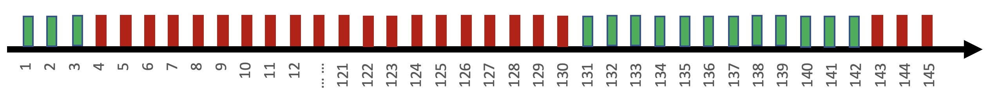

# 策略配置
Time series data, event data, and log data all generate alarm events through policy configuration planning, and trigger alarm notifications and other actions to achieve the purpose of monitoring alarms.

## Preliminary steps

**Navigation path**: Navigation → Monitoring Configuration → Policy → New

Basic process of policy configuration:

* Step one: **Fill in basic information**
     * Policy name: will be displayed in the alarm notification
     * Monitoring object: It is a classification condition for indicator selection and also the classification of this strategy.
* Step 2: **Monitoring item settings** - Determine abnormal points
     * Select a monitoring item, time series - indicator, event - event name, log keyword
     * Calculation formula: AVG MAX MIN SUM COUNT real-time
     *Monitoring period: The default is 1 minute, it is recommended to be greater than or equal to the collection period
     * Monitoring dimension: The granularity of detection is IP/instance/a certain data dimension
     * Monitoring conditions: refers to dimension conditions, such as mount point =/
     * Monitoring target: For monitoring and collection, you can quickly select the monitoring directory, and you can also perform alarms based on clusters and modules.
         > **Monitoring target range selection**
             Data collected based on CMDB is required, such as tasks, operating systems, processes, system events, etc. in the collection configuration.
             There is no such option based on custom reporting or data platform or service dial-up testing.
     * Detection algorithms and settings: such as static thresholds
* Step Three: **Advanced Settings** - Optional
     * Trigger condition: It is an anti-shake mechanism. Alarm notification will only be issued if the algorithm meets the monitoring items three times within five cycles.
     *Recovery conditions: Recovery occurs only if the triggering conditions are not met within consecutive periods.
     * Alarm template: Customized alarm notification template
* Step 4: **Alarm notification settings**
     *Restore notification
     *Notification time period
     * Notification method: Alarm group, if there is no required alarm group, you need to create a new one [Alarm group description](./alarm-group.md)

**working principle**:

**Understand the concepts**:

* **Abnormal points**: The time series data is detected by algorithm to detect abnormal points.
* **Alarm event**: Multiple abnormal points are events of the same type and are generally persistent.
* **Alarm notification**: Multiple alarm events are summarized into alarm notifications through convergence rules, storm suppression, etc.

> View more[Explanation of terms](../../concepts/glossary.md)

## List of main functions

*Supported data type strategies:
     * Time series indicator strategy
     * System event strategy
     * Custom event strategy
     * Log keyword strategy
     * Log timing strategy
     * Data platform source indicator strategy
*Strategic methods
     * Calculation formula: AVG MAX MIN SUM COUNT real-time
     * Monitoring aggregation: monitoring dimensions and monitoring conditions
     * Cluster monitoring: monitor any node based on CMDB business topology
     * Detection algorithm: 8 algorithms
* Anti-shake mechanism
     * Triggering conditions
     * Recovery mechanism
* Alarm notification
     * Template preview
     * Variable list
     * Convergence method
* Notification control
     *Notification interval
     *Effective time
     * Alarm notification group
     * Message queue notification method
     * Alarm recovery notification

## Features

* Batch modification function: You can batch modify some items of the policy to the desired settings. Such as: alarm group, trigger condition, recovery condition, notification interval, recovery notification
* Add and delete targets: the scope within which the rapid change strategy takes effect
* Quick shielding: Quickly shield all alarm notifications generated by this policy, affecting the reception of notifications
* Start and stop strategies: Quickly activate and deactivate strategies to affect the occurrence of events

### Step 1: Basic information settings

* **Policy Name**: Used to describe the specific meaning of the alarm policy, so that when an alarm is issued, the user can quickly confirm the source of the problem from the title of the alarm.
* **Monitoring objects**: View specific categories and concepts [term explanation](../../concepts/glossary.md). Has two functions:
     * Determine where the policy classification belongs.
     * Help indicators, events and logs to do a classified filtering

### Step 2: Monitoring item settings

#### Options monitoring items

The selection of monitoring items is required, and the selection range of monitoring items is determined by the "monitoring object".

**Time Series Data**: The monitoring item is Metric. The sources of monitoring indicators include monitoring collection, data platform, custom reporting, [log field extraction](./custom-report.md)

**Event data**: The monitoring item is the event name Event. The sources of the event name include system events and custom event reporting.

**Log keyword**: The monitoring item is the "retrieval statement" that selects [index set], that is, the keyword content

#### Aggregation calculation of monitoring items

* **Calculation formula**: refers to the calculation method of data during the monitoring period. For example, if multiple data points appear in one period, how to obtain the value. If there is only one data point in a period, of course these calculation formulas will have the same result.
     * Aggregation operation methods: support SUM, AVG, MAX, MIN, COUNT
     * Real-time: refers to judging directly based on data points, so there is no way to aggregate based on dimensions in real-time

> Note: Some monitoring items do not have all optional aggregation methods. For example, the expected response code for keywords and dial tests is COUNT.

* **Monitoring dimension**: It is the minimum granularity of aggregation. If the dimension is IP, then the alarm will be in the IP dimension; if it is an instance, then the alarm will be in the instance dimension; if it is a certain data dimension such as module node, then It is based on module nodes for aggregation judgment. For more usage methods, check out the scenario case [How to perform cluster monitoring] (../../guide/cluster_monitor.md)
* **Monitoring conditions**: refers to the conditions of dimensions or indicators. The purpose is to find the most accurate data for strategy detection.

#### Monitoring target range selection

The monitoring target range is still selecting the checking accuracy range of the data. Only when the CMDB method is used to collect data, the target range can be selected, such as monitoring collection configuration, operating system default collection, process collection, system event collection, etc.

It is also divided into static and dynamic. It is recommended to use dynamic so that it can automatically change with the changes of CMDB and avoid the manual synchronization process.

In addition, if you want to monitor the status of the cluster, you can combine the monitoring dimensions to meet the monitoring needs of the cluster and modules.

#### Level sum detection algorithm

* **Alarm level**: It is divided into three levels: reminder, warning and fatal. The purpose is to allow users to conveniently specify different processing methods and notification objects based on the size of the alarm value and the level of the jitter trend. The corresponding alarm group will also have corresponding configurations. The information notified will also be different based on different level styles, and will also affect the convergence and summary strategies.
* **Detection Algorithm**: 8 detection algorithms are provided, each algorithm has a suitable scenario. For a description of the specific algorithm, please see the appendix [Algorithm Description](../addenda/algorithms.md)

### Step 3: Determine conditions

* **Trigger condition**: It is an anti-shake mechanism that controls the sensitivity of data. Of course, the less sensitive it is, the less timely the alarm notification will be. The more sensitive it will be, the more alarm notifications will be.
* **Recovery conditions**: It is a method for judging problem recovery and also determines the end time of event recovery.
* **Alarm notification template**: Affects the content of the alarm notification. Because different notification channels have character restrictions, the default alarm notification is automatically converted and segmented. The purpose is to provide more useful information within limited character limits. The types of notifications are:
     * Abnormal single alarm by level
     * Same strategy but different goals by level
     * Abnormal cross-policy summary alarms by level)
     *Recovery notification corresponding to the above
> For more configurations of alarm notification templates, please see the scenario case [How to set up your own notification template](../../guide/notify_case.md)
* **Alarm storm suppression**: refers to the cross-policy aggregated alarm notification when the maximum limit set by a certain platform is reached at the same time.
     * Configuration method: Navigation → System Management → Global Configuration → Alarm Notification Summary Settings
     * For more information on alarm aggregation and convergence, please see the appendix [Notification Convergence & Summary Mechanism Description] (../addenda/coverge.md)

#### Working principle of trigger conditions and recovery conditions

After the data is detected by the algorithm, abnormal points will be obtained one by one. If notifications are sent for every abnormal point, in scenarios where data jitters or continuous abnormalities occur, notifications will be received multiple times within a period of time, causing an alarm storm. In order to prevent alarm harassment caused by data jitter and other scenarios, alarm suppression can be performed by setting trigger conditions, recovery conditions, and notification intervals.

- page settings

- Triggering conditions

     An alarm notification is triggered only if multiple detection algorithms are met in multiple consecutive detection cycles.

     For example, set the trigger condition to 5 cycles to meet the 3 detection algorithm. It means that among 5 consecutive data detections, if 3 or more detection results meet the detection algorithm, an alarm will be triggered.

As shown in the figure above, points 2, 7, 17, 18, 19, 20, 21...etc. all satisfy the detection algorithm, but from the perspective of the detection window.

> Note: In the detection window, look 5 periods ahead of the current point, and see how many points meet the conditions within these 5 periods.

Only 19, 20, 21...etc. meet the triggering conditions (satisfied 3 times in 5 cycles), and only those that meet the conditions trigger the alarm notification. This can effectively avoid multiple alarms caused by jitter.

- Recovery conditions

     The recovery conditions are judged on the basis of the trigger conditions. Only if the trigger conditions are not met **continuous** times, it means recovery.

     If the recovery condition is set to not meet the trigger condition for 5 consecutive periods, it means that if the trigger condition is not met for 5 consecutive trigger condition detections, the alarm will be restored.

As shown in the figure above, points 19, 20, 21, 22, 23, 24, 25, 26, etc. all meet the trigger conditions (satisfied 3 times in 5 cycles), then starting from 27, 27, 28, 29, 30, 31, 32 These points do not meet the triggering conditions. Then the alarm will be restored at point 31, because this point reaches the first time that the trigger condition is not met for 5 consecutive times.

> Note:
> The period in the trigger condition is divided into two situations:
> Timing class: based on user-configured aggregation period
> Event class: Events only have data when they are abnormal, and there is no concept of cycle, so the cycle here is fixed at 1 minute, 5 cycles, that is, 5 minutes

#### How it works without data

No data detection is an additional function in the policy configuration. It is configured under the advanced options. When no data is fetched for n consecutive periods, an alarm is triggered.

If the configuration does not report data for 5 consecutive cycles,

As shown in the picture:

|Time| No data detection (no data for 5 consecutive periods) | Whether to alarm |
|---|---|---|
|1st minute|With data|None|
|... ...|With data|None|
|6th minute|No data for 1 period, condition not met|None|
|Minute 7|No data for 2 periods, condition not met|None|
|8th minute|No data for 3 periods, condition not met|None|
|9th minute|No data for 4 periods, condition not met|None|
|10th minute|No data for 5 cycles, conditions met|Generate alarm|

> Note: No data alarms also have trigger conditions, recovery conditions, alarm intervals, etc. Will follow the configuration of the policy.

### Step 4: Alarm notification settings

* **Alarm recovery notification**: The default recovery is no notification.
* **Notification Interval**: refers to how often the alarm will be issued before recovery or confirmation.
* **Notification Time Period**: If you can confirm that there is no problem in not needing to receive notifications in each time period, then set it. Default is all day
* **Notification method**: The default is the alarm group. Generally, the people who receive alarms are relatively fixed. It will be more convenient to set and change the alarm group, and it can also support multiple alarm groups. For details on how to use the alarm group, see [Alarm Group Description](./alarm-group.md)
     * In addition to alarm groups, it will also support fault self-healing, webhook, and work order docking methods.

#### How setting the notification interval works

- page settings

- illustrate

     In the case of persistent anomalies, the previous triggering conditions will always be met, and the alarm will always be triggered, which is called [persistent event]. In order to prevent frequent alarms from being received, you can set the minimum interval between two notifications. As shown in the figure above, the notification interval is set to 2 hours. If an alarm continues to occur, as long as it is not recovered, it will be sent at a minimum interval of 2 hours.

Here are the pictures in the trigger conditions. 19, 20, 21, 22, 23, 24, etc. all meet the trigger conditions, and the alarm notification will be triggered. If the alarm interval is set to 120 minutes, then a notification will only be sent on 19, and then None will be sent. If the trigger condition continues to be met, then the next time it will be notified again after the 139 point.

#### Event generation principle

- As shown below, the disk usage alarm is configured as follows
     - Detection algorithm: >= 90
     - Trigger condition: met once in 5 cycles
     - Recovery conditions: The trigger conditions are not met for 5 consecutive cycles
     - Notification interval: 120 minutes

- data point

- Outlier

- Judgment results at each time point

|Time|Detection algorithm (>= 90)|Trigger condition (satisfied once in 5 cycles)|Notification (interval 120 minutes)|Whether to restore |
|---|---|---|---|---|
|1st minute|None|None|None|None|
|2nd minute|None|None|None|None|
|3rd minute|None|None|None|None|
|4th minute|Satisfies >90|Satisfies 1 time in 5 cycles|Generates new events and notifies.  Next notification at minute 124|None|
|5th minute|Satisfied >90|Satisfied 2 times in 5 cycles|Converged, not notified|None|
|... ...|Satisfy>90|... ...|... ...|... ...|
|Minute 123|Satisfied >90|Satisfied 5 times in 5 cycles|Converged, not notified|None|
|Minute 124|Satisfied >90|Satisfied 5 times in 5 cycles|Generate notification.  Next notification at minute 244|None|
|Minute 125|Satisfied >90|Satisfied 5 times in 5 cycles|Converged, not notified|None|
|... ...|Satisfy>90|... ...|... ...|... ...|
|130th minute|Satisfied >90|Satisfied 5 times in 5 cycles|Converged, not notified|None|
|131~134th minute|None|Satisfied 4~1 times in 5 cycles|Converged, no notification|None|
|135~138 minutes|None|None|Converged, not notified|Trigger conditions not met 1~4 times|
|139th minute|None|None|End notification, reset the next alarm time|Failed to meet trigger conditions 5 times, event recovery|
|140th minute|None|None|None|None|
|... ...|None|... ...|... ...|... ...|
|143rd minute|Satisfied >90|Satisfied 1 time in 5 cycles|Generate a new event and notify.  Next notification at minute 263|None|
|144th minute|Satisfied >90|Satisfied 2 times in 5 cycles|Converged, no notification|None|

The changes of this event can be viewed in the event flow of event details.

### Host operation field

When setting the host operation field in the CMDB, it will be linked with monitoring by default and no alarm notification will be performed. Therefore, this field can be linked with publishing related operations.

Specific differences: More states can be set in the global settings of monitoring.

* Host does not monitor field list: the policy under this host will not generate any alarm events
* Host does not alarm field list: The policy under this host will generate alarm events, which can be viewed in the event center, but no alarm notification will be sent to people, and it is blocked.

### Monitor target range suppression

For monitoring and collection, the data collected based on CMDB can suppress the monitoring target range. As an example:

* Environment: 90% of the machines in a cluster are 500G, but some machines or modules are 2T. Then the alarm policy to uniformly set the disk space to alarm when the disk space exceeds 80% is unreasonable for 2T servers, because Too much space remaining by percentage
*Configuration method:
     * First create a global A policy, the monitoring target is the cluster, and an alarm will be issued when the static threshold exceeds 80%
     * Create a small-scale B policy to monitor those special servers or modules. The static threshold can be set to exceed 90% before an alarm is issued.
*The effect is:
     * The configuration content of policy A and policy B are the same, but the scope of the monitoring target is different, so servers in a small range will take effect first in a large range. Achieve the effect of alarm suppression

### Monitoring level suppression

Monitoring has three levels by default, from low to high: reminder, warning, and fatal.

Then when judging the strategy, the high level will be judged first. Once the high level conditions are met, the low level will no longer be checked. Achieve level suppression effect without repeated alarms.

### More related scenario cases

* [How to monitor the process](../../guide/process_monitor.md)
* [How to monitor the data of the log platform](../../guide/log_monitor.md)
* [How to monitor data from the data platform](../../guide/bigdata_monitor.md)