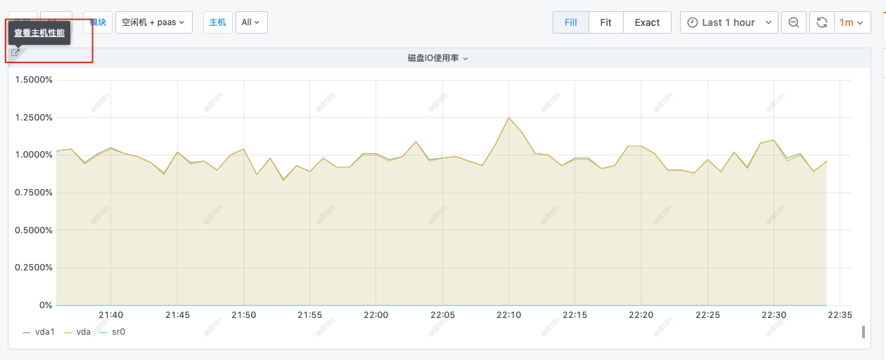

# New dashboard

The new dashboard is very flexible, which means it also has many practical functions. These functions will be introduced one by one below.

### Create new views and groups

1. Create a new view. You can select data or graph first.
2. If you want to implement grouping, you can use Convert to row to achieve similar grouping functions.

### View type

##### Query data panel description

* Monitoring objects: classification of data. When your data cannot be found, the monitoring object may be wrong.
* Indicator selection: choose the right indicator
* Aggregation method: When there are multiple data points in one aggregation period, attention should be paid to selecting the aggregation method at this time. When the data collected is 1 minute, the aggregation period is also 1 minute, and there is only one data point, then the aggregation method is actually the same whether it is SUM MAX MIN
* Dimension: similar to Group by
* Condition: similar to Where used to filter data
* Target selection: is a quick IP/instance selection method
* Function: It includes sorting (top bottom) and time offset for time comparison data
* Alias: Generally, the default example names are very long, so you can make good use of the alias function to make the chart look better.

### Alias function

Alias syntax: starting with `$`, `$header_field name`

For example: indicator id. The header is `metric` and the field name is `id`. So the whole variable is: `$metric_id` If you want to display the indicator name, it is. `$metric_name`

For example: dimension name. The header is `tag` and the field name is `device_name`, so the entire variable is: `$tag_device_name`.

### TOP or Bottom function

There are TOP and Bottom functions, and setting a limit number can realize TOP data query.

### Time comparison

To compare data with a certain day in the past, you can use the time offset function.

Time format:

| key | shorthand |
|---|---|
| years | y |
| quarters | Q|
| months | M |
| weeks | w |
| days | d |
| hours | h |
| minutes | m |
| seconds | s |

For example: `1d 1day 1days`

### Variable function

There is a variable function in the settings of the dashboard. After setting the variables and matching the query conditions, the linkage effect of the variables can be instantiated. Next, configure the host query corresponding to a cluster module as an example.

#### Configure the linkage variables of the cluster and module

First configure the cluster `cluster`.

Then configure the module `module`, and the query conditions in the module use the cluster ID as the condition.

#### Configure host

Set the variable `host`.

Multiple host selection and all conditions can be enabled

You can see the following effect.

#### Configure query condition association

Using the host variable in the condition can achieve the effect of linked query

### Data drill-down

As shown in the figure, data drill-down is configured. Click on the IP to jump to the page corresponding to host monitoring through "Host Details".

Configuration method: In the view configuration, use the `Add link` function and use relevant variables in the URL

