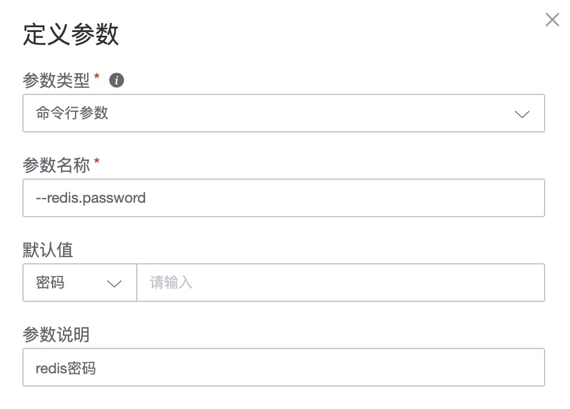

# How to make Exporter plug-in online

The monitoring platform is compatible with the import capability of [Prometheus Exporter](https://prometheus.io/docs/instrumenting/exporters/). Obtain the source code from Github to compile the binary or directly obtain the release. According to the plug-in specifications of the monitoring platform, monitoring collection can be transformed. It's very simple.

## Environment preparation

1. Golang compilation environment
2. Find the open source Exporter [Exporter list](https://prometheus.io/docs/instrumenting/exporters/)

> The following content takes redis_exporter as an example, [redis_exporter](https://github.com/oliver006/redis_exporter)

## Edit Exporter

3. Compile according to the readme.

```bash
$ go get github.com/oliver006/redis_exporter
$ cd $GOPATH/src/github.com/oliver006/redis_exporter
$ go build
$ ./redis_exporter <flags>
```

## Define monitoring platform plug-in

4. Add the new plug-in, fill in the relevant information and upload the compiled binary program.


5. View the command line parameters, select commonly used parameters and set them

     * View parameter content `redis-exporter -h`

     

     * Setting parameters

     

     * 1) Binding port: refers to the default port for the plug-in to run. If the default port is occupied, an available port will be automatically added.
     * 2) Bind host: The default is 10.0.0.1. Others are not supported yet and are mainly provided to

     > Note: This is not the port of the redis service, but the port where the Exporter runs. The bound host is also the host where Exporter runs.

     > `${port}` and `${host}` are two built-in variables to let `bkmonitorbeat` know the listening port and location.

     * 3) Define the required parameters

         * Required parameters: In order for `bkmonitorbeat` to discover the Exporter, `${port}` and `${host}` need to be used

         

         * Common parameters: specify the address of the service such as redis

         

         * Commonly used parameters: when the redis service connection method requires a password

         

6. View the collected indicators and make settings

How to view indicators:

1\) readme file

2\) Start the Exporter command line locally `curl http://10.0.0.1:9121/metrics`


7. Add other information LOGO description


### Plug-in debugging and verification

8. Next step is to enter debugging


### Plug-in to collect data

9. Start formal collection


> **Note**: Because redis is bound to the intranet IP, you need to use CMDB variable parameters to solve the collection. `redis://{{target.host.bk_host_innerip}}:6379`

10. View **Check View** to confirm whether the data has been reported.


> **Note**: Because data collection has a certain periodicity, wait at least two minutes before you can see the corresponding data points.

### Policy configuration and view configuration

11. Configure strategy


12. View **alarm events**


13. Add views to the dashboard

### Plug-in export and share

The produced plug-ins can also be exported to other people or other businesses for use. If you are an administrator, you can also share the plug-in for use by the entire platform.