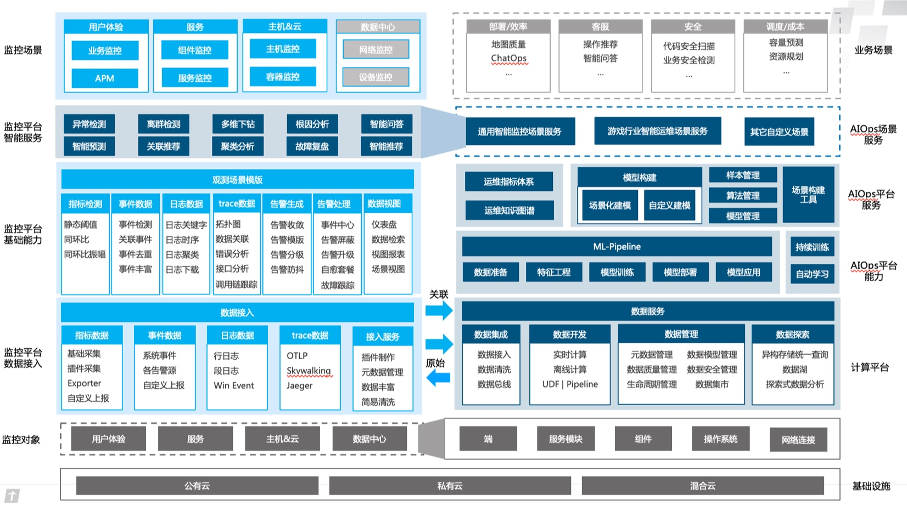

# Product Architecture

The monitoring platform is committed to realizing a one-stop monitoring platform, with the goal of being **fast**, **stable**, **accurate**, and **complete**.

* **Fast**: Fast data reporting, fast data processing, fast problem location, and fast fault handling

* **Accurate**: Accurate problem location, accurate information, and intelligent decision-making

* **Stable**: timely alarms, no missed reports, no excessive reports, and massive data processing capabilities

* **Full**: Complete data, complete management, and ecological closed loop

## Architecture diagram

To understand the monitoring platform, there are three main lines:

* **Article 1: Main line of data processing**
     * From the `monitoring object` through various `data collection`, no matter what the `data source` is, it will enter the `data link/storage` of the monitoring platform, perform `anomaly detection` and `analysis positioning` on the data, and determine How to carry out `alarm notification`, have complete `alarm tracking` and `ecological closed loop` for the generated alarms, and feed back the final data to the monitoring as a basis for judgment

* **Article 2: Data Visualization**
     * In daily work, various `monitoring scenarios` are used through `pc/mobile terminal` to conduct inspections. When problems are discovered, various `view reports` can be used to comprehensively locate the problem and provide various data. Visual tools

* **Article 3: Configuration Management**
     * Convenient `collection management` reduces the tedious collection configuration, and the complete `monitoring configuration management` and `platform system management` make management work easier

## Monitoring platform capabilities

Introduced in order from bottom to top:

* **Monitoring objects**: Monitoring objects are the object services that BlueKing monitoring needs to meet, and the entire concept of using monitoring objects runs through it from top to bottom.
* **Data Access**: According to data types, there are five types: Metrics, Traces, Events, Logs, and Alerts. It provides Pull, Push, local collection, remote collection, cross-cloud partition collection capabilities, and has collection hosting capabilities.
* **Basic capabilities**: The core service capabilities of monitoring have different data processing capabilities based on different data types. Each service can be independently configured and reused to meet the complex needs of upper-level monitoring scenarios and requirements.
* **Intelligent Service**: Provides various AI-related capabilities to help various monitoring functions become more intelligent and easy to use.
* **Monitoring Scenarios**: For different monitoring objects, different out-of-box limited observation scene perspectives are provided. Users can also customize their own observation scenes to meet individual needs.

## Simple data reporting link diagram

1. Able to achieve cross-cloud region transmission
2. Support local PULL, remote PULL, PUSH and other capabilities
3. The blue dotted lines are components related to BlueKing monitoring, and the other components are BlueKing components.