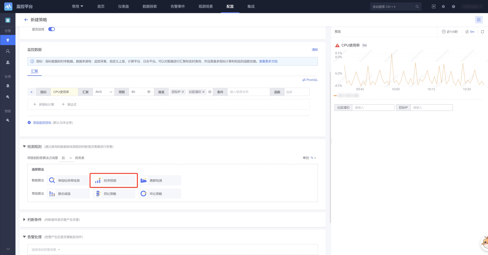

# Instructions for using the time series prediction function

### Applicable data

1. Data type: indicator data, supports multi-dimensional indicator data
2. Data source: Monitoring collection, reported by default, data that can be viewed in monitoring by the computing platform tspider. Data for custom reporting and logging is not included.

#### Scenario 1: Indicators show cyclical fluctuations

When indicators fluctuate cyclically, the time series prediction model can automatically learn the cyclical pattern from historical data.

#### Scenario 2: The indicator shows a trend of growth or decline

When an indicator shows a reasonable growth or decline trend, the time series prediction model can adapt to the growth or decline trend of the curve while learning other pattern changes from historical data.

### Configuration method

1. Select to add monitoring indicators in the monitoring data.

2. Select "General Time Series Forecasting_Hourly Level" in the model name.

3. Configure whether it is linear prediction and the prediction duration.
4. Configure the threshold. When the threshold condition is met, an alarm will be triggered.
5. After receiving the alarm, if it is inaccurate, you can provide feedback in the alarm details, and the model will continue to be trained regularly.