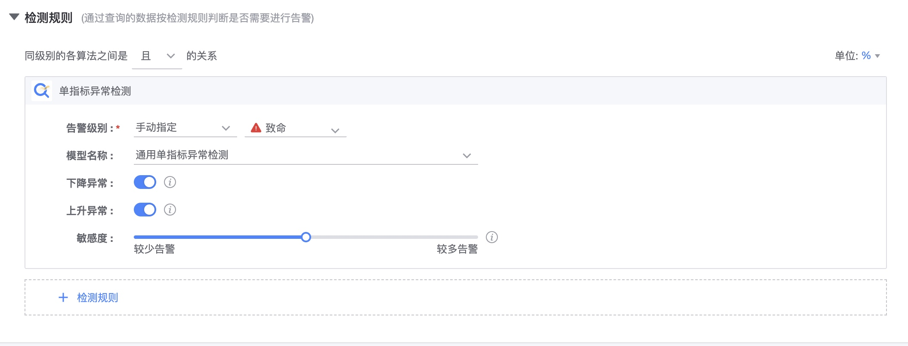

# Single indicator intelligent anomaly detection

AIOps-related capabilities rely on the BlueKing AIOps platform. BlueKing Monitoring is connected to the scene services of the AIOps platform. Adding a model to the AIOps platform can be used directly in BlueKing Monitoring.

### Applicable data

1. Data type: indicator data, supports multi-dimensional indicator data
2. Data source: Monitoring collection, reported by default, data that can be viewed in monitoring by the computing platform tspider. Data for custom reporting and logging is not included.

#### Scenario 1: Indicators show cyclical fluctuations

When indicators fluctuate cyclically, it is difficult to set reasonable static thresholds to detect obvious anomalies in the graph. Using intelligent anomaly detection in this scenario can not only ensure the accuracy of detection, but also avoid repeated alarms that harass users.

#### Scenario 2: The indicator shows a trend of growth or decline

When the indicator shows a reasonable growth or downward trend, using a static threshold will detect it as an anomaly during the continuous decline/rise period of the indicator; in this scenario, intelligent anomaly detection is used to adapt to the downward/rising trend of the curve, if and only if the indicator An abnormality is detected only when the amplitude of change is obviously too large.

#### Scenario 3: The indicator shows a sudden increase or decrease trend

When an indicator shows an unexpected sudden increase or decrease, it is difficult to set a reasonable static threshold to identify the sudden increase point of the curve. In this scenario, dynamic anomaly detection can be used to automatically capture different degrees of sudden increase or decrease. If the change range of the indicator is obviously too large, it will be detected as an anomaly.

### Configuration method

1. Select to add monitoring indicators in the monitoring data.

2. Select "General Intelligent Anomaly Detection Model" in the model name.

3. Configure the direction of the abnormality you want to detect: upward or downward.
4. Configure the sensitivity. If you are not sure, you can leave it alone for now, and then adjust it according to the alarm situation after it has an effect. The higher the sensitivity, the more alarms will be hit, and the lower the sensitivity, the fewer alarms will be hit.
   PS: There will be a delay after the configuration is completed, and intelligent learning has a certain learning process.

5. After receiving the alarm, if it is inaccurate, you can provide feedback in the alarm details, and the model will continue to be trained regularly.
