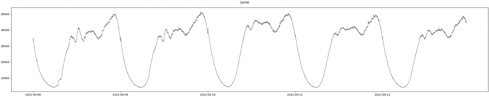
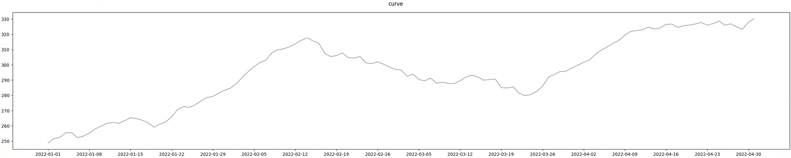

# Outlier detection

## Concept introduction

Outlier detection is a dynamic observable capability implemented by BlueKing Monitoring based on the AIOps platform. Its most notable feature is that the principle of anomaly determination does not rely on any manual experience or historical data, but is determined based on the actual data distribution. It is very suitable for use scenarios with low thresholds, cold starts, and no manually labeled samples.

Most traditional monitoring alarms are based on a static threshold to determine whether a service is abnormal. Taking CPU usage as an example, the current traditional solution has the following problems:

- Static thresholds cannot separate peak and off-peak periods of business, making it impossible to accurately set static thresholds for alarms. If the static threshold is set too high, actual abnormal scenarios will not be notified to the person in charge during off-peak periods. If the static threshold is set too low, false alarms will be generated frequently during peak periods, affecting the health of the business. judgment.
- The setting of the threshold has often had an actual impact on the business. For a long period of time when the node has just started to experience abnormalities, the corresponding alarm event cannot be generated because the threshold has not been reached. For example, during the peak period, all nodes in the same cluster are in a stable upward stage, but a single node is in a downward trend.
- Different business modules and different services have different settings for static thresholds. If different services require different static thresholds, there will be very similar policies with similar functions for the same type of alarms.

Outlier detection can solve the above problems very well:

- The core idea of outlier detection is to judge whether it meets expectations by calculating the discrete values of all nodes in each cluster in the entire cluster. The calculation of discrete values does not depend on the peak or off-peak periods of the business, but calculates the actual situation of the entire cluster itself.
- Outlier detection can well detect nodes with different trends. If the value of a node has a different upward or downward trend in a certain period of time than other nodes, its outlier value will generate an abnormal alarm.

     CPU usage of different IPs for the same business

As shown in the figure above, the CPU usage represented by the red curve fluctuates with almost the same amplitude in interval 1 and interval 2. The fluctuation in interval 1 is a fluctuation that is synchronized with other IPs, while the fluctuation in interval 2 deviates from other IPs. Outlier detection can easily identify such abnormal fluctuations.

## Applicable data

1. Data type: indicator data, supports multi-dimensional indicator data
2. Data source: Monitoring collection, reported by default, data that can be viewed in monitoring by the computing platform tspider. Data for custom reporting and logging is not included.

### Scenario 1: Indicators show cyclical fluctuations

### Scenario 2: The indicator shows a trend of growth or decline

Note: It is not recommended to use the outlier detection solution for curves with a large sudden increase and sudden decrease.

## Configuration method

Select to add monitoring indicators in the monitoring data and configure the dimension information.

Here we take [Target IP] [Cloud Region ID] as an example to detect CPU usage.

Detection rule selection Outlier detection

Configuration parameters

- grouping fields
    
     It is not required. You can select one or more indicator dimensions specified in the above steps. Note that you cannot select all (selecting all will not form a group)

     The default is not selected, that is, all dimension combinations are detected. Here, we only select [Cloud Region ID] as an example, that is, "Perform outlier detection on the CPU usage of different target IPs in each cloud region."

- sensitivity

     Parameters that control the sensitivity of outlier detection will affect the number of alarms. You can configure it as needed.

Triggered alarms can be viewed in the Alarm Events tab. As shown in the example below, it can be found that the CPU usage of a certain target IP exceeds the sensitive range set by the user, so an alarm is triggered:

