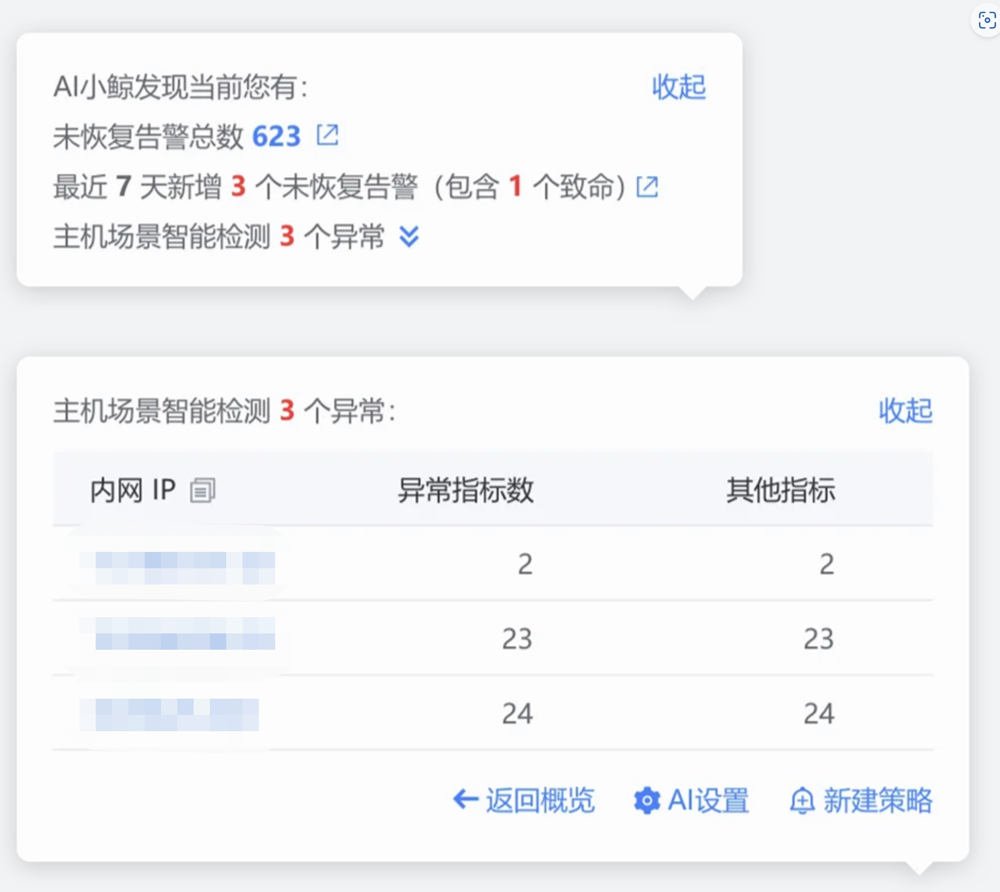

# Scene intelligent detection

## working principle

By detecting all indicators of a specific scenario, detection results can be provided for such scenarios without configuring a specific indicator list.

## Applicable data

Classified according to observation scenarios, currently supported is the host scenario.

## Configuration method

Currently only automatic scanning of host scenarios is supported, so no configuration is required. Just check that the scan results are as expected. If not, please contact the administrator. The manual configuration policy function will be provided later.

### Scanning results of host scene intelligent detection (global prompt pop-up box)

### Scanning results of host scene intelligent detection (host details page)

- The anomaly score ranges from 0 to 1. The larger the score, the higher the abnormality of the indicator of this dimension value.

