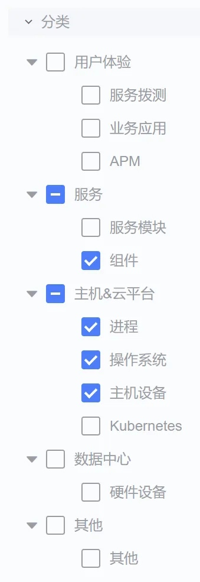

# Alarm Analysis-Indicator Recommendation

## scenes to be used

- Pain point: The single-index alarm strategy configured in the monitoring system can only alarm for abnormalities in a single index. When troubleshooting problems, it may be necessary to manually locate the root cause by combining related indicators. The correlation indicator recommendation function will recommend correlation indicators based on whether there are simultaneous abnormalities and the shape of the curve when the alarm occurs.
- Usage: The system will automatically make recommendations based on the current alarm indicators among the four types of indicators of current business components, processes, operating systems, and host devices and all indicators for which alarm policies have been configured. Users can directly view the recommended results by category. Can.

Currently supported monitoring object categories

## Instructions

In the [Associated Indicators] tab of the [Alarm Details] side-swipe page, the indicators associated with the current alarm indicators will be classified according to the monitoring object level, and you can view them directly.

- The left side is classified according to the level of monitoring objects, and anchor points are provided for jumping
- On the right, you can view indicator details and recommendation reasons. You can provide "like" or "dislike" feedback on the recommended results.

As shown in the figure below, an abnormality was detected in the disk space usage of a certain service. Through the recommendation of related indicators, it was found that 7 other related indicators at the [operating system] level had similar shapes or were abnormal at the same time.

