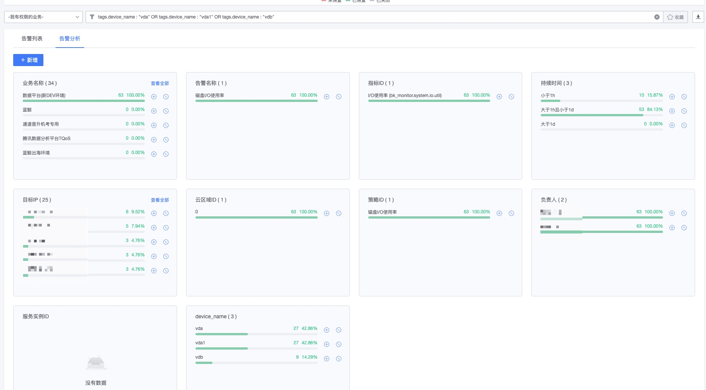

# Eventcenter

The event center records all alarm events and alarm notifications. Basic problem location and analysis can be performed in the event center.

## Preliminary steps

**working principle**

**Understand the concepts**:

* **Abnormal points**: The time series data is detected by algorithm to detect abnormal points.
* **Alarm event**: Multiple abnormal points are events of the same type and are generally persistent.
* **Alarm notification**: Multiple alarm events are summarized into alarm notifications through convergence rules, storm suppression, etc.
* **Processing record**: It is the execution record information after execution notification and execution processing package

> View more[Term explanation](../../Term/glossary.md)

## List of main functions

All alarm events, related events, processing records, etc. are displayed, and events can be queried, analyzed, and alarm confirmed.

## View alarm events

### Alarm event list

Alarm events provide a variety of query methods to help quickly locate the event.

**Notification Status**:

* Success: All successful
* Partial failure: The notification partially failed
* Failure: Notifications all failed
* The notifier is empty: the alarm group is configured but the notifier is empty

**Alarm status**:

* Unrecovered: The event continues and has not been recovered, requiring focus
* Unrecovered (confirmed): The event has continued and has not been recovered, and someone has already performed **Alarm Confirmation**
* Unrecovered (shielded): The event has continued and has not been restored, and someone has already performed **quick blocking**
* Unrecovered (suppressed): It is the internal logic of monitoring
*Recovered: The incident no longer continues, it is considered a historical situation and can no longer be focused on
* Closed: When the policy is deleted, the event directly enters the closed state

### Alarm handling

### Query and collection

### Alarm analysis

### Alarm event details

* [1] View the associated alarm policy. You are viewing a snapshot. It is possible that the current policy has been modified or deleted.
*【2】Alarm handling
     * **Quick Screening**: Quickly screen the event. If similar events occur in the future, there will be no notification during the screening time.
     * **Alarm Confirmation**: The alarm event is quickly confirmed, and no notification will be given until the event is restored. When the same event occurs again after recovery, notification will still be given.
*【3】Notification status details: You can view the status of each notification
* 【4】View information: Displays the data status from the first exception time to the end time point. Logs and event classes are displayed in different ways
*【5】Processing suggestions: Simple recording event processing solution, associated with indicators
*【6】Transfer record: detailed event transfer process, mainly used for single event tracking and positioning

### Alarm related information

The platform will analyze the alarm event content and its associated content: the host, associated logs, associated traces, and associated scenarios. It can be viewed quickly, and you can also quickly jump to specific content for viewing.

### identify the problem

When the notification is not received, you can check the "Notification Status Details".

The details of the alarm notification being converged can be viewed in the circulation record.

