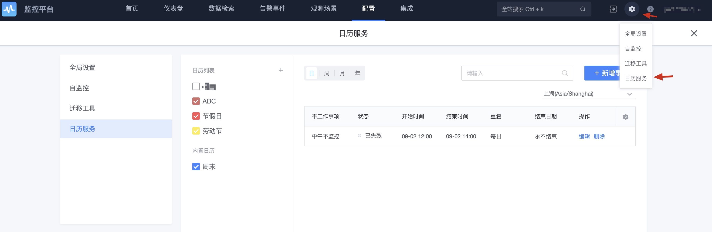

# Configure policies to take effect based on the calendar service

In some special scenarios, the effective time of monitoring is fixed, and it is necessary to configure whether complex alarms take effect based on calendar working hours. Calendar services can meet their needs.

## Calendar configuration

Location: Navigation -> Platform Settings -> Log Service

> Note: Because the default is working hours throughout the year, and non-working hours are special, the calendar is set for non-working time periods. Such as holidays, market closing time, weekends, etc.

Create new calendar

## Calendar application

When creating a strategy, select judgment conditions, associate calendars, and multiple selections.

