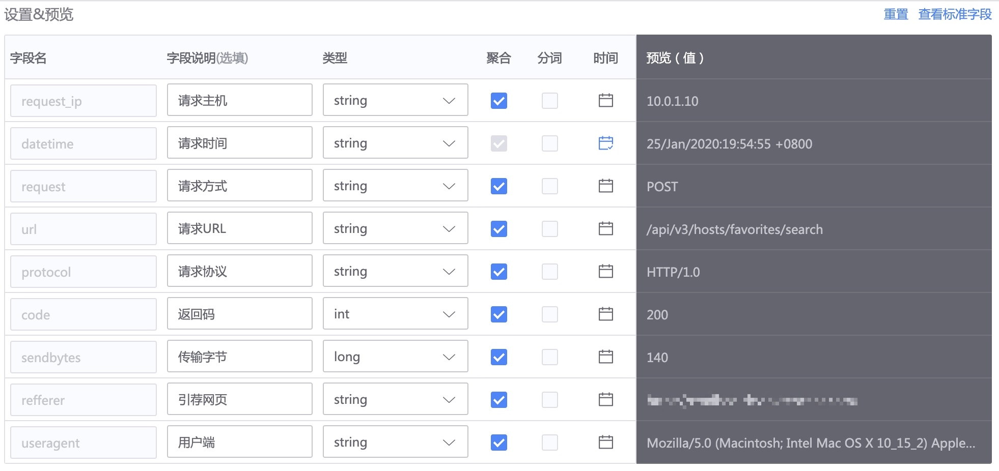

# How to monitor the data of the log platform

Logs are a very useful type of data for discovering and locating problems. Basically any monitoring object has logs. The operating system, process module, service module, etc. will have corresponding log data.

Effective use of log data can not only achieve monitoring purposes but also meet the needs of problem location.

## Preliminary steps

**working principle**:

Log collection is to monitor changes in log file content and collect real-time log streams. During the collection process, "log extraction" can be performed to format the log content.

Log collection and processing are based on log platform services. Collection and configuration can be done directly on the "log platform" or directly on the monitoring platform.

**Collection navigation path**: Log platform → Management → Log collection

**Policy configuration navigation path**: Navigation → Monitoring configuration → Policy → New → Log keywords/monitoring items (source log platform)

**Problem location navigation path**: Navigation → Log retrieval

**View configuration navigation path**: Navigation → Dashboard → New → Indicator selection (source log platform)

## Log collection & field extraction

Specifically view the log platform [Acquisition Access](../../../../../LogSearch/4.6/UserGuide/ProductFeatures/integrations-logs/logs_overview.md)

## Log monitoring strategy

There are two types of log monitoring:

1. Log keyword monitoring, the most common and commonly used monitoring method
2. Log-to-indicator time-series data monitoring is to convert logs into time-series data for monitoring.

### Log keyword monitoring

two entrances

1. You can search directly in the log. After searching the results, click "Add as Monitor" above.

2. Directly select the "log keyword" strategy in the policy configuration of the monitoring platform.

The query statements used are the same

> Note: The current log retrieval statement is based on the ES word segmentation syntax. See [query string](../../../../../LogSearch/4.6/UserGuide/ProductFeatures/data-visualization/query_string.md) for details.

### Log to indicator time series data monitoring

The data extracted from the field will be entered into the monitored indicator selector.

* Indicator: **aggregation type** and is of numeric type, such as int/long.
* Dimension: **aggregation type** and of type string.

> Note: Word segmentation can be used when there is no need for monitoring or overall query. It can save storage space and improve efficiency.

Two indicator items, `code` and `sendbytes`, will appear in the monitored indicator selector.

Everything else will become dimensions

## data visualization

In addition to being used in strategies, data can also be queried in dashboards and data retrieval.