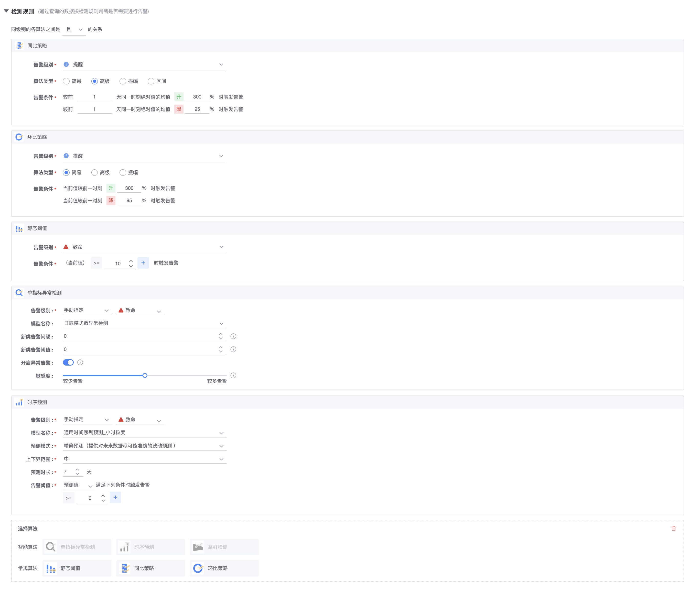
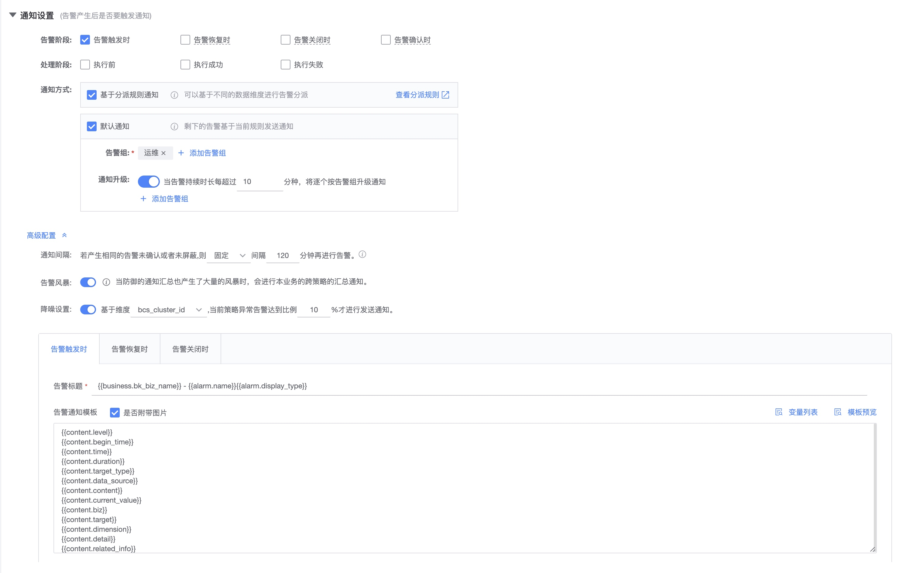

# Alarm policy configuration

All monitoring strategies of the monitoring platform can be managed and created in Configuration->Alarm Strategy.

* Supports five data types: the monitoring platform receives five types of data, including Metrics, Events, Logs, Alerts, and Traces. All five types of data can be monitored and configured in the alert policy. .
* Support different data sources: monitoring platform itself, computing platform, log platform
*Supports 8 detection algorithms and 2 types of intelligent detection
* Supports rich alarm notification settings and fully customized notification templates
* Support convenient peripheral service linkage to achieve the purpose of fault self-healing
* Support no data alarm
* Supports second-level monitoring
* Supports multi-index calculation and is compatible with PromQL

## Strategy list

* Added status of various strategies:
     * Alarm in progress: When the alarm is currently in progress, you can click to jump to the event center to view it.
     * Expired: An invalid policy means that although it is in the effective state, it is meaningless to have no policy because the data source no longer exists or the configuration is unreasonable.
     * Disabled/Enabled
* Has various batch modification capabilities

## Strategy function description

### Basic information settings

* **Policy Name**: Used to describe the specific meaning of the alarm policy, so that when an alarm is issued, the user can quickly confirm the source of the problem from the title of the alarm.
* **Monitoring objects**: View specific categories and concepts [Term explanation](../../Term/glossary.md). Has two functions:
     * Determine where the policy classification belongs.
     * Help indicators, events and logs to do a classified filtering

### Monitoring data settings

Each data strategy has different ways of querying data and corresponding capabilities.

**Indicator data**: The monitoring items are indicators Metrics. The sources of monitoring indicators include monitoring default collection and monitoring user collection, computing platform, custom reporting, and log platform.

**Event data**: The monitoring item is the event name Events. The sources of the event name include system events and custom event reporting.

**Log keyword**: Log keywords come from two sources: log keyword events collected on the client, and log keyword alarms based on ES storage queries.

**Associated alarms**: For different alarm events, or alarm events from other platforms, the associated configuration is then performed whether to process, such as making a phone call only when two alarms are generated at the same time.

#### Monitoring data-indicator data

- Indicator selector

- Indicator data query and calculation
     View more [Multi-metric queries and functions](../data-visualization/mutil_metric.md)

-PromQL

- Monitoring targets
     The data range in which the locking policy can take effect is only available if it is linked to the CMDB. The rest are the data range of this business by default.

### Detection rules

* Conventional algorithm: Provides static threshold, year-on-year, month-on-month and other capabilities
* Intelligent algorithm: Provides [Single Metric Anomaly Detection](../aiops/aiops_metrics_intelligent_detect.md), [Time Series Forecast](../aiops/aiops_metrics_forecast.md), [Outlier Detection](../aiops/aiops_metrics_outline .md)
* Algorithm relationship: Each algorithm can be used to take effect simultaneously or take effect separately.

For a description of the specific algorithm, please see the appendix [Algorithm Description](../../Other/functions/addenda/algorithms.md)

### Analyzing conditions

* **Trigger condition**: It is an anti-shake mechanism that controls the sensitivity of data. Of course, the less sensitive it is, the less timely the alarm notification will be. The more sensitive it will be, the more alarm notifications will be.
* **Recovery conditions**: It is a method for judging problem recovery and also determines the end time of event recovery.
* **No data**: It can be judged based on indicators or whether there is data in a certain dimension. The range of dimension selection is the range of data query (aggregation dimension).
* **Effective time period**: If you can confirm that there is no problem in not needing to receive notifications in each time period, then set it. The default is all day. You can also connect to a calendar service to finalize more complex notifications.

### Alarm processing settings

### Alarm notification settings

* **Alarm stage**: refers to the corresponding notification capabilities when an alarm occurs, when the alarm is restored, when the alarm is closed.
* **Processing phase**: It means that only when the alarm processing action is configured, you need to determine whether to use it.
* **Notification method**: There are two types
     * 1) Notification based on dispatch rules, see [alarm dispatch](alarm_routing.md) for details
     *2)Default notification
         * **Alarm Group**: The default is the alarm group. Generally, the people who receive alarms are relatively fixed. It will be more convenient to set and change the alarm group, and it can also support multiple alarm groups. For details on how to use the alarm group, see [Alarm Group Description](./alarm_group.md)
         * **Notification upgrade**: Notify other alarm groups one by one when the alarm has not been restored for a long time.
* Advanced configuration
     * **Notification Interval**: Refers to how often the alarm will be issued before recovery or confirmation. There are two ways: fixed and incremental.
     * **Alarm storm**: refers to cross-policy aggregated alarm notifications when the maximum limit set by a certain platform is reached at the same time.
         * Configuration method: Navigation → System Management → Global Configuration → Alarm Notification Summary Settings
         * For more information on alarm aggregation and convergence, please see the appendix [Notification Convergence & Summary Mechanism Description] (../alarm-configurations/coverge.md)
     * **Noise reduction settings**: Alarm notifications can only be generated based on certain dimensions reaching a certain level.
     * **Alarm notification template**: Affects the content of the alarm notification. Because different notification channels have character restrictions, the default alarm notification is automatically converted and segmented. The purpose is to provide more useful information within limited character limits. The types of notifications are:
         * Abnormal single alarm by level
         * Same strategy but different goals by level
         * Abnormal cross-policy summary alarms by level)
         *Recovery notification corresponding to the above
         > For more configurations of alarm notification templates, please see the scenario case [How to set up your own notification template] (../alarm-configurations/notify_case.md)

#### Trigger conditions, recovery conditions, and notification working principles

After the data is detected by the algorithm, abnormal points will be obtained one by one. If notifications are sent for every abnormal point, in scenarios where data jitters or continuous abnormalities occur, notifications will be received multiple times within a period of time, causing an alarm storm. In order to prevent alarm harassment caused by data jitter and other scenarios, alarm suppression can be performed by setting trigger conditions, recovery conditions, and notification intervals.

#### How it works without data

No data detection is an additional function in the policy configuration. It is configured under the advanced options. When no data is fetched for n consecutive periods, an alarm is triggered.

If the configuration does not report data for 5 consecutive cycles,

As shown in the picture:

|Time| No data detection (no data for 5 consecutive periods) | Whether to alarm |
|---|---|---|
|1st minute|With data|None|
|... ...|With data|None|
|6th minute|No data for 1 period, condition not met|None|
|Minute 7|No data for 2 periods, condition not met|None|
|8th minute|No data for 3 periods, condition not met|None|
|9th minute|No data for 4 periods, condition not met|None|
|10th minute|No data for 5 cycles, conditions met|Generate alarm|

> Note: No data alarms also have trigger conditions, recovery conditions, alarm intervals, etc. Will follow the configuration of the policy.

## Advanced alarm linkage

### Host operation field

When setting the host operation field in the CMDB, it will be linked with monitoring by default and no alarm notification will be performed. Therefore, this field can be linked with publishing related operations.

Specific differences: More states can be set in the global settings of monitoring.

* Host does not monitor field list: the policy under this host will not generate any alarm events
* Host does not alarm field list: The policy under this host will generate alarm events, which can be viewed in the event center, but no alarm notification will be sent to people, and it is blocked.

### Monitor target range suppression

For monitoring and collection, the data collected based on CMDB can suppress the monitoring target range. As an example:

* Environment: 90% of the machines in a cluster are 500G, but some machines or modules are 2T. Then the alarm policy to uniformly set the disk space to alarm when the disk space exceeds 80% is unreasonable for 2T servers, because Too much space remaining by percentage
*Configuration method:
     * First create a global A policy, the monitoring target is the cluster, and an alarm will be issued when the static threshold exceeds 80%
     * Create a small-scale B policy to monitor those special servers or modules. The static threshold can be set to exceed 90% before an alarm is issued.
*The effect is:
     * The configuration content of policy A and policy B are the same, but the scope of the monitoring target is different, so servers in a small range will take effect first in a large range. Achieve the effect of alarm suppression

### Monitoring level suppression

Monitoring has three levels by default, from low to high: reminder, warning, and fatal.

Then when judging the strategy, the high level will be judged first. Once the high level conditions are met, the low level will no longer be checked. Achieve level suppression effect without repeated alarms.

### More related scenario cases

* [How to monitor the process](../../ProductFeatures/scene-process/process_cases.md)
* [How to monitor the data of the log platform](./log_monitor.md)
* [How to monitor data of computing platform](./bigdata_monitor.md)