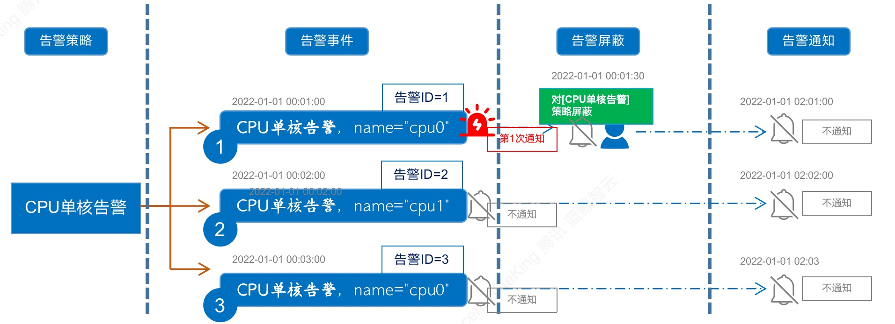

# Functional differences between different alarm shielding

Alarm shielding has only one function item, but in fact we have three alarm shielding capabilities. An in-depth understanding of the differences between each shielding function can meet the needs of different users and different scenarios, and enable better operation.

The three types are: alarm confirmation, quick shielding, and alarm shielding.

## The difference between the three functions

Function | Effective scope | Functional features
---|---|---
Alarm confirmation | After only confirming the current event, notification of the event will no longer be generated, and the shielding range is small | If a new event occurs with the same policy, you will be notified again
Quick shielding | Same strategy, only shields the dimensions of the current event, shielding range | If there are dimensions, shield according to the dimensions in the event
Alarm shielding | Can be shielded by policy and scope. Policies include dimensions, and the shielding range is larger | Shielding by policy

### Alarm confirmation

### Quick shielding

### Alarm shielding

## 1. Alarm confirmation

Alarm confirmation means that the current alarm will not be notified again. Note that alarm confirmation is based on the alarm ID. When the policy triggers a new alarm, a new alarm ID is generated and is not affected by the current alarm confirmation.

## 2. Quick shielding

Quick shielding is based on the level and dimension information of the alarm.

In addition, you can also confirm and quickly block the alarm on the alarm page, as shown in the figure below.

## 3. Alarm shielding

For details, please view [Alarm Blocking Function Description](./block.md)

## 4. Mobile terminal operation

