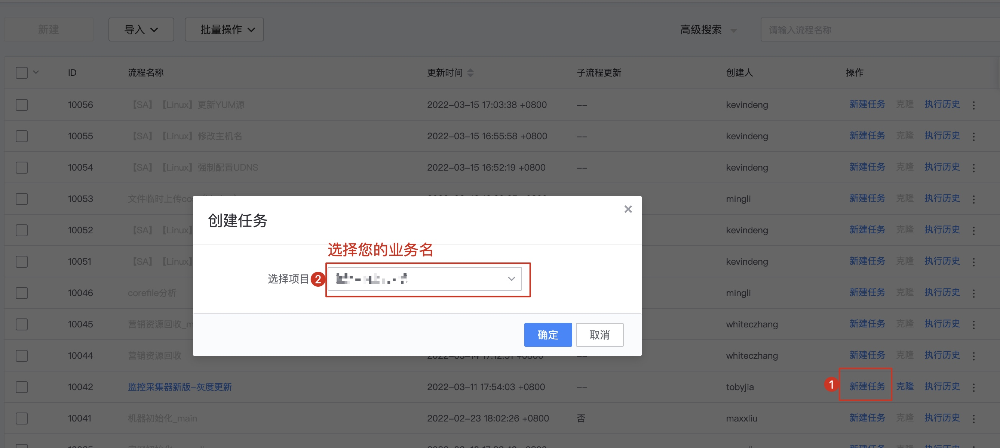

#bkmonitorbeat 4-in-1 upgrade

## background

Currently, there are four monitoring collectors: basereport, exceptionbeat, processbeat, and bkmonitorbeat. It is troublesome to install and deploy the collectors. Now the collectors have been merged, and the business only needs to deploy bkmonitorbeat.

Depends on bkmonitorbeat version: 0.24.0.189 or above

## Steps

Node management operations

1. Stop the old version of the collector basereport, exceptionbeat, processbeat #During the stop process, data reporting is interrupted

2. Reinstall the new version of the collector bkmonitorbeat #The new collector reports the previous data of basereport, exceptionbeat, and processbeat

### Method 1. Installation through standard operation and maintenance common operations (recommended)

Find the new version of the monitoring collector in standard operation and maintenance - grayscale update

Click on New Task

Click next

Select the target node, or enter the IP manually

Click the execute button in the upper right corner

The process is being executed

If you have used standard operation and maintenance installation, please ignore the following method.

## Method 2. Node management (use this method when standard operation and maintenance cannot be performed)

Node management address

### Step 1. Determine the switching IP

First determine the IP list that needs to be switched

### Step 2. Stop the old version of the collector

Copy the IP list to and stop basereport, exceptionbeat, and processbeat in sequence.

### Step 3. Update bkmonitorbeat

Update bkmonitorbeat, select version 0.24.0.189

### Step 4. Verify data

Verify host monitoring data

Verification plug-in collects data