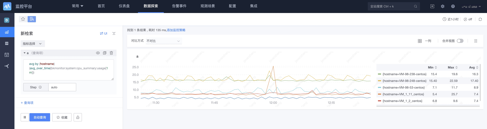

# Indicator retrieval

All data connected to the monitoring platform, computing platform Tspider, ES, and log platform ES can be quickly queried in the indicator search.

## function list

1. Indicator retrieval, multiple pictures by default, can be merged into one picture
2. Save to dashboard
3. Data comparison: time comparison, target comparison, indicator comparison
4. Query collection
5. Add strategies directly
6. Large picture function to view original data
7. View settings: area chart, the minimum value of the y-axis is 0
8. View display: one per line, two per line, three per line, up to five
9. View related alarms
10. Support PromQL

11. Multi-indicator calculation
12. Index function for quick positioning