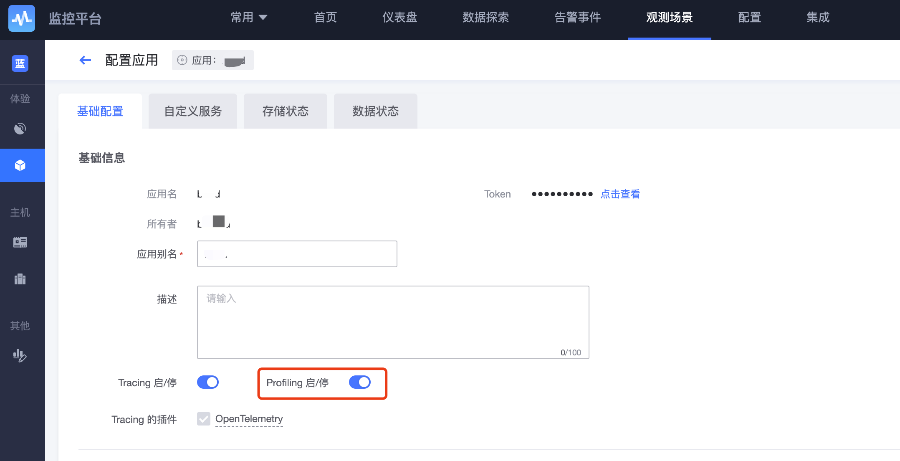
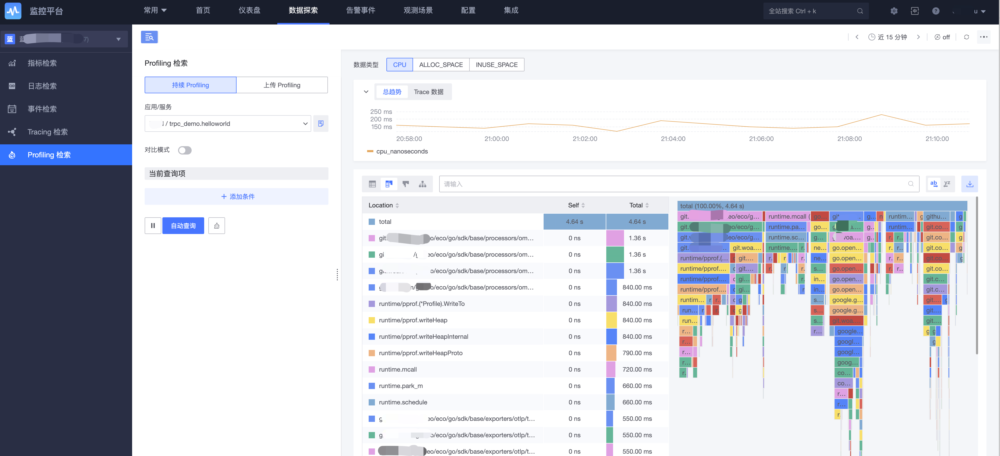
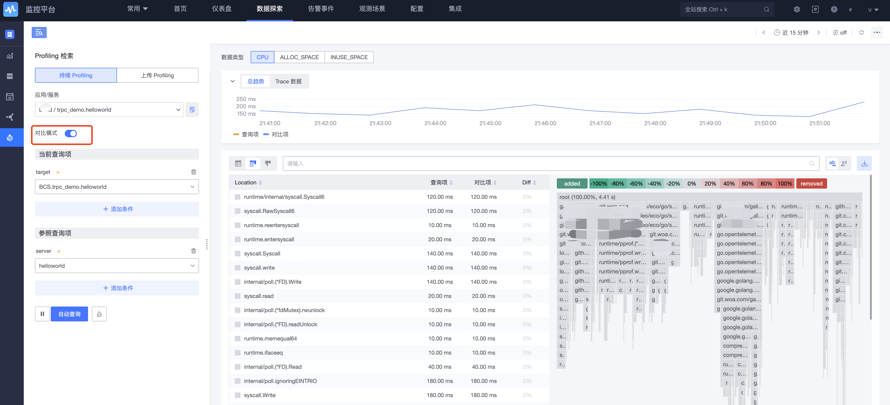

# Profiling retrieval

Profiling refers to the collection of data that can reflect the execution status of the program during the execution of the program, such as the memory occupied by the program execution, the use of specific instructions, or the frequency and duration of function calls, to help the application locate and optimize performance problems.

To realize the Profiling function, you need to enable the Profiling function [when you create a new APM application](../scene-apm/apm_monitor_overview.md) or in the corresponding APM application configuration, edit enable Profiling.

## Profiling retrieval

Through the data reported by pyroscope SDK, we can view the data under continuous Profiling, and also support manual upload of perf, pprof format files.

Visualization of Profiling data support tables, flame charts, function call charts, etc., use top N to print out the most CPU/ memory function list, data types support CPU, ALLOC_SPACE, INUSE_SPACE to view performance from different dimensions.

If span_id is included in the Profile data, it can be associated with Trace data.

In the Trace data bar chart of [Profiling retrieval], you can see the number of span_id at the current moment, and clicking on it will jump to the specific span details.

Similarly, in the Span details, if this Span has Profile data, it is also displayed on the Profile TAB.

### Contrast function

In comparison mode, you can compare performance views based on different tags, such as the performance of different versions of the same service or similar services.

