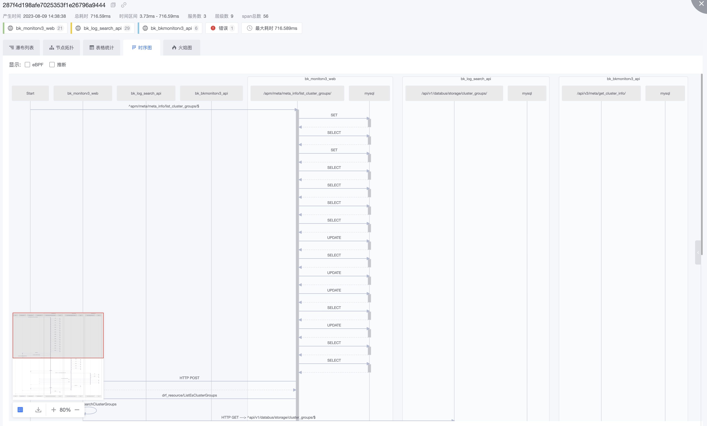
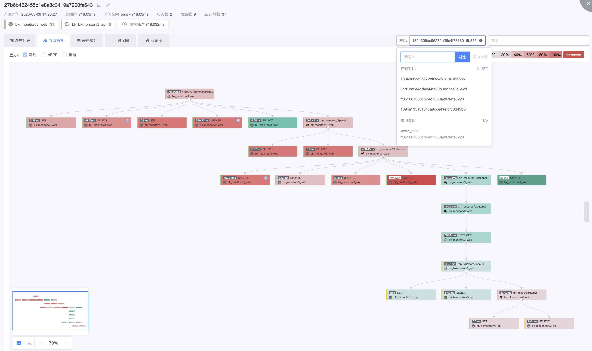

# Trace retrieval

Trace retrieval,It mainly meets the purpose of fast retrieval through Trace reported by APM. View all relevant data based on this Trace call chain. Viewing data access [Enable APM](../scene-apm/apm_monitor_overview.md)

## ID precision retrieval and range retrieval

- The first type: Generally has a clear ID, which is obtained directly from the browser or log for accurate ID viewing

  For example, you can obtain the corresponding TraceID and SpanID in the http Header`Traceparent:00-29a543417ecfe6b3c2939ccff4ee3eba-fb11889da130bf29-01`

- The second: there is no clear ID, there is a rough time range, you can view a rough situation

## range retrieval

1. Search criteria, there are rich search criteria can quickly query related list data
2. Tabular data provides four perspectives:
    - Trace view: List of Traceids, regardless of Span. The same traceids are clustered into a row
    - Span perspective: SpanID list, the most original data list, is presented as SpanID, without distinguishing TraceID
    - Interface statistics: Aggregated by interface dimension
    - Service statistics: Aggregated by service dimension
3. Provides some quick capabilities:
    - Error: Contains the condition status_code:2 in error OTel
    - Entry Service: The first service of the server process
    - Import interface: The first interface of the import service 
    - Root Span: The first Span of the entire Trace  

## Single Trace details

Four data viewing capabilities:

1. Waterfall list: There is a strict parent-child upstream and downstream relationship, which can be quickly located according to the upstream and downstream.
2. Node topology: Ignoring the time relationship, only the hierarchical and topological relationship between Span is displayed, and the overall is very intuitive.
3. Tabular statistics: Data of different dimensions are presented in a table to quickly compare and view values and focus on problem points.
4. Timing diagram: Show the relationship between calling and being called from the perspective of program implementation, and quickly check whether it is consistent with the original design.
5. Flame diagram: The flame diagram presents the situation of Span time consuming and occupying large, and quickly views the key Span. And solved the rendering problem on concurrent processes.

Other advanced abilities:

1. Source: Default OTel, eBPF support (need to integrate DeepFlow, to be released later)
2. Cross-application: When a TraceID is cross-application, it will be displayed. If you have permission, you can view it accordingly.
3. Inference: Things like DB, middleware, and third parties can all be inferred from the services of the host
4. Folding: In order to better view the data, different data types have corresponding folding capabilities to reduce the interference of similar data.

### List of waterfalls

### Node topology

### Tabular statistics

### Sequence chart

### Flame diagram

### Performance analysis

## Contrast function

The comparison function mainly solves two kinds of problems:

1. Using a complete TraceID as reference, check whether the current Trace has missing data
2. Whether the comparison changes after tuning

The comparison function supports only node topology and flame graphs

## Span Details

### Basic information

### Abnormal event

### Log and host

Logs and hosts are associated through the configuration of the service and are matched based on instance information.

