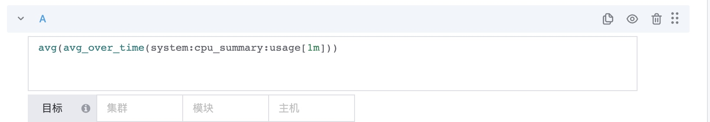

# Multiple indicator calculations and function usage

Applicable locations:

1. Dashboard-Indicator Data Source
2. Data retrieval-index retrieval
3. Configuration-Strategy-Indicators

## Multi-indicator calculation

Multi-indicator calculation refers to operations such as addition, subtraction, multiplication, and division between multiple indicators.

Note: To be able to calculate indicators, the data period and dimensions need to be consistent.

### PromQL

Supports native PromQL syntax and can be directly switched to PromQL mode

## Function usage

### Indicator change function

Function | Function description
---|---
rate | Average growth rate per second, within the period (last_val-first_val)/Interval. When encountering a decrease, a virtual counting algorithm is used to simulate growth and reflect the average rate.
increase | Increase amount, within the period (last_val-first_val), when encountering a decrease, a virtual counting algorithm is used to simulate the growth value
delta | difference, within the period (last_val-first_val), the result is allowed to be negative
irate | Average growth rate per second, within the period (last_val-pre_val)/Interval. If it encounters a drop, it will be calculated from 0 to reflect the instantaneous rate.
idelta|Difference, within the period (last_val-pre_val), the result is allowed to be negative
deriv | Derivative, using simple linear regression to calculate the derivative of each time series in the interval vector v
changes | Number of numerical changes, the number of times each sample data value changes
resets | The number of counter resets (monotonically growing indicator, a decrease is a reset)

#### The difference between rate and irate

time | value | rate(2m) | irate(2m)| irate(5m) | algorithm | rate(5m) algorithm |
---|---|---|---|---|---|---
22:33 | 1 | 0.167 | 0.167 | 0.167 | (2-1)/60 | 0.0183
22:34 | 2 | 0.167 | 0.167 | 0.167 | (3-2)/60 | 0.0167
22:35 | 3 | 0.167 | 0.167 | 0.167 | (4-3)/60 | 0.0167
22:36 | 4 | 0.167 | 0.167 | 0.167 | (5-4)/60 | 0.0417
22:37 | 5 | 0.167 | 0.167 | 0.167 | (6-5)/60 | 0.0958
22:38 | 6 | 0.167 | 0.167 | 0.167 | (7-6)/60 | 0.208
22:39 | 7 | 0.117 | 0.117 | 0.117 | (14-7)/60 | 0.438
22:40 | 14 | 0.233 | 0.233 | 0.233 | (28-14)/60 | 0.875
22:41 | 28 | 0.467 | 0.467 | 0.467 | (56-28)/60 | 1.75
22:42 | 56 | 0.933 | 0.933 | 0.933 | (112-56)/60 | 3.50
22:43 | 112 | 1.87 | 1.87 | 1.87 | (224-112)/60 | 7
22:44 | 224 | 3.73 | 3.73 | 3.73 | (448-224)/60 | 14
22:45 | 448 | 7.47 | 7.47 | 7.47 | (896-448)/60 | 12.7
22:46 | 896 | 14.9 | 14.9 | 14.9 | (1972-896)/60 | 11.8
22:47 | 1972 | 29.9 | 29.9 | 29.9 | (3584-1972)/60 | 9.76

### Math calculation function

Function | Function description
---|---
abs | Absolute value, the absolute value of the indicator value within the period, such as |v1|, |v2|, |v3|
ceil | Round up to the nearest integer, such as 1.7->2
floor | Round down to the nearest integer, such as 1.8->1
round | Rounding, the function is similar to the ceil and floor functions, returning the nearest integer of all sample values
ln | natural logarithm, log(10)=2.30, natural logarithm e~=2.718281828
log2 | Logarithm with base 2, such as log2(4)=2
log10 | logarithm with base 10, such as log10(100)=2
sgn | All sample values, positive numbers are converted to 1, negative numbers are converted to 0, and zero is converted to 0
sqrt | Square root, take a positive number, √100=10, √4=2

### Only functions supported by the dashboard

Function | Function description
---|---
top | Based on the time range of the chart query, according to the aggregation method, find the N values of TOP, and then take out the data of these N lines
bottom | Based on the time range of the chart query, according to the aggregation method, find the N values of bottom, and then take out the data of these N lines
time_shift | time shift based on the current chart's time range