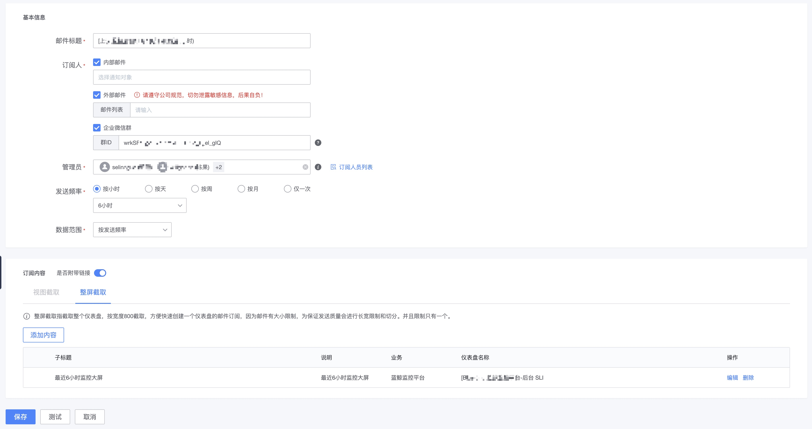
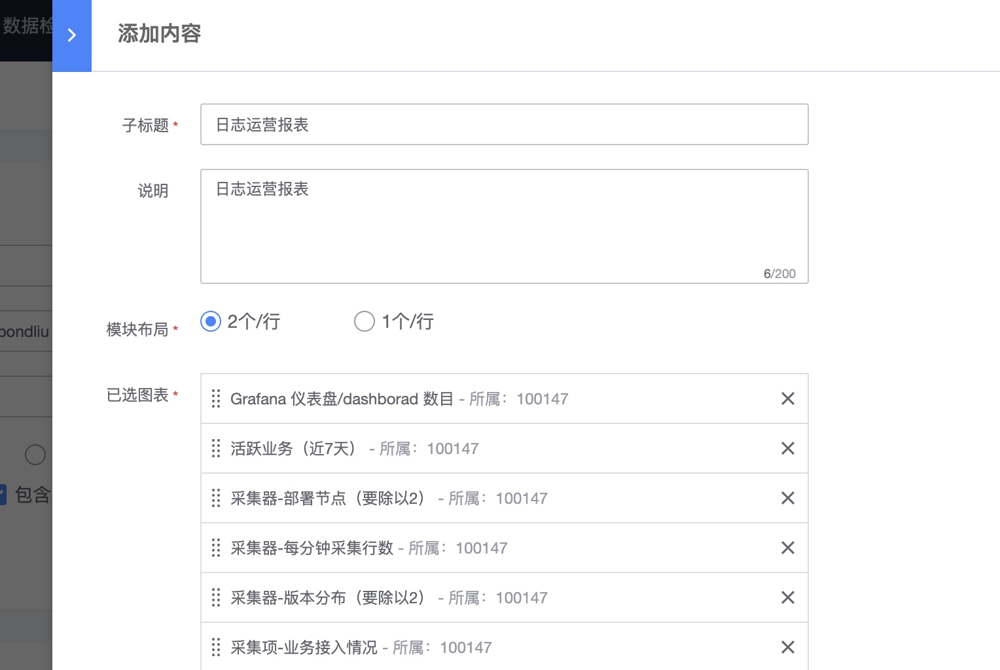

# Email report subscription

## Function Description

The email subscription report function can subscribe to all charts in the dashboard, and some public operating data of the monitoring platform can also be subscribed.

Navigation location: Dashboard->Email Subscription

Scenarios that can be solved include:

1. Subscribe to the public operating data of the monitoring platform, such as function usage, alarm event trends, alarm notifications, etc.
2. Subscribe to all data in the dashboard.
3. Can subscribe across dashboards
4. Can be subscribed across businesses
5. You can subscribe to other people (people who have not applied for dashboard permissions, such as the boss)
6. You can unsubscribe or resume your subscription
7. The subscribed dashboard view has corresponding links that can be jumped directly.

## Create new subscription

1. This function does not require permission application, but you need to subscribe to the data of the dashboard, so you must have the permission of the dashboard.

* 1) Subscriber
     * Internal mail: Based on the user-managed personnel list, you can specify the recipient and proactively send it to those who need it.
     * External mail: Based on the mailing list, specify the mailing list, which can be any mail address. Pay attention to company security.
     * Enterprise WeChat group: It can be sent through the enterprise WeChat group robot. .
* 2) Subscribed people can unsubscribe voluntarily, and the unsubscribed persons will be seen in the subscription list
* 3) Administrator: the person who can edit and modify later
* 4) Sending frequency: supports multiple types, then this time range will be linked with the dashboard. If you choose weekly, then the corresponding chart data will be for this week.
* 5) Add content: Add specific report content, which will be introduced in detail later.
* 6) After adding content, you can sort, edit and delete it.
* 7) When testing, send it to yourself

### Subscription content

#### View interception

Obtain by single view in the dashboard, you can subscribe to partial views in one or multiple dashboards

* 1) Subtitles and descriptions will be displayed in the report
* 2) The module layout currently has one fixed layout per row and two fixed layouts per row.
* 3) The content is divided into two parts, built-in: represents the public data provided by the platform, and you can make multiple selections according to the business you have permission to.
* 4) Dashboard: represents the dashboard of authorized businesses

#### Full screen capture

Send by individual dashboard

## Send history

You can view the sending status in the sending history.
