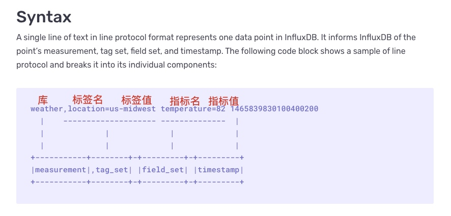

# What are metrics and dimensions


## 1.Indicator overview

In the monitoring system, indicators are a very important concept, and we often ignore its existence. The definition of indicators has a very close relationship with the data model structure supported by the monitoring system.
​​
The source of monitoring data can be divided into numerical values, short text strings, and logs (long text strings) from the type of data.
​​
The indicators usually mentioned are statistical data that have measurement value for the current system environment, allowing us to clearly know the operating status of the current system environment.

## 2. What is an indicator?

Indicators are measurements of software attributes or hardware attributes. That is, the goals we define for monitoring objects. These indicators need to be closely related to our systems, business procedures, and environments. The definition principles of indicators must comply with the SMART principle.

*S stands for Specific. The indicator is clear, has a specific meaning, can reflect specific attributes, and is targeted.
* M stands for measurable activities with measurable indicators, including percentages, numerical values, etc.
* A stands for Assignable. The value of the indicator can be obtained, and there are technical means or tools to collect it.
* R stands for correlation (Realistic) and has a certain logical correlation with other indicators.
* T represents time-bound tracking of values within a certain time range.


## 3. What are multidimensional indicators?

Before understanding multi-dimensional indicators, let us first review the development history of monitoring indicators.

### 1. Exit code period

Only focus on the return status of the indicator. In the Linux system, the exit status code of script execution is [1]. The status code returns 0 to indicate successful execution, 1 to indicate failure, and other status codes 2-255 have more meanings.

The monitoring system has the same meaning as the exit status code of the Linux system. It was first used in Nagios. The monitoring detection script uses the exit status code 0-3 of the shell script to determine the different running status of the service. The return value The meaning is as follows

```
0 - Service is OK.
1 - Service has a WARNING.
2 - Service is in a CRITICAL status.
3 - Service status is UNKNOWN.
```

Write the corresponding detection script as follows [2], and then let the monitoring system determine the running status of the service


### 2. Single indicator period

The so-called single indicator means that the indicator and value appear in pairs, that is, K-V key-value pairs appear in pairs. The typical representative monitoring is Zabbix. For example, to define disk usage status, how many disk partitions there are, how many indicators need to be defined, as shown below

```
disk_partition_used_percent["/"] 50
disk_partition_used_percent["/boot"] 10
disk_partition_used_percent["/home"] 1
disk_partition_used_percent["/data1"] 50
disk_partition_used_percent["/data2"] 50
```

  **What are the disadvantages of a single indicator**

1. Complex conditional queries cannot be performed. Only the value of one indicator can be queried at a time. For example, if you need to find the usage of the largest disk partition of all machines, you need to find out all disks and perform data calculations to find the corresponding value.

2. The indicator construction is very inconvenient. It requires splicing indicators. For example, the network port of SNMP is associated with the traffic, packets and other indicators corresponding to the port. Multiple queries are required to extract the value. The indicator construction is very complicated [3].


The final constructed data structure is as follows


### 3. Multidimensional indicator period

The definition of multi-dimensional indicators is very simple. The indicator names are the same as single-dimensional indicators, but the dimensions are placed in another field.

```
disk_partition_used_percent{name="/"} 50
disk_partition_used_percent{name="/boot"} 10
disk_partition_used_percent{name="/home"} 15
disk_partition_used_percent{name="/data1"} 30
disk_partition_used_percent{name="/data2"} 70
```

Compared with the single-dimensional indicators above, the benefits of multi-dimensional indicators are very obvious. The same type of indicators and data with different names can be classified into one kind of data for query. For example, I can not specify the name when querying the indicator, and all the indicators will be returned. name value, or select "/data1", "/data2" multiple partitions at one time, you can return the query data at once.

With multi-dimensional indicators, aggregation queries can be performed very well, and indicator names and dimensions are completely separated, thus creating basic conditions for complex data calculation and analysis.

### 4. What is time series data?

#### 1. Time series data

A time series is an ordered collection of measurements sampled at regular intervals. For example, collect the host CPU usage every minute. Time series data has the following concepts

Terminology | Description
---|---
Namespace | namespace, similar to database
Metric Name | Metric name
Tags | Multiple Key/Value type tags can be added under each indicator name.
TagKey | tag name
TagValue | tag value
Value | The value corresponding to the indicator
Timestamp | The time when the indicator is generated. If not filled in, it will be automatically filled in based on the storage time.


The following uses a practical example to correspond to the concepts of various time series data.


Note: The writing rules here are written according to the format of prometheus, that is: indicator name {label name="label value"} value timestamp

Of course, timing indicators can also be written according to the influxDB line protocol [4], as shown below



#### 2. Time series concept

For the following data, if 3 pieces of data are collected, 5 time series will be generated, each time series has 3 data points.

```
disk_partition_used_percent{name="/"} 50
disk_partition_used_percent{name="/boot"} 10
disk_partition_used_percent{name="/home"} 15
disk_partition_used_percent{name="/data1"} 30
disk_partition_used_percent{name="/data2"} 70
```


As can be seen from the above, the data points are the collected data values. And the time series is the product of the dimensions in the indicator name. The formula for time series calculation is as follows

```
metric_name{tagA="tagA_value",tagB="tagB_value"} metric_value
tagA_value=[0 1 2 .... m]
tagB_value=[0 1 2 .... n]
time_series_total=count(tagA_value) * count(tagB_value)=m * n
```### 5. How to define indicators and dimensions

In the monitoring platform, the prometheus format is used, as shown below

`metric_name{<label name>=<label value>, ...} value timestamp`

metric: The name of the metric (metric name) can reflect the meaning of the sample being monitored (for example, http_request_total - represents the total number of HTTP requests received by the current system). The indicator name can only consist of ASCII characters, numbers, and underscores and must conform to the regular expression `[a-zA-Z_][a-zA-Z0-9_]*`.

label: The label reflects the characteristic dimensions of the current sample. Through these dimensions, Prometheus can filter, aggregate, etc. the sample data. The name of the label can only consist of ASCII characters, numbers and underscores and satisfy the regular expression `[a-zA-Z_][a-zA-Z0-9_]*`. Equivalent to dimension in the BlueKing monitoring platform.

timestap: optional
For example

```
node_disk_read_bytes_total{device="sr0"} 4.3454464e+07
node_disk_read_bytes_total{device="vda"} 8.570345472e+09
node_vmstat_pswpin 0
node_vmstat_pswpout 0
http_request_total{status="200", method="GET", route="/api"} 94355
http_request_total{status="404", method="POST", route="/user"} 94334
```

### 6. Best practices for indicator and dimension definition

In the above, we have mastered the content related to time series data and indicators. Next, let’s study the types of indicators in detail

#### 1. Counter
​
The counter type represents a monotonically increasing indicator of sample data. It only increases without decreasing when no reset occurs, and its sample value should continue to increase. For example, you can use Counter type indicators to represent the number of requests served, the number of completed requests, the number of errors, etc. In prometheus client SDK, the two functions Inc() and Add(float64) are mainly used.

#### 2. Gauge

The dashboard type represents an indicator whose sample data can be changed arbitrarily, that is, increased visibility. It can be viewed as a snapshot of status, such as CPU usage and network card speed.

#### 3. Histogram

In program interface services, since there is usually more than one request per second, for example, there are 1,000 requests per second, the average response of 950 requests is less than 10ms, and the average response of 50 requests is more than 50ms, if we use counter or gauge types, we should It is actually inappropriate to use the maximum value, minimum value, or average value of this set of data as the final indicator statistics. Using the maximum value will miss the minimum value; using the minimum value will miss the maximum value; using the average value, the overall value will not conform to the actual situation, resulting in a long tail effect. Therefore, a new indicator type is generated, that is, a set of data is combined and arranged according to its distribution rules.

```
# HELP prometheus_tsdb_compaction_chunk_size_bytes Final size of chunks on their first compaction
# TYPE prometheus_tsdb_compaction_chunk_size_bytes histogram
prometheus_tsdb_compaction_chunk_size_bytes_bucket{le="32"} 5
prometheus_tsdb_compaction_chunk_size_bytes_bucket{le="48"} 25
prometheus_tsdb_compaction_chunk_size_bytes_bucket{le="72"} 35
prometheus_tsdb_compaction_chunk_size_bytes_bucket{le="108"} 39
prometheus_tsdb_compaction_chunk_size_bytes_bucket{le="162"} 39
prometheus_tsdb_compaction_chunk_size_bytes_bucket{le="243"} 1503
prometheus_tsdb_compaction_chunk_size_bytes_bucket{le="364.5"} 1673
prometheus_tsdb_compaction_chunk_size_bytes_bucket{le="546.75"} 1774
prometheus_tsdb_compaction_chunk_size_bytes_bucket{le="820.125"} 1810
prometheus_tsdb_compaction_chunk_size_bytes_bucket{le="1230.1875"} 1853
prometheus_tsdb_compaction_chunk_size_bytes_bucket{le="1845.28125"} 1856
prometheus_tsdb_compaction_chunk_size_bytes_bucket{le="2767.921875"} 1856
prometheus_tsdb_compaction_chunk_size_bytes_bucket{le="+Inf"} 1856
prometheus_tsdb_compaction_chunk_size_bytes_sum                                       471152
prometheus_tsdb_compaction_chunk_size_bytes_count                                     1856
```

There are three types of indicator names for histogram types. Assuming the indicator is <basename>, the indicator consists of the following

The number of sample values distributed in the Bucket, named <basename>_bucket{le="<upper boundary>"}, there are multiple samples distributed in different intervals
The sum of all samples, named <basename>_sum
The total number of all samples, named <basename>_count, its value is the same as <basename>_bucket{le="+Inf"}

#### 4. Summary

```
# HELP prometheus_target_interval_length_seconds Actual intervals between scrapes.
# TYPE prometheus_target_interval_length_seconds summary
prometheus_target_interval_length_seconds{interval="15s",quantile="0.01"} 14.99828357
prometheus_target_interval_length_seconds{interval="15s",quantile="0.05"} 14.99869915
prometheus_target_interval_length_seconds{interval="15s",quantile="0.5"} 15.000018812
prometheus_target_interval_length_seconds{interval="15s",quantile="0.9"} 15.00112985
prometheus_target_interval_length_seconds{interval="15s",quantile="0.99"} 15.001921368
prometheus_target_interval_length_seconds_sum{interval="15s"} 7455.018291232004
prometheus_target_interval_length_seconds_count{interval="15s"} 497
```

There are three types of indicator names for summary types. Assuming that the indicator is <basename>, the indicator consists of the following

The number of sample values distributed in the Bucket, named <basename>{quantile="<quantile>"}
The sum of all samples, named <basename>_sum
The total number of all samples, named <basename>_count, its value is the same as <basename>_bucket{le="+Inf"}

