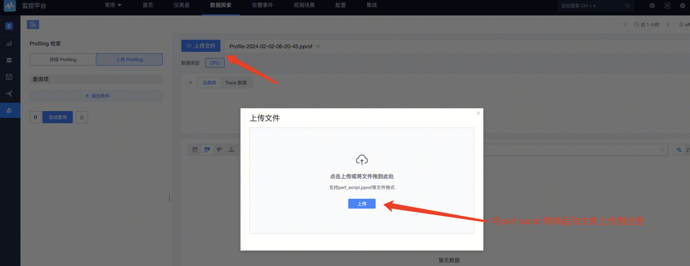

'perf' is a performance analysis tool under Linux, the data file generated by this tool can be accessed to the BlueKing Profiling function through file upload. Here are the steps:

>⚠️ `perf` Tool version required  >= 5.0，The version that does not meet the requirements will fail to parse Perf data.The version of the perf tool used in this article is: 5.4.241-1-tlinux4-0017.4

1. First we need to execute 'perf' to generate binary perf data for the project:

```bash
perf record ./your_proj
```

2. The perf data is then converted to text

```bash
perf script -i perf.data > perf_script.txt
```

3. Upload files & View Profile



After the file is parsed and stored, you can query the corresponding Profile data 🎉

