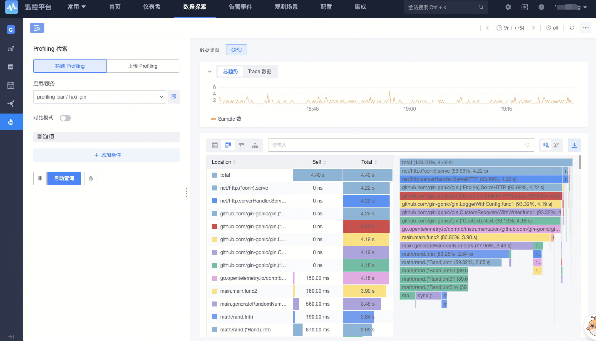
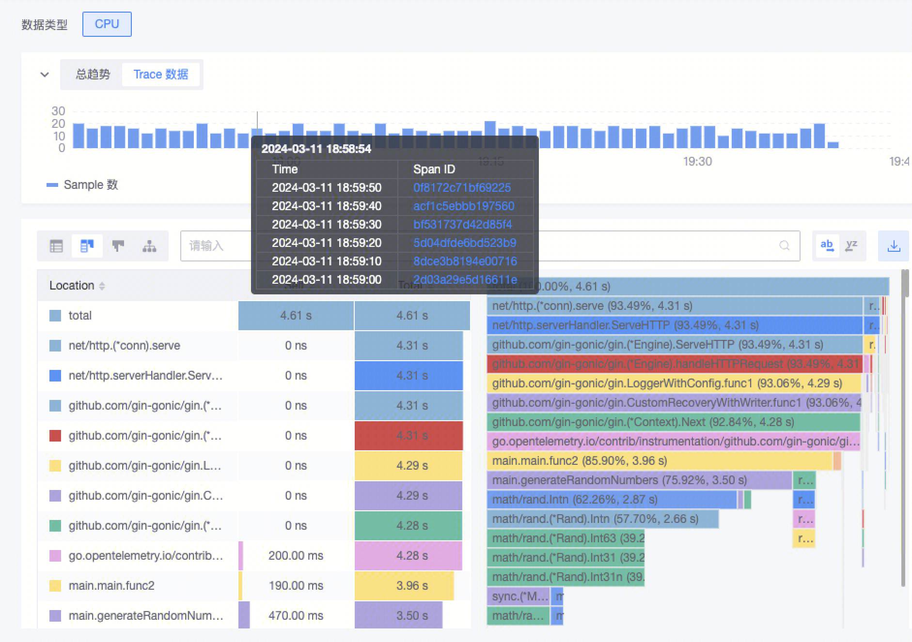

This document describes the complete process and function of Profile access in detail.
## Enable or access the Profiling function

- The profiling function depends on the APM application. If no application has been created, you need to create an application at [Observation Scenarios-APM]. During creation, check the Profiling function switch:

​		

- If the application already exists, you need to open Profiling on the [Application Configuration] page:


## Reporting Profiling Data

### Report data through the SDK

pyroscope SDK is used in the code to report, profiling data reported by this method can be viewed in [Profiling retrieval - persistent Profiling].



Currently, the following language access documents are supported:
1. [Java language access documentation](./java.md) 
2. [Go language access documentation](./go.md)

### Report data through file

File upload supports perf and pprof files.

[Perf access Profiling documentation](./perf.md)

Upload the file directly on the page, wait for a moment to view the Profile data, during which the file is stored to the platform and analyzed asynchronously.


After the Profile is parsed successfully, you can view profile data on the page.
## Combined with APM

This is the basic flow of Profiing access, if the Profile data includes' span_id '(this process provides a ready method for pyroscope SDK, see the access documentation), then it can be associated with Trace data.


**Linkage at the observation scene**

During initialization of pyroscope,**It is recommended that AppName be set to the same name as 'Resource.service_name' in Trace**,This way you can see both the trace and profile data of the service in the observation scene, for example:

```go
// Configure profiling
_, err = pyroscope.Start(pyroscope.Config{
  ApplicationName: "my-service",
  // ... other config
})

// Configure opentelemetry resource
resource := resource.NewWithAttributes(
    semconv.ServiceNameKey.String("my-service"),
  // ... other config
)
```

If that's not what you're used to, you can also use ServiceName in Labels, such as:

```go
_, err = pyroscope.Start(pyroscope.Config{
  ApplicationName: "my-app",
  Tags: map[string]string{
    	// key can be serviceName, service_name, SERVICE_NAME, service, SERVICE
			"serviceName": "my-service",
		},
  // ... other config
})
```

If serviceName is defined in Tags, Profiling will retrieve the Tags value as the service name instead of ApplicationName.

**Linkage in the Profling retrieval**

In the Trace data bar chart of [Profiling retrieval], you can see the number of span_id at the current moment, and clicking on it will jump to the specific span details.



Similarly, in the Span details, if this Span has Profile data, it will also be displayed on the Profile TAB:
