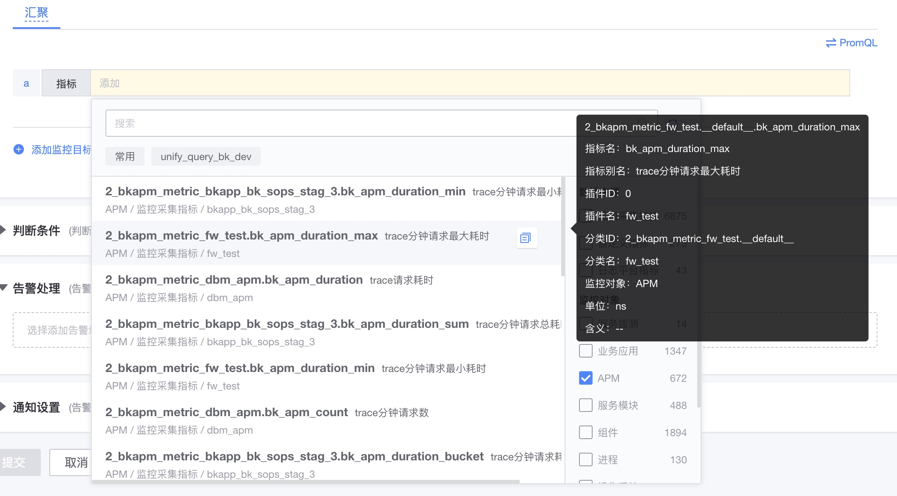

# APM related strategies

## APM default policy description

By default, no data alarm can be turned on in the application settings.

## Policy configuration

### Method 1: Based on the gold indicator

Each application will have a corresponding golden indicator, which can be used directly in the indicator selector for strategy alerts and drawing.

advantage:

- Fast, the data is already aggregated
- High accuracy, it is the aggregated data before sampling

shortcoming:

- Only applicable to gold indicators and corresponding dimension content, built-in

### Method 2: Use original data directly

advantage:

- Can be based on any dimension and indicator

shortcoming:

- The larger the amount of raw data, the slower it will be
- It can only be data stored after statistical collection