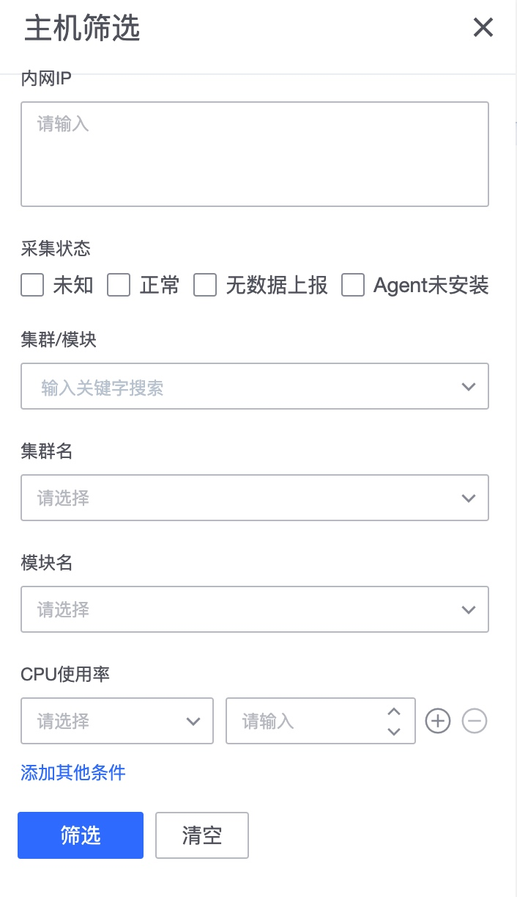
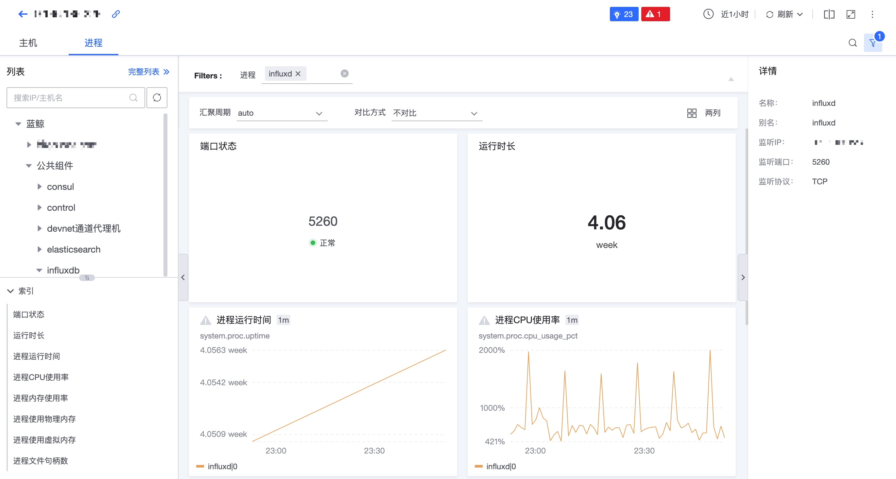

# Host monitoring

Host monitoring is a scenario specially customized for viewing host and process-related information. In this scenario, host-related information can be quickly obtained.

## Preliminary steps

When the CMDB under this business does not have a host, the data monitored by the host is empty. Therefore, you must first learn how to add a host and add process information, service instance information, etc. in the CMDB.

* [How to create a business and import the host into the business](../../../../../CMDB/3.10/UserGuide/QuickStart/case1.md)
* [How CMDB manages processes and service instances](../../../../../CMDB/3.10/UserGuide/UserCase/CMDB_management_process.md)

## Host list page

* **Collection status**: There are the following states:
     *Normal: Data collection is normal
     * Agent is not installed: If there is no Agent, there will be no data. The collection function of Agent monitoring must be installed on the CMDB and node management before it can be used.
     * Unknown: If the status cannot be determined, please contact the administrator. less seen
     * No data reporting: It means that the Agent is installed. Basereport may not be installed or is abnormal. You can try "Collect and Deliver" to reinstall the default collector installation of the host-operating system.

### View the disk space usage of machines under a certain cluster and sort them

There are many fields to view

### Comparison of host monitoring indicators

You can select multiple hosts on the list page for host comparison.

### Host details page

Able to compare time

### Process details page

