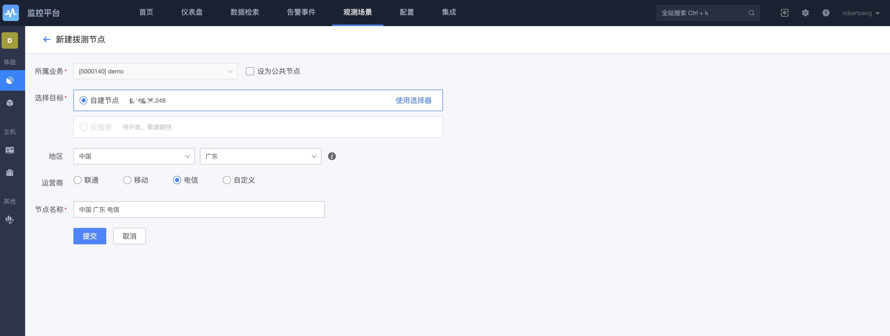
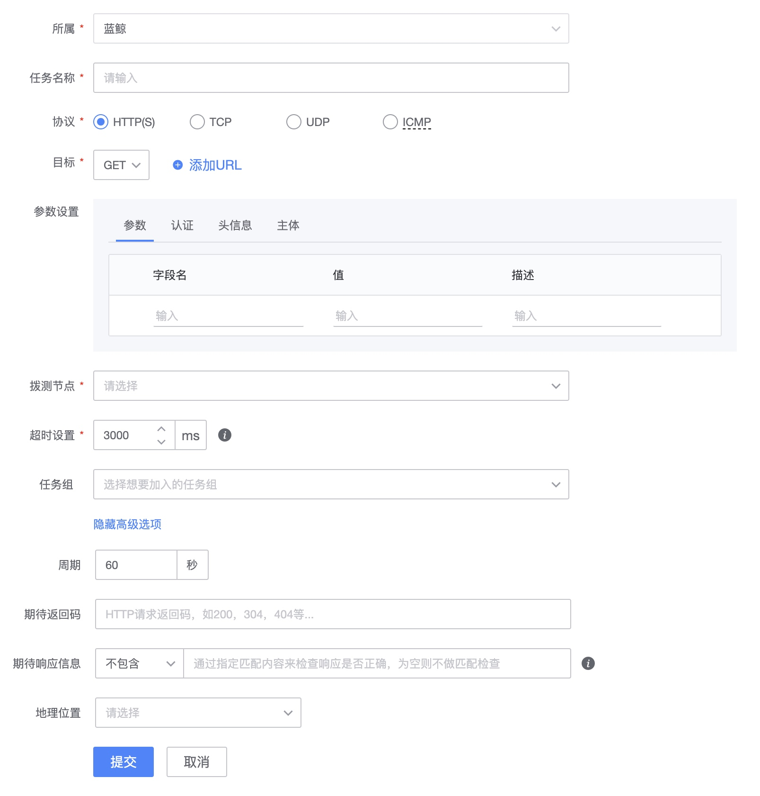

# Start comprehensive dial test

Comprehensive dial testing is to determine whether the target is running normally by remotely simulating user access, which is similar to a black box monitoring method.

## working principle

* Remote Object remote monitoring object: can be HTTP(s), TCP, UDP, ICMP, etc.
* Dial test node: gse agent is required to deploy the plug-in bkmonitorbeat. From then on, gse agent initiates external requests. The source address of the request is the IP. For bkmonitorbeat deployment, please refer to monitoring collector installation.

## Configuration process

(1) Configure the dial test node → (2) Create a new dial test task → (3) Select the protocol → (4) Fill in the target address → (5) Set the policy [if an alarm is required] → (6) View the dial test task

The collection of service dialing test is mainly divided into two parts, first: `adding dialing test node`, and then `adding dialing test task`.

If there is already a dial test node, this step is not required.

### Add dial test node

The `dial-test node` is the host where BlueKing Gse_Agent is deployed. The logic of service dial-test is to detect the service availability from the `dial-test node` to the `target address`.

Filter hosts from the configuration platform as dial test nodes through host attributes: `Country`, `Region` and `External Network Operator`.

In the `External Network Operator` field, select `Intranet`: It is designed to detect the availability of internal network services. Only the internal network IP will be used, and external network attributes such as operators will not be filtered. Select other operators such as `Telecom`: only Use external network IP to detect external network service availability.

> The administrator can set it as a public node, and other businesses can view it. By default, only this business can use it. If you build a self-built node, the selected IP information will be synchronized with the region and operator configured on the platform.

### Add dial test task

After selecting the node, configure different protocols to actively dial and test the website/application service. This is the second step of service dialing and testing collection: adding a dialing and testing task.

### View dial test tasks

## something else

Target selection instructions

* Dynamic topology: There are topology changes in the CMDB, and the node information and IP information under it change dynamically.
* Static topology: If the topology in the CMDB changes, the collection target will not change accordingly.
* Service template: Deliver collection targets based on service instances in CMDB
* Cluster template: issue collection targets based on the cluster template in CMDB
* Custom input: refers to manually inputting the external network IP address. As long as it conforms to the IP format, CMDB verification will not be performed.