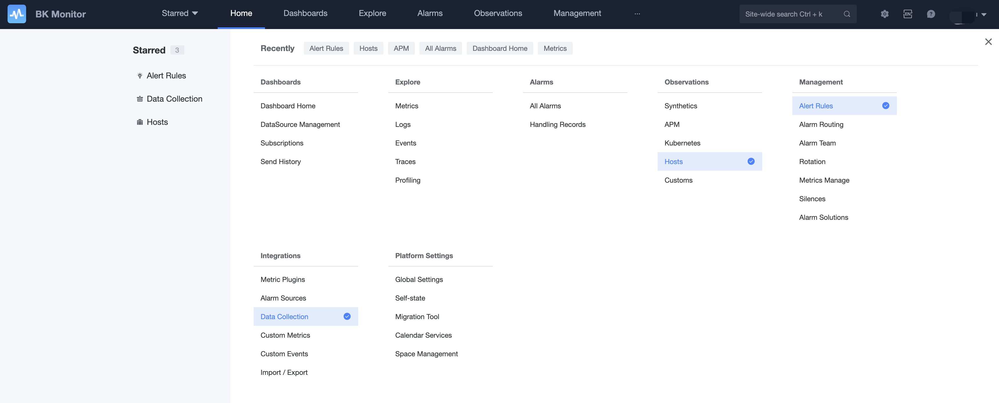

# Navigation instructions

A brief understanding of the navigation function description can help you quickly understand the function distribution of the monitoring platform.

## front page

* [Home](../ProductFeatures/data-visualization/home.md): Display the statistical information of this business, monitor the configuration, and quickly understand the matters that need to be processed

## dash board

* [Dashboard](../ProductFeatures/data-visualization/dashboard.md): Generate views through indicators to replace custom monitoring scenarios
* [E-mail subscription](../ProductFeatures/data-visualization/report_email.md): Subscribe to reports by email to view report data regularly

## Data retrieval

* [Indicator retrieval](../ProductFeatures/data-visualization/explore_metrics.md): View the original content of collected indicators
* [Log retrieval](../ProductFeatures/data-visualization/explore_logs.md): View the original content of the collected logs
* [Event retrieval](../ProductFeatures/data-visualization/explore_events.md): View the original content of collected events
* [Trace retrieval](../ProductFeatures/data-visualization/explore_traces.md): View the original content of the collected Trace

## Alarm events

* [Event Center](../ProductFeatures/alarm-analysis/alerts.md): records all alarm events and alarm notification contents, and can view and process alarm details, such as alarm confirmation and alarm event shielding
* [Processing Record](../ProductFeatures/alarm-analysis/alert_recording.md): Alarm notifications and processing records of calling peripheral systems can be viewed and analyzed.

## Observation scene

Different scene information and perspectives will be customized based on different scenarios to help users in this scenario quickly grasp the corresponding information. In the future, more scenarios can be expanded, such as network, hardware, containers, etc.

* [Host Monitor](../ProductFeatures/scene-host/host_monitor.md): Scenario for viewing host and process related information
* [Synthetic dial test](../ProductFeatures/scene-synthetic/synthetic_monitor.md): Determine whether the service is normal through remote dial test service. Provide various perspectives and information in this scene
* [K8s Monitoring](../ProductFeatures/scene-k8s/k8s_monitor_overview.md): Provides k8s cloud-native monitoring solutions.
* [APM](../ProductFeatures/scene-apm/apm_monitor_overview.md): Provides application performance monitoring based on OpenTelemetry.
* Custom scene: Scenario presentation based on data source, just like the data source of a monitoring plug-in, across multiple data collection tasks, and simultaneous observation. Personalized visual chart configuration can also be met.

## Monitoring configuration

All content related to the monitoring configuration is defined in the monitoring configuration. Report views, monitoring scenarios and analysis positioning are modifications of the viewing class that does not exist in the monitoring configuration.

* [Alarm Strategy](../ProductFeatures/alarm-configurations/rules.md): The configuration entry for all monitoring strategies, you can configure the time series data collected by monitoring, system event data, custom reported events and time series data, and data platform Access, log keyword monitoring, etc. There is corresponding algorithm support
* [Alarm Group](../ProductFeatures/alarm-configurations/alarm_group.md): Set a commonly used group of people and notification methods
* [Alarm Shield](../ProductFeatures/alarm-handling/block.md): Shield alarm notifications, including range-based shielding, policy-based shielding, and event-based shielding
* [Processing Package](../ProductFeatures/alarm-handling/what_fta.md): By setting the processing package, you can link JOB, standard operation and maintenance, ITSM, HTTP callback and other peripheral services.
* [Alarm Dispatch](../ProductFeatures/alarm-configurations/alarm_routing.md): Routing dispatch through the dimension of alarm data to provide alarm upgrade and other capabilities.

## Integration

* [Plug-in production](../ProductFeatures/integrations-metric-plugins/plugins.md): All collection configurations need to define plug-ins first (except built-in plug-ins such as logs), plug-ins include built-in plug-ins and custom plug-ins, business private Plug-ins and public plug-ins, local collection and remote collection modes of plug-ins, support different operating systems
* [Collection Tasks](../ProductFeatures/integrations-metrics/collect_tasks.md): All collection timings and log classes are implemented from collection to implement the collection process of the target machine. Meet dynamic and static collection
* [Customized metrics](../ProductFeatures/integrations-metrics/custom_sdk_push.md): Supports PUSH reporting of custom metric data.
* [Custom Events](../integrations-events/custom_events_http.md): Supports custom event data PUSH.
* [Alert Source](../integrations-alerts/custom_alerts_source.md): Supports adding alarm sources from various monitoring tools or platforms to meet one-stop monitoring and management needs.
* [Import and Export](../Appendix/import_export.md): Perform batch import and export operations of configurations.

## Platform settings

It affects the configuration of the entire monitoring platform, and you can also see the operating status of the platform.

* [Global Configuration](../Appendix/admin_config.md): Global switches of the monitoring system, such as data storage period, watermark switch, message queue settings, etc.
* [Self-monitoring](../Appendix/self_monitor.md): Monitor the operating status information of the platform itself: survival status, running status, business operation information, etc.
* [Calendar Service](../ProductFeatures/alarm-configurations/calendar_rules.md): Set the calendar to meet the alarm policy and determine whether the alarm policy takes effect based on the calendar.