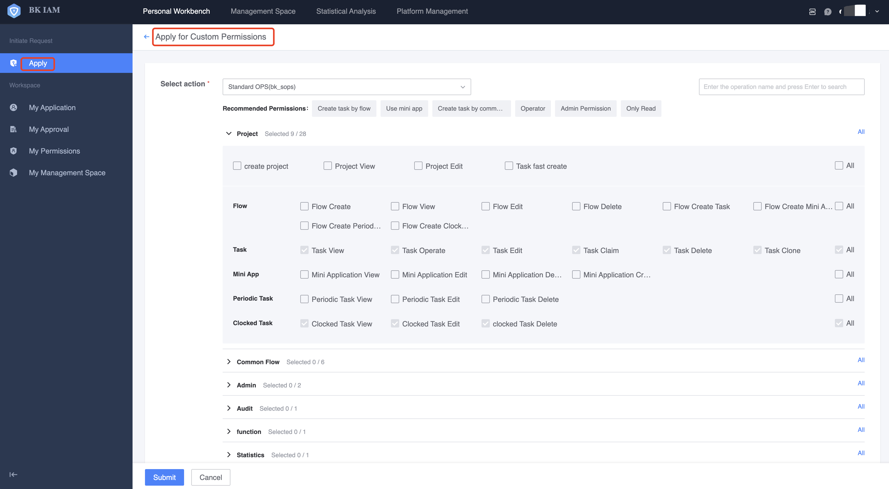
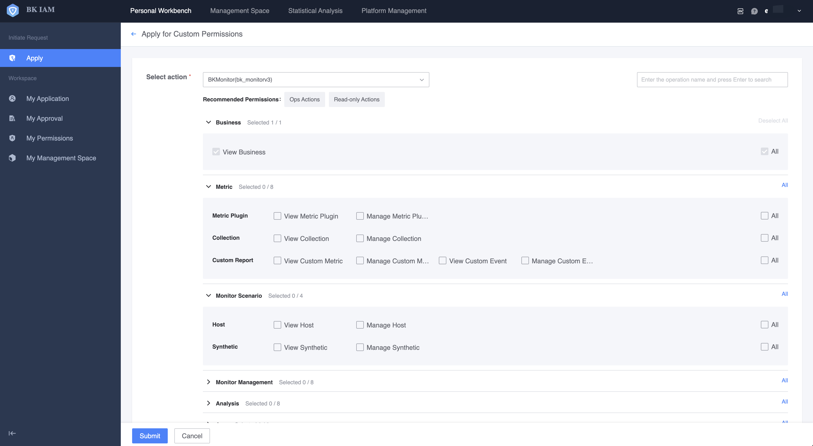

# Access Request

The permission application for the monitoring platform is connected to the IAM, so the application for permission to use the monitoring platform is mainly done through the IAM.

There are two specific ways to apply:

1. Create a permissioned user group, such as xx business operation and maintenance group. The IAM can add corresponding people or apply to join the group.

   

2. To apply for custom permissions, you can enter directly in the IAM or enter on the guidance of the monitoring product.

   

## Permission granularity

There are two basic divisions: viewing and management according to the functions provided by monitoring. Generally speaking, there are the following user scenarios:

* Receivers of alarm notifications: such as operation and maintenance, development, testing, products, etc. Applicable to application viewing and blocking operations.
*Configurator of monitoring: such as operation and maintenance. Suitable for applying for viewing + management operations.
* Manager of the monitoring platform: functions applicable to the whole world.

