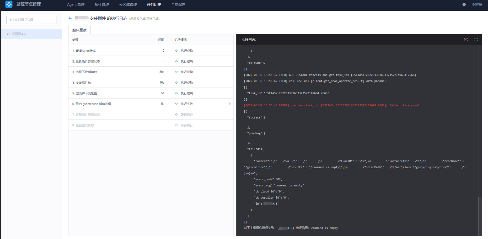

**报错信息：**
```bash
[2022-03-30 16:53:42 ERROR] gse task(task_ id: [ GSETASK: 202203301653373572149694:7666]) failed. task_result:
```


<br/>

**原因 ：**
gsecmdline 插件不是常驻进程，不需要安装，再 agent 执行任务的时候会自动启用，任务结束该进程也就退出了,安装这个插件没意义，也不需要安装  