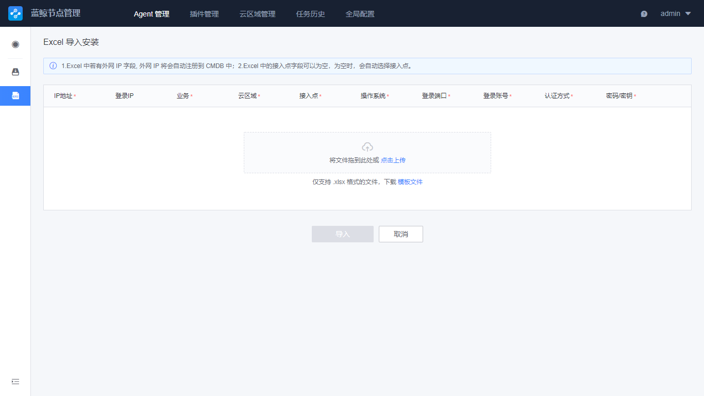

# Agent Manage 
Hour the server where the BlueKing platform is located and the host where the Agent needs to be installed belong to the same network area, you can directly install the BlueKing Agent after filling in/selecting the host, port, password/key information. To install the Agent, you need to ensure that the SSH channel of the target machine is open.

## Agent Status Query 
Enter the Agent Manage page, and the status of all Agents whose current account has query permissions will be shown.

Currently, filtering by business name, cloud area, IP, operation system, status and other attributes is supported.

## Install Agent on New CVM 
If you need to install BlueKing Agent on a new CVM and know the SSH login password of the CVM, you can follow the following step. This action will also register the CVM to BlueKing Configuration System.

1. Click the Install Agent button and select Normal Install 

2. Fill in the install parameters as follows:
- Install to Business Name: After the Agent is installed on the CVM, you need to specify which business to enter into the BlueKing Configuration System. By default, it will be placed under "/free pool/free machine" under the business 
- Cloud area: The cloud region to which the CVM belongs needs to be specified. If the stage deployed by BlueKing can be directly connected to this CVM without network isolation, select "direct mode".  If the company has complex network division, BlueKing cannot directly connect to this host. You need to make network planning in "Cloud Area Manage" before installing Agent. 
- Access Point: This configuration is generally specified by default in the cloud area. For some cloud regions without access point specified, you need to manually select them 
- Install information: 
   - IP address: The IP address used by BlueKing to connect to this host 
   - Login IP: The IP address that BlueKing logs in to install the Agent.  This parameter can be empty, and usually this address is the same as the first parameter "IP address".  This parameter is only required if there is an inconsistency 
   - Operation system: The type of operating system installed on this host. Please fill in correctly because the login mode of different operating systems is different 
   - Login port: Usually SSH login port is 22, port error will lead to failure to log in to install normal 
   - Login account: Linux please use the root account, Windows please use Administrator 
   - Authentication method: Currently,"Password" and "Key" are supported. To select a key, you need to upload a key file.  In order to ensure security and avoid repeated user input, the NodeMan stores the sensitive information for 24 hours by default, and the login account information will be deleted after timeout.

  

3. Once fully configured, click the Install button at the bottom to continue. 

   At this point, the NodeMan will verify whether the entered "cloud area + IP address" combination already exists in BlueKing. If it already exists, the Install program will ignore this batch of CVMs, and a dialog tip will appear. 

## Install Agent on a New CVM Pass Import 

The previous section describes the steps for installing the agent in general. When the network stage of the agent you want to install is too different and the number is too large, it is difficult to edit in the NodeMan interface, or you already have a table of host information, you can use Excel import for installation. 

The actions steps are as follows:

1. Click the Install Agent button and select Excel Import Installation. 

 

2. Download the template, supplement the information of the host according to the prompt requirements of the template, and then upload. Please note that you can only enter the password in the "Authentication Data" when importing pass Excel. If you log in with a key, you can enter an invalid password first, and then modify to the key method in the next step. 

 

3. Confirm the host details, and the NodeMan will recognize the format in the current Excel file. Click Install after confirming that there is no error. 

 

## Agent Maintenance 

After the agent is installed, the daily maintenance includes reinstallation, restart, uninstallation, remove, etc. You can select target host in the list and click more to perform the actions. 

