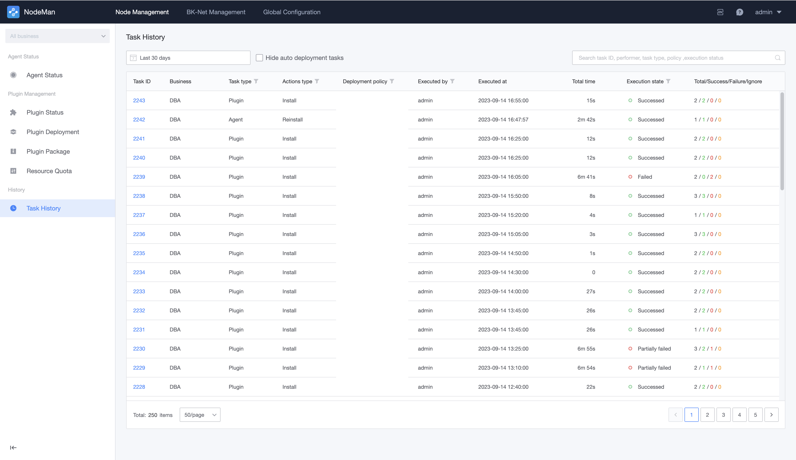
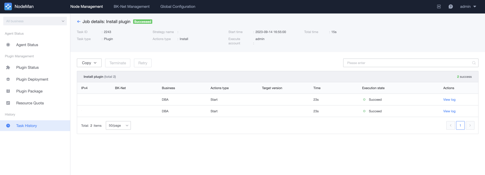
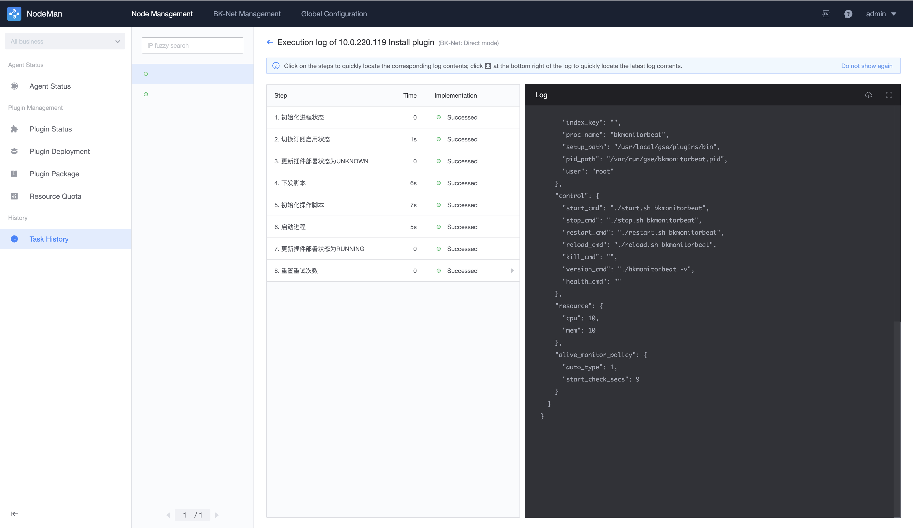

# Checks History 

Since most NodeMan checks are performed asynchronously and take a long time, this feature can help query the status and log of tasks performed by node management.

## Viewing checks history list 

Contains the list of actions checks for agent, proxy, and plugins. Task details are usually filtered by business name and executor.

## Task details 

Click a single check to view the task details, including the status of the subtasks executed under the current task. For example, you can view the installation status of each host by batch installing BlueKing agent on the host.

To query the execution log of each check, click again to enter the log detail.

