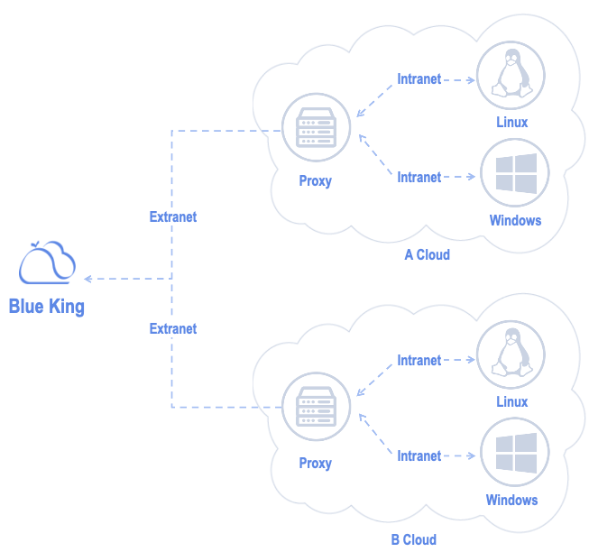

# Product Architecture 

NodeMan is based on SSH communication link or Windows 3389 remote port to achieve batch host agent installation.

If you need to manage CVMs in different network (BK-Net), you only need to provide a Linux CVM with a WAN IP in each region as a proxy. Other CVMs in the same region can be Cross-network Management by communicating with the proxy.

