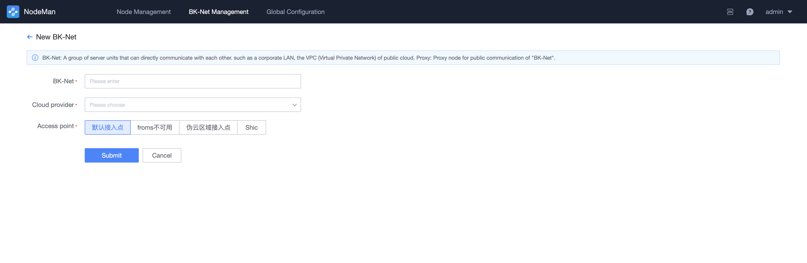
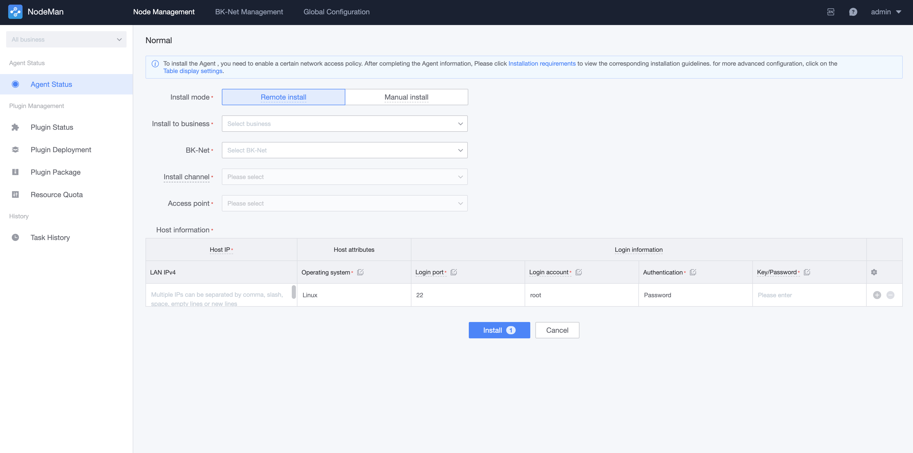

# Install BlueKing Agent (Custom BK-Net)

Background: When the target CVM where the Agent needs to be installed cannot be directly accessed by BlueKing, you need to install the Agent pass create a custom BK-Net.

## Step 1: Confirm the access point Configuration

Click "Global Setting" to confirm that the following configurations of the default access point are not blank, and the target CVM where the BlueKing Agent will be installed can connect to the private network addresses of these configurations.

## Step 2: Create a BK-Net

On the BK-Net Manage page, click "New" to create a new cloud region. Explanation of BK-Net parameters:

After a successful submit, the system will prompt to "Install Proxy". Select "Proxy Install" to configure the proxy.

Fill in the proxy install parameters according to the instructions, click Install to enter the Task Details page, wait for the successful installation, and proceed to the next step.

## Step 3: Install Agent

Switch to the node Management->agent status page and click the "Install Agent" button.

To install a business name, select a service that has been created on the Configuration System. If there is none service, you can select Resource Pool.

BK-Net, the cloud zone you just created, and use the default access point for the access point.

Then complete the target host details configuration for the installation. When complete, click Install to begin the installation checks.

## Step 4: Check the Implementation Status

After Step 3 is complete, you will automatically jump to the checks page and wait for the success Agent installation. If the checks fail, you can click on the host to view the install log.

